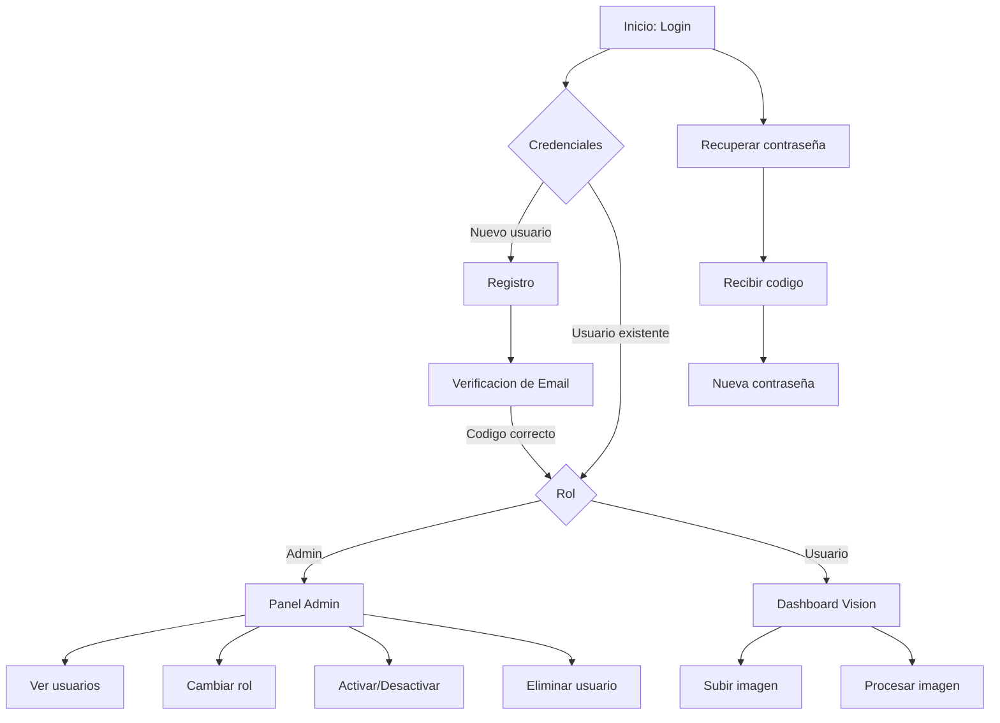

# 🧪 Manual del Betatester - Argos2

## 📋 Información General

**Sistema:** Argos2 - Sistema de Visión Computacional con Autenticación  
**Versión:** Beta  
**Servidor:** http://localhost:5000  
**Fecha:** Mayo 2026  

---

## 🚀 Paso 1: Instalación

### Windows
1. Doble clic en `install.bat`
2. Seguir las instrucciones en pantalla
3. Seleccionar opción **[2]** para iniciar y abrir el navegador automáticamente

### Linux
```bash
chmod +x install.sh
./install.sh
```
Seleccionar opción **[2]** para iniciar y abrir el navegador.

### Inicio Rápido (ya instalado)
- **Windows:** Doble clic en `start.bat`
- **Linux:** `./start.sh`

> ⚠️ **Requisito:** Python 3.8 o superior debe estar instalado en el equipo.

---

## 📊 Mapa de Funcionalidades a Probar



---

## 🧪 Plan de Pruebas

### PRUEBA 1: Registro de Nuevo Usuario

**Objetivo:** Verificar que un usuario nuevo puede registrarse correctamente.

**Pasos:**
1. Abrir http://localhost:5000
2. Clic en el botón **REGISTRAR**
3. Completar el formulario con:
   - **Usuario:** betatester1
   - **Correo:** tu-correo-real@gmail.com *(usar correo real para recibir el código)*
   - **Contraseña:** Test1234 *(mínimo 8 caracteres, 1 mayúscula, 1 minúscula, 1 número)*
   - **Nombre Completo:** Tu Nombre
   - **Fecha de Nacimiento:** cualquier fecha válida
   - **Tipo de Documento:** V
   - **Número de Documento:** 12345678
   - **Teléfono:** 04141234567 *(opcional)*
4. Clic en **REGISTRAR**

**Resultado esperado:**
- ✅ Se redirige a la página de verificación de correo
- ✅ Se muestra el correo ingresado en pantalla
- ✅ Llega un correo con código de 6 dígitos

**⚠️ Nota importante sobre el correo:**  
El sistema envía correos reales usando SMTP de Gmail. Si no recibes el código:
- Revisa la carpeta de **Spam** o **Correo no deseado**
- El código expira en **2 minutos**
- Puedes usar el enlace **Reenviar código** después del countdown

---

### PRUEBA 2: Verificación de Correo

**Objetivo:** Verificar que el código de verificación funciona correctamente.

**Pasos:**
1. Revisar el correo electrónico
2. Ingresar el código de 6 dígitos en los campos individuales
3. Clic en **VERIFICAR**

**Resultado esperado:**
- ✅ Mensaje de verificación exitosa
- ✅ Redirección a la página de login

**Casos adicionales a probar:**
- ❌ Ingresar un código incorrecto (debe mostrar error)
- ❌ Esperar más de 2 minutos e intentar usar el código (debe mostrar error de expiración)
- ✅ Usar **Reenviar código** y verificar que llega un nuevo código

---

### PRUEBA 3: Inicio de Sesión (Login)

**Objetivo:** Verificar que el login funciona correctamente.

**Pasos:**
1. Ir a http://localhost:5000
2. Ingresar **Usuario** y **Contraseña** del usuario registrado
3. Clic en **INGRESAR**

**Resultado esperado:**
- ✅ Redirección al Dashboard (si es rol usuario) o Panel Admin (si es rol admin)
- ✅ Se muestra el nombre de usuario en la barra superior
- ✅ No hay errores en la consola del navegador (F12 > Console)

**Casos adicionales a probar:**
- ❌ Ingresar contraseña incorrecta (debe mostrar "Credenciales inválidas")
- ❌ Ingresar usuario que no existe (debe mostrar "Credenciales inválidas")
- ❌ Intentar login con cuenta no verificada (debe mostrar "Email no verificado")

---

### PRUEBA 4: Cierre de Sesión (Logout)

**Objetivo:** Verificar que el logout funciona correctamente.

**Pasos:**
1. Estar logueado en cualquier página
2. Clic en **Cerrar Sesión** (esquina superior derecha)
3. Verificar redirección al login

**Resultado esperado:**
- ✅ Se muestra mensaje de "Sesión cerrada exitosamente"
- ✅ Redirección a la página de login
- ✅ Al intentar navegar al dashboard, redirige al login

---

### PRUEBA 5: Recuperación de Contraseña

**Objetivo:** Verificar el flujo completo de recuperación de contraseña.

**Pasos:**
1. Ir a http://localhost:5000
2. Clic en **¿Olvidaste tu contraseña?**
3. Ingresar el correo del usuario registrado
4. Clic en **ENVIAR CÓDIGO**
5. Revisar correo y obtener el código
6. Ingresar el código de 6 dígitos
7. Ingresar nueva contraseña (ej: NuevaPass123)
8. Confirmar el cambio

**Resultado esperado:**
- ✅ Se envía código de recuperación al correo
- ✅ Se puede cambiar la contraseña con el código
- ✅ Se puede iniciar sesión con la nueva contraseña

---

### PRUEBA 6: Panel de Administración

**Objetivo:** Verificar las funciones del panel de administración.

> **⚠️ Nota:** Para probar esto necesitas un usuario con rol **admin**.  
> Puedes crear un usuario admin directamente en la base de datos SQLite ejecutando:
> ```sql
> INSERT INTO usuarios (username, email, password_hash, nombre_completo, fecha_nacimiento, tipo_documento, numero_documento, rol, activo, email_verificado)
> VALUES ('admin', 'admin@test.com', '$2b$12$hash', 'Admin Test', '1990-01-01', 'V', '10000000', 'admin', 1, 1);
> ```

**Pasos:**
1. Iniciar sesión como admin
2. Verificar que se redirige al Panel de Administración
3. Verificar que se muestra la tabla de usuarios

**Funciones a probar:**

| Función | Pasos | Resultado Esperado |
|---------|-------|--------------------|
| **Ver usuarios** | La tabla se carga automáticamente | Lista de todos los usuarios con sus datos |
| **Cambiar rol** | Clic en botón de rol de un usuario | El rol cambia entre admin y usuario |
| **Activar/Desactivar** | Clic en botón de estado | El usuario se activa o desactiva |
| **Eliminar usuario** | Clic en botón eliminar | El usuario se elimina de la lista |
| **Actualizar lista** | Clic en **Actualizar Lista** | La tabla se refresca con datos actuales |

**Casos adicionales a probar:**
- ❌ Intentar cambiar el propio rol (debe mostrar error)
- ❌ Intentar desactivar la propia cuenta (debe mostrar error)
- ❌ Intentar eliminar la propia cuenta (debe mostrar error)

---

### PRUEBA 7: Dashboard de Visión Computacional

**Objetivo:** Verificar la interfaz del dashboard de procesamiento de imágenes.

**Pasos:**
1. Iniciar sesión como usuario normal (rol usuario)
2. Verificar que se redirige al Dashboard
3. Verificar los elementos visibles:
   - Barra de navegación con nombre de usuario
   - Sección de bienvenida
   - Formulario de subida de imagen
   - Selector de tipo de operación (Detección, Clasificación, Mejora)
   - Barra de progreso
   - Área de resultados

**⚠️ Nota:** El procesamiento de imágenes puede no estar completamente funcional aún.  
Probar lo siguiente:
- ✅ Se puede seleccionar un archivo de imagen
- ✅ Se puede seleccionar tipo de operación
- ✅ Al enviar, se muestra algún tipo de respuesta (procesando, error, o resultado)

---

### PRUEBA 8: Sesiones y Seguridad

**Objetivo:** Verificar aspectos de seguridad del sistema.

**Casos a probar:**

| Prueba | Pasos | Resultado Esperado |
|--------|-------|--------------------|
| **Token expirado** | Esperar 24 horas con sesión activa y recargar | Redirige al login |
| **Acceso sin login** | Abrir directamente http://localhost:5000/dashboard.html | Redirige al login |
| **Acceso admin sin permisos** | Siendo usuario normal, ir a http://localhost:5000/admin.html | Redirige al dashboard |
| **Logout en múltiples pestañas** | Abrir 2 pestañas, cerrar sesión en una, usar la otra | Redirige al login |
| **Navegación hacia atrás** | Después de logout, usar botón atrás del navegador | No permite acceder a páginas protegidas |

---

### PRUEBA 9: Validaciones de Formularios

**Objetivo:** Verificar que las validaciones funcionan correctamente.

**Campos a probar en Registro:**

| Campo | Prueba | Resultado Esperado |
|-------|--------|--------------------|
| **Contraseña corta** | Ingresar "Ab1" | Error: mínimo 8 caracteres |
| **Sin mayúscula** | Ingresar "test1234" | Error: requiere al menos 1 mayúscula |
| **Sin minúscula** | Ingresar "TEST1234" | Error: requiere al menos 1 minúscula |
| **Sin número** | Ingresar "TestTest" | Error: requiere al menos 1 número |
| **Correo duplicado** | Usar correo ya registrado | Error: correo ya existe |
| **Usuario duplicado** | Usar username ya registrado | Error: usuario ya existe |
| **Documento duplicado** | Usar documento ya registrado | Error: documento ya existe |
| **Cédula inválida** | Ingresar "123" | Error: debe tener 7-8 dígitos |
| **Teléfono inválido** | Ingresar "123" | Error: formato 04141234567 |

**Campos a probar en Login:**

| Campo | Prueba | Resultado Esperado |
|-------|--------|--------------------|
| **Campos vacíos** | Enviar formulario vacío | Mensaje de completar campos |
| **Solo espacios** | Ingresar espacios en blanco | Mensaje de completar campos |

---

### PRUEBA 10: Interfaz de Usuario (UI/UX)

**Objetivo:** Verificar la apariencia y usabilidad de la interfaz.

**Verificar en cada página:**

- [ ] Los iconos SVG se muestran correctamente
- [ ] El logo de Argos2 aparece en todas las páginas
- [ ] Los colores y estilos son consistentes
- [ ] Los botones responden al hover (cambio visual al pasar el mouse)
- [ ] Los mensajes de error se muestran correctamente (toast notifications)
- [ ] Los enlaces entre páginas funcionan (login → registro, login → recuperar, etc.)
- [ ] La interfaz se ve bien en ventana normal y maximizada
- [ ] No hay elementos superpuestos o desalineados

---

## 📝 Plantilla de Reporte de Bugs

Al encontrar un problema, usa este formato:

```
### BUG #[número]: [Título descriptivo]

**Severidad:** [Alta / Media / Baja]
**Página:** [Login / Registro / Verificación / Recuperar / Admin / Dashboard]
**Navegador:** [Chrome / Firefox / Edge / Otro]

**Pasos para reproducir:**
1. 
2. 
3. 

**Resultado esperado:**
[Lo que debería pasar]

**Resultado actual:**
[Lo que realmente pasa]

**Captura de pantalla:**
[Pegar imagen si es posible]

**Mensaje de consola (si aplica):**
[Pegar error de la consola del navegador - F12 > Console]
```

---

## ✅ Checklist del Betatester

### Instalación
- [ ] El instalador funciona correctamente
- [ ] El servidor inicia sin errores
- [ ] La página principal carga en el navegador

### Autenticación
- [ ] Registro de nuevo usuario funciona
- [ ] Verificación de correo funciona
- [ ] Login con usuario verificado funciona
- [ ] Logout funciona correctamente
- [ ] Recuperación de contraseña funciona

### Administración
- [ ] Panel de admin carga correctamente
- [ ] Lista de usuarios se muestra
- [ ] Cambio de rol funciona
- [ ] Activar/Desactivar usuario funciona
- [ ] Eliminar usuario funciona

### Dashboard
- [ ] Dashboard carga correctamente
- [ ] Formulario de imagen se muestra
- [ ] Selector de operación funciona

### Seguridad
- [ ] No se puede acceder a páginas protegidas sin login
- [ ] No se puede acceder al panel admin sin ser admin
- [ ] Logout cierra sesión correctamente

### UI/UX
- [ ] Interfaz visual consistente
- [ ] Mensajes de error claros
- [ ] Navegación fluida entre páginas
- [ ] No hay errores en consola del navegador

---

## 📞 Contacto para Reportes

Enviar todos los reportes de bugs al equipo de desarrollo con el formato indicado arriba.  
Incluir capturas de pantalla cuando sea posible para facilitar la reproducción del problema.

**¡Gracias por participar como betatester de Argos2! 🎉**
