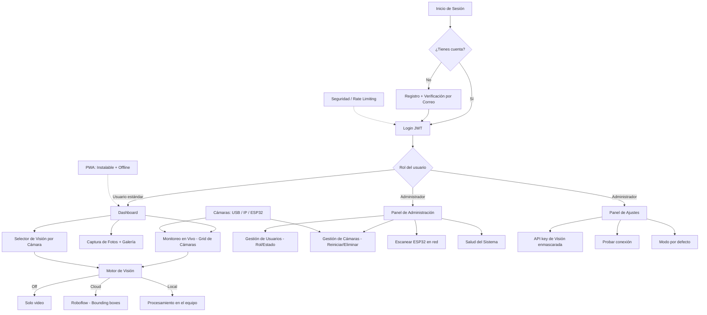

# 🧪 Manual del Betatester — Argos2

> **Versión:** 2.0 · **Fecha:** Junio 2026
> **Servidor local:** http://localhost:5000
> **Contacto:** sqprpject@gmail.com

¡Gracias por participar como betatester de **Argos2**! 🎉 Este manual te guía, paso a paso, por todo lo que tienes que instalar, probar y reportar. No necesitas saber programar: si sigues las instrucciones y anotas lo que encuentras, nos ayudas muchísimo.

---

## 📋 1. Información General

### ¿Qué es Argos2?
**Argos2** es un **Sistema de Visión Computacional con Autenticación**. En palabras sencillas, es una aplicación que:

- Permite **iniciar sesión** de forma segura (con verificación por correo electrónico).
- Conecta **una o varias cámaras** (webcams USB, cámaras IP y placas ESP32-CAM) y las muestra en un panel.
- Puede **"ver"** lo que ocurre en esas cámaras usando un **motor de visión** (detección de objetos en la nube o en local).
- Permite **tomar fotos**, revisarlas en una galería y **gestionar usuarios y cámaras** desde un panel de administración.

### Perfil del betatester
- **No necesitas ser técnico.** Si sabes abrir un navegador, instalar un programa y seguir pasos, puedes hacerlo.
- Tu trabajo es **usar la aplicación como lo haría un usuario real** y **reportar todo lo que no funcione bien**, esté roto, se vea feo o resulte confuso.
- No pasa nada si "rompes" algo: para eso es el betatest. Anótalo y sigue adelante.

### ¿Qué se espera de ti y cuánto dura?
- **Duración estimada:** 1 a 2 semanas, a tu ritmo.
- **Lo que esperamos:**
  1. Que instales y pongas en marcha Argos2.
  2. Que recorras las funcionalidades del **Plan de Pruebas** (sección 5).
  3. Que rellenes la **Ficha de Reporte** [`Ficha_Betatester.xlsx`](Ficha_Betatester.xlsx) por cada problema u observación.
  4. Que nos envíes la ficha por correo al terminar.

---

## 🚀 2. Preparación / Instalación

### Requisitos previos
- **Python 3.8** o superior instalado en tu equipo (descárgalo de <https://www.python.org/downloads/>). Al instalarlo, marca la casilla *"Add Python to PATH"*.
- **Conexión a internet** (para descargar las dependencias la primera vez y para el correo y el motor de visión en la nube).
- **Cámara USB opcional** (sirve una webcam cualquiera para probar el descubrimiento de cámaras; si no tienes, podrás probar igualmente con cámaras IP).

> 💡 **Buenas noticias:** el instalador **crea el entorno virtual, instala todas las dependencias y configura automáticamente las variables de entorno** (incluyendo el correo de la empresa). **No tienes que editar el archivo `.env` a mano.**

### En Windows
1. Localiza el archivo [`install.bat`](install.bat:1) en la carpeta del proyecto.
2. Haz **doble clic** sobre él (o ejecútalo en una terminal).
3. Sigue las instrucciones que aparezcan en pantalla. El proceso descargará e instalará todo lo necesario.
4. Cuando termine, **ejecuta `start.bat`** (doble clic) para arrancar el servidor y abrir el navegador en http://localhost:5000.

```bat
start.bat
```

### En Linux
```bash
chmod +x install.sh
./install.sh
```
Sigue las instrucciones en pantalla. Cuando termine, arranca el servidor con:

```bash
./start.sh
```

### Inicio rápido (si ya está instalado)
- **Windows:** doble clic en [`start.bat`](start.bat:1).
- **Linux:** `./start.sh`

### Verificar que todo está en marcha
1. Al arrancar, se abrirá (o puedes abrir) el navegador en **http://localhost:5000**.
2. Debes ver la pantalla de **inicio de sesión** de Argos2.
3. Si la página no carga, revisa que la terminal del servidor no muestre errores y vuelve a intentarlo.

> ⚠️ **Importante:** Argos2 se ejecuta **en tu propio equipo** (`localhost`). Para que el correo de verificación llegue, tu equipo debe tener conexión a internet.

---

## 🗺️ 3. Mapa de Funcionalidades

Este diagrama muestra todos los módulos que componen Argos2. En la sección 5 encontrarás cómo probar cada uno.



---

## 🔑 4. Cuentas de Prueba / Accesos

### Tu primera cuenta
Argos2 no trae credenciales prefabricadas: **tú mismo te registras** la primera vez.

1. En la pantalla de inicio, pulsa **REGISTRAR**.
2. Completa el formulario con tus datos reales (usa un **correo válido**, porque te llegará un código de verificación).
3. Verifica el correo con el código de 6 dígitos.
4. Inicia sesión con tu nuevo usuario.

### Rol administrador
Para probar **cámaras IP, ajustes de visión y el panel de administración**, necesitas un usuario con rol **admin**.

- El **primer usuario** que se registra puede ser definido como administrador durante la configuración, o bien el responsable del betatest te indicará qué usuario tiene rol admin.
- Si el responsable te entrega unas credenciales de demo (usuario + contraseña), úsalas tal cual y **no las cambies**.
- Si **no te indican credenciales de admin**, regístrate y solicita el rol de administrador al contacto (sección 8).

### Reglas de las contraseñas
La contraseña debe tener **mínimo 8 caracteres**, incluyendo **1 mayúscula, 1 minúscula y 1 número** (y se requiere al menos **1 carácter especial**). Ejemplo válido: `Prueba$123`.

---

## 🧪 5. Plan de Pruebas por Módulo

Recorre estas **12 categorías** en orden. Para cada una: lee el "qué es", ejecuta los pasos numerados y anota los resultados. Si algo falla o se ve raro, **abre una fila en la Ficha de Reporte** (sección 6).

> 💡 **Convención:** ✅ = resultado correcto esperado · ❌ = caso negativo que debe ser rechazado con un mensaje claro.

---

### 5.1 Descubrimiento y Registro de Cámaras (USB / IP / ESP32)

**Qué es:** La capacidad de detectar cámaras conectadas (USB) o de dar de alta cámaras remotas (IP/ESP32-CAM) para que aparezcan en el panel.

1. **(USB)** Conecta una webcam USB, pulsa **"Descubrir cámaras"** y verifica que se detecta y se autorregistra. ✅
2. **(Admin)** Como administrador, registra una cámara **IP** con una URL MJPEG/RTSP válida y confirma que aparece en el grid de Monitoreo con **stream en vivo**. ✅
3. **(Negativo)** Intenta registrar una cámara con una URL **inválida o inalcanzable** y verifica que se **rechaza con un mensaje claro** (la aplicación **no** debe caerse ni el servidor colgarse). ❌
4. **(Persistencia)** Recarga la página y confirma que **las cámaras siguen ahí** (no se pierden). ✅
5. **(Permisos)** Como usuario **no administrador**, intenta registrar una cámara y verifica que se **deniega el acceso** (código `403`). ❌

---

### 5.2 Monitoreo en Vivo + Reconexión

**Qué es:** La vista de cámaras en tiempo real y la capacidad de recuperarse cuando una cámara se cae.

1. Abre el dashboard con **al menos 1 cámara** y verifica que el video se ve **fluido, sin congelarse** de forma prolongada. ✅
2. **(Caída)** Desconecta físicamente la cámara o corta la red; verifica que aparece un **indicador de error** y que, al reconectar, la cámara se **reconecta automáticamente**. ✅
3. **(Multicámara)** Con **4 o más cámaras**, verifica que el grid las muestra **todas** y que el **estado y la latencia** se actualizan. ✅
4. **(Admin)** Pulsa **"Reiniciar cámara"** y verifica que el stream **se reanuda sin recargar** la página. ✅

---

### 5.3 Captura de Fotos + Galería

**Qué es:** Tomar fotografías desde una cámara y revisarlas después en una galería.

1. En la pestaña **Captura**, selecciona una cámara y pulsa **Capturar**; verifica que la foto aparece en la **previsualización**. ✅
2. **Procesa** la captura y confirma que se obtiene un **resultado** y que la imagen **pasa a la galería**. ✅
3. Toma **más de 12 capturas** y verifica que la galería **conserva solo las últimas** (comportamiento FIFO: las más antiguas se descartan). ✅
4. Pulsa **Descargar** en un elemento de la galería y verifica que se **descarga el archivo JPG**. ✅
5. **(Fallback)** Si la cámara no responde, verifica que el **fallback de canvas** genera una captura **utilizable** (no una imagen rota). ✅

---

### 5.4 Selector de Visión por Cámara (Off / Cloud / Local)

**Qué es:** El control que permite elegir, para cada cámara, si la detección está **apagada**, en la **nube** (Roboflow) o en **local**.

1. Activa el modo **Cloud** (con la API key configurada) y verifica que aparecen **bounding boxes** (rectángulos) sobre las detecciones. ✅
2. Cambia a **Off** y confirma que el stream **vuelve a video plano, sin anotaciones**. ✅
3. Activa **Local** por primera vez y verifica que aparece la **advertencia de consumo de recursos**. ✅
4. **Recarga** la página y verifica que la **selección de visión persiste por cámara** (cada cámara recuerda su modo). ✅
5. **(Negativo)** Con la API key **ausente**, activa Cloud y verifica que aparece un **mensaje de error** (la aplicación **no** debe cerrarse). ❌

---

### 5.5 Motor de Visión (Cloud Roboflow + Local)

**Qué es:** El "cerebro" que analiza las imágenes y dibuja las detecciones.

1. Con **workflow** activo y `use_server_overlay=true`, verifica que el frame **trae las anotaciones desde el servidor**. ✅
2. Cambia al **modelo estándar** y verifica que las predicciones se dibujan con **colores y clases correctas** (cada tipo de objeto con su etiqueta). ✅
3. **(Degradación)** Envía un **frame negro o vacío** y verifica que el sistema **degrada de forma elegante** (sin excepción ni caída). ✅
4. Verifica que `GET /api/cameras/vision/modes` **devuelve solo los modos disponibles** (no modos inexistentes). ✅

---

### 5.6 Panel de Ajustes de Visión

**Qué es:** Donde el administrador configura la API key de Roboflow y el comportamiento del motor de visión.

1. **(Admin)** Abre **Ajustes** y verifica que la API key aparece **enmascarada** (por ejemplo: `****abcd`). ✅
2. **Guarda** dejando la API key **vacía** y verifica que la clave existente **no se sobrescribe ni se pierde**. ✅
3. Pulsa **Probar conexión** y verifica que el indicador responde **OK o Error de forma coherente** con el estado real. ✅
4. Cambia el **modo por defecto**, guarda y verifica que **los motores se recargan** con el nuevo modo. ✅
5. **(Permisos)** Como usuario **no administrador**, intenta `PUT /api/settings/vision` y verifica que se devuelve **`403`**. ❌

---

### 5.7 Dashboard Rediseñado (pestañas + roles)

**Qué es:** La pantalla principal, organizada en pestañas que cambian según el rol del usuario.

1. Inicia como **usuario estándar** y verifica que las pestañas **Admin** y **Ajustes no aparecen**. ✅
2. Inicia como **admin** y verifica que **ambas pestañas están visibles y funcionales**. ✅
3. Abre una cámara en **pantalla completa** y verifica que usa el **stream anotado** si la visión está activa. ✅
4. Navega entre pestañas y verifica que **los streams se detienen** al salir de Monitoreo (no siguen consumiendo en segundo plano). ✅

---

### 5.8 Panel de Administración (Usuarios + Cámaras + Salud)

**Qué es:** Las herramientas del administrador para gestionar usuarios, cámaras y ver el estado del sistema.

1. **(Admin)** Cambia el **rol de otro usuario** y verifica que **se aplica y persiste** tras recargar. ✅
2. **(Anti-self)** Intenta **modificar tu propio rol/estado o eliminarte** y verifica que **se bloquea** (no puedes autodescartarte ni quitarte permisos). ❌
3. **Desactiva** un usuario y verifica que **ya no puede iniciar sesión**. ✅
4. Usa **Escanear ESP32** y verifica que **detecta dispositivos** en la subred `/24`. ✅
5. **Reinicia o Elimina** una cámara desde el panel y verifica que el **efecto es inmediato en Monitoreo**. ✅

---

### 5.9 Autenticación + Correo

**Qué es:** El registro, la verificación por correo, el inicio/cierre de sesión y la recuperación de contraseña.

1. **Regístrate** y verifica que **llega el correo con el código de 6 dígitos** (revisa Spam si no lo ves). ✅
2. **(Negativo)** Introduce un código **expirado o errado** → debe ser **rechazado**; luego introduce el **correcto** → **activación**. ❌➡️✅
3. Haz **logout** y verifica que el *access token* queda en **lista negra** (las peticiones posteriores devuelven `401`). ✅
4. Usa **Recuperar contraseña**, recibe el código y **restablece** con una contraseña válida; verifica que el **login posterior funciona**. ✅
5. **(Negativo)** Registra una contraseña **sin carácter especial ni mayúscula** y verifica que el **backend la rechaza**. ❌

---

### 5.10 PWA (instalable + offline)

**Qué es:** Argos2 es una *Progressive Web App*: se puede instalar como una app y funciona parcialmente sin conexión.

1. Abre la app en **Chrome** (Android o escritorio) y verifica que aparece el **prompt "Instalar"**. ✅
2. **Instálala** y verifica que **abre en modo standalone** (sin la barra del navegador). ✅
3. **(Offline)** Con conexión, navega por la app; luego **desconéctate de internet** y verifica que **las páginas cacheadas cargan**, mientras que las rutas `/api/` **no** se cachean (deben fallar con elegancia). ✅
4. Verifica que el **icono se muestra correctamente** (versiones 192 y 512). ✅

---

### 5.11 Rate Limiting / Seguridad

**Qué es:** Los límites que protegen a Argos2 del abuso (demasiados intentos en poco tiempo).

1. **(Login)** Intenta hacer login fallido **5 o más veces en un minuto** y verifica que la respuesta es **`429` con un campo `retry_after`**. ✅
2. **(Registro)** Intenta registrarte **4 veces en una hora** y verifica que se aplica el **bloqueo**. ✅
3. **(Privacidad)** Verifica que el error `429` **no expone trazas internas del servidor** (solo un **mensaje JSON limpio**). ✅

---

### 5.12 Salud del Sistema / Documentación API

**Qué es:** Endpoints públicos que muestran el estado del sistema y la lista de endpoints disponibles.

1. `GET /health` debe responder **`200`** con un **JSON de estado** y **sin requerir autenticación**. ✅
2. `GET /api` debe **listar los endpoints disponibles** y sus **métodos** (GET, POST, PUT, etc.). ✅

> 💡 Puedes probar estos endpoints directamente en el navegador: <http://localhost:5000/health> y <http://localhost:5000/api>.

---

## 📝 6. Cómo reportar: uso de la ficha `Ficha_Betatester.xlsx`

Para reportar todo lo que encuentres usaremos una **ficha de Excel** rellenable. Está en [`Ficha_Betatester.xlsx`](Ficha_Betatester.xlsx) (en la raíz del proyecto).

### Qué contiene la ficha
La ficha tiene **4 hojas**:

| Hoja | Para qué sirve |
|------|----------------|
| **Instrucciones** | Guía rápida de uso de la ficha. |
| **Reportes** | Aquí rellenas **una fila por cada hallazgo**. Las columnas *Módulo*, *Tipo*, *Severidad* y *Estado* son **desplegables**. |
| **Checklist de Pruebas** | Lista de funcionalidades para marcar **cuáles probaste** y cómo te fue. |
| **Listas** *(oculta)* | Contiene los valores de los desplegables. No la modifiques. |

### Paso a paso

1. **Abre la ficha** con **Microsoft Excel** o **LibreOffice Calc**.
2. Consulta primero la hoja **"Instrucciones"** para entender el formato.
3. Ve a la hoja **"Reportes"** y **rellena una fila por cada problema u observación**:
   - **ID Reporte:** ya viene prellenado (`RPT-001`, `RPT-002`, …). Usa el siguiente libre.
   - **Fecha:** día en que encontraste el problema.
   - **Betatester:** tu nombre.
   - **Módulo** *(desplegable):* dónde ocurrió (Autenticación, Cámaras, Visión, etc.).
   - **Tipo** *(desplegable):* qué clase de reporte es (ver tabla más abajo).
   - **Severidad** *(desplegable):* qué tan grave es (ver tabla más abajo).
   - **Navegador/SO:** dónde lo probaste (ej. `Chrome / Windows 11`).
   - **Pasos para reproducir:** numera los pasos exactos para que podamos repetirlo.
   - **Resultado esperado:** qué **debería** pasar.
   - **Resultado actual:** qué **pasa en realidad**.
   - **Evidencia (archivo/ruta):** nombre del archivo de captura si adjuntas uno.
   - **Estado** *(desplegable):* déjalo en **"Nuevo"** salvo que te indiquen otra cosa.
   - **Notas/Resolución:** cualquier comentario extra.
   - 🗑️ **Borra las dos filas amarillas de EJEMPLO** antes de enviar la ficha.
4. Ve a la hoja **"Checklist de Pruebas"** y marca, para cada funcionalidad, si la **probaste** (Sí/No/No aplica) y el **resultado** (OK/Con errores/No pude probarla).
5. **Guarda** el archivo (mismo nombre, `Ficha_Betatester.xlsx`).
6. **Envíalo por correo** a **sqprpject@gmail.com**.

### Cómo clasificar la Severidad

| Nivel | Significado |
|-------|-------------|
| **Crítica (bloquea uso)** | Impide usar la aplicación por completo. No hay forma de continuar. |
| **Alta (función clave rota)** | Una función principal no funciona, pero la app no se cae entera. |
| **Media (workaround existe)** | Hay un error, pero existe una forma alternativa de lograr la tarea. |
| **Baja (cosmético/menor)** | Detalle visual o menor que no afecta a la funcionalidad. |
| **Informativa** | Comentario, sugerencia u observación; no es un error como tal. |

### Cómo clasificar el Tipo

| Tipo | Significado |
|------|-------------|
| **Bug funcional** | Algo no funciona como debería. |
| **Error visual/CSS** | Fallo de diseño: desalineación, colores, superposición, etc. |
| **Bug de rendimiento/lentitud** | Va lento, se cuelga o consume muchos recursos. |
| **Fallo de seguridad** | Posible brecha, acceso sin permiso o datos expuestos. |
| **Sugerencia de mejora** | Idea para mejorar la aplicación. |
| **Duda/Consulta** | Pregunta sobre cómo funciona algo. |
| **Documentación** | Error o ausencia en la ayuda o el manual. |
| **Otro** | Cualquier cosa que no encaje en las categorías anteriores. |

### Sobre las capturas (Evidencia)
- Si puedes, **adjunta una captura de pantalla o un video corto** del problema.
- **Nombra el archivo** de forma descriptiva, por ejemplo: `camara_congelada_monitoreo.png`.
- Ese mismo nombre ponlo en la columna **"Evidencia"** del reporte, para que sepamos a qué te refieres.
- Adjunta las capturas **junto con la ficha** en el correo.

---

## ✅ 7. Checklist de Cierre

Antes de dar por terminado tu betatest, verifica lo siguiente:

- [ ] Instalé Argos2 correctamente y el servidor arranca sin errores.
- [ ] Me registré, verifiqué mi correo e inicié sesión.
- [ ] Probé las **12 categorías** del Plan de Pruebas (sección 5).
- [ ] Rellene **una fila por cada hallazgo** en la hoja "Reportes".
- [ ] **Borré las filas de EJEMPLO** de la ficha.
- [ ] Marqué la hoja **"Checklist de Pruebas"** indicando qué probé.
- [ ] **Adjunté capturas** y puse sus nombres en la columna "Evidencia".
- [ ] **Guardé** el archivo `Ficha_Betatester.xlsx`.
- [ ] **Envié la ficha (y las capturas)** por correo a **sqprpject@gmail.com**.

---

## 📞 8. Contacto

Para dudas durante el betatest o para enviar tu ficha de reporte:

**📧 sqprpject@gmail.com**

**¡Gracias por tu tiempo y por ayudar a mejorar Argos2! 🎉**
