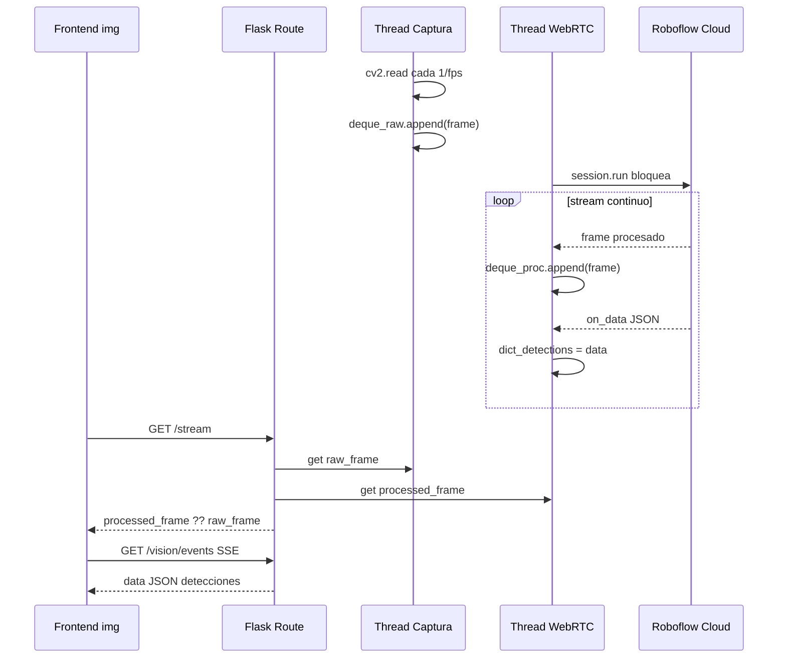
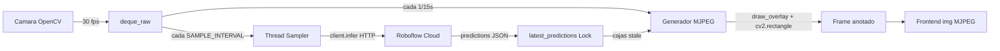
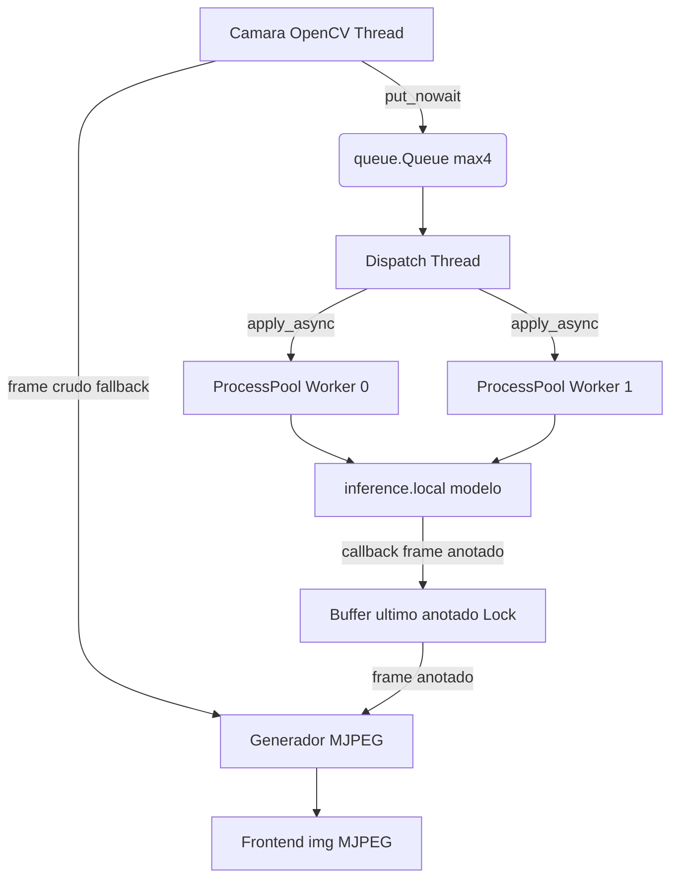
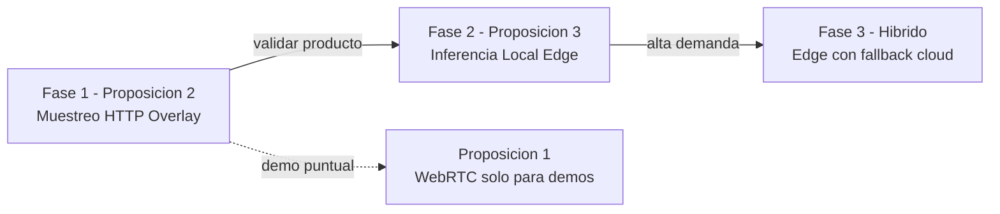

# Proposiciones de Arquitectura — Visión Computacional Asíncrona con Roboflow — Argos2

> **Documento técnico** — Análisis de tres (3) proposiciones arquitectónicas para integrar la API de Roboflow en Argos2 logrando procesamiento asíncrono con apariencia continua en tiempo real.
> **Fecha:** 2026-06-15
> **Estado:** Borrador para revisión
> **Modo:** Análisis/Arquitectura (sin implementación)

---

## Tabla de Contenidos

1. [Contexto y Arquitectura Actual](#contexto-y-arquitectura-actual)
2. [El Problema Central](#el-problema-central)
3. [Proposición 1 — Sesión WebRTC en Hilo Demonio con Buffer de Último Frame](#proposición-1--sesión-webrtc-en-hilo-demonio-con-buffer-de-último-frame)
4. [Proposición 2 — Muestreo Periódico con SDK HTTP y Pipeline de Overlay Continuo](#proposición-2--muestreo-periódico-con-sdk-http-y-pipeline-de-overlay-continuo)
5. [Proposición 3 — Inferencia Local/Edge con Cola Productor-Consumidor](#proposición-3--inferencia-localedge-con-cola-productor-consumidor)
6. [Tabla Comparativa](#tabla-comparativa)
7. [Recomendación Final](#recomendación-final)

---

## Contexto y Arquitectura Actual

Argos2 es un sistema de vigilancia con cámara y visión computacional construido sobre **Flask (síncrono)** sin uso de `asyncio`, WebSockets ni colas distribuidas. El estado actual del pipeline es:

### Backend

| Componente | Archivo | Rol |
|------------|---------|-----|
| App principal | [`Backend/app.py`](Backend/app.py:39) | Factory `create_app()` registra blueprints, CORS, rate limiter y sirve el frontend estático |
| Rutas de cámara | [`Backend/routes/camera.py`](Backend/routes/camera.py:43) | Endpoints CRUD + streaming MJPEG vía generador [`generate_frames()`](Backend/routes/camera.py:43) |
| Rutas de visión | [`Backend/routes/vision.py`](Backend/routes/vision.py:29) | **STUB**: [`_simulate_processing()`](Backend/routes/vision.py:29) simula progreso en un `threading.Thread` |
| Servicio de cámaras | [`Backend/services/camera_service.py`](Backend/services/camera_service.py:49) | Jerarquía `VideoSource` ABC + `CameraManager` Singleton |

### Modelo de concurrencia actual

Todo el sistema opera con **threads clásicos** (no asyncio):

- Cada fuente de video ([`LocalCamera`](Backend/services/camera_service.py:90), [`IPStreamCamera`](Backend/services/camera_service.py:231), [`ESP32Camera`](Backend/services/camera_service.py:438)) lanza un `threading.Thread` daemon con un loop de captura interno ([`_capture_loop()`](Backend/services/camera_service.py:207)).
- El último frame se guarda en un `collections.deque(maxlen=2)` protegido por `threading.Lock`.
- [`CameraManager`](Backend/services/camera_service.py:691) es un **Singleton** thread-safe que gestiona un `Dict[str, VideoSource]`.
- El streaming al frontend usa **MJPEG sobre HTTP**: el generador [`generate_frames()`](Backend/routes/camera.py:43) hace polling de `camera_manager.get_frame()` en un bucle con `time.sleep(interval)` y produce chunks `multipart/x-mixed-replace`.

### Frontend

- [`Frontend/js/camera.js`](Frontend/js/camera.js:8): módulo `CAMERA` que consume el stream MJPEG con un `` ([`getStreamUrl()`](Frontend/js/camera.js:659)), gestiona reconexión con backoff ([`handleStreamError()`](Frontend/js/camera.js:487)) y tiene un modo low-rate de 1 fps ([`startSingleLowRate()`](Frontend/js/camera.js:429)).
- [`Frontend/js/vision.js`](Frontend/js/vision.js:9): módulo `VISION` con [`processImage()`](Frontend/js/vision.js:18) (POST FormData) y [`pollTaskStatus()`](Frontend/js/vision.js:101) (polling cada 2s). Actualmente solo opera con **imágenes estáticas**.

### Dependencias relevantes

[`Backend/requirements.txt`](Backend/requirements.txt:1) **no incluye** `inference-sdk`, `aiohttp`, `websockets`, ni ninguna librería asíncrona. Solo tiene `opencv-python`, `Flask`, `Flask-Limiter`, `requests`.

---

## El Problema Central

El snippet de Roboflow proporcionado usa la **API de streaming WebRTC** del `inference_sdk`. El problema es esta línea:

```python
session.run()   # BLOQUEA el thread hasta que se cierre la sesión
```

`session.run()` es **síncrono y bloqueante**: mantiene el loop de eventos del WebRTC activo y no retorna hasta que se llama a `session.close()`. Si se invoca dentro de un endpoint Flask o del loop de captura de una cámara, **congela todo el flujo**.

La pregunta del usuario es:

> **¿Cómo hacer que las cámaras activas realicen las llamadas a la API de forma asíncrona, pero dando la impresión de ser continuas (tiempo real/streaming)?**

Esto descompone en dos sub-problemas:

1. **Asincronía del cómputo**: las llamadas a Roboflow no deben bloquear ni el loop de captura de la cámara, ni los endpoints HTTP de Flask, ni el streaming MJPEG.
2. **Ilusión de continuidad**: el usuario debe percibir video fluido con detecciones, aunque el cómputo de IA ocurra en segundo plano (posiblemente con latencia o muestreo).

Las tres proposiciones siguientes resuelven ambos sub-problemas con enfoques fundamentalmente distintos.

---

## Proposición 1 — Sesión WebRTC en Hilo Demonio con Buffer de Último Frame

### Resumen en una línea

Ejecutar el `session.run()` bloqueante de Roboflow WebRTC dentro de un **thread daemon dedicado por cámara**; los callbacks `@session.on_frame` / `@session.on_data` escriben en un buffer compartido del que el generador MJPEG existente lee en paralelo.

### Cómo funciona (descripción técnica)

La API WebRTC de Roboflow ya es un stream **continuo y en tiempo real**: el servidor de Roboflow procesa cada frame entrante y devuelve frames anotados + datos de detección vía los callbacks decorados. El único problema es que `session.run()` bloquea.

La solución es aislar esa llamada bloqueante en su propio thread daemon, independiente del loop de captura de OpenCV y de los endpoints Flask:

1. Al "activar visión" sobre una cámara, se crea una sesión WebRTC con un `WebcamSource` configurado para leer de la misma fuente que el `VideoSource` de Argos2 (o se envían los frames capturados por OpenCV como frames del source).
2. Se lanza un `threading.Thread(daemon=True)` que ejecuta `session.run()`. Este thread vive mientras dure la sesión.
3. El callback `@session.on_frame(frame, metadata)` guarda el **último frame procesado** en un `deque(maxlen=2)` con lock (réplica exacta del patrón ya usado en [`LocalCamera._frame_deque`](Backend/services/camera_service.py:111)).
4. El callback `@session.on_data(data, metadata)` guarda el último JSON de detecciones (`counts`, `tracked_predictions`, etc.) en un campo compartido.
5. El generador MJPEG existente [`generate_frames()`](Backend/routes/camera.py:43) se modifica (o se crea una variante `generate_annotated_frames()`) para servir el frame procesado por WebRTC si está disponible; si la sesión está caída/reconectando, sirve el frame crudo como fallback.

### La estrategia de "ilusión continua"

El stream WebRTC **es inherentemente continuo**: Roboflow procesa y devuelve frames a su propio ritmo (típicamente 10-30 fps según el plan GPU). La continuidad no necesita "truco" porque la fuente ya fluye. El mecanismo de **fallback** es lo que garantiza que nunca se vea congelado:

- **Frame procesado disponible** → se sirve el frame con detecciones dibujadas (calidad IA).
- **Gap temporal / reconexión WebRTC** → se sirve el **último frame procesado conocido** (buffer), repetido si es necesario, para evitar parpadeo.
- **Sesión completamente caída** → se sirve el **frame crudo** de OpenCV como degradación elegante, manteniendo video vivo aunque sin IA.

Los datos de detección (`on_data`) se entregan al frontend por un canal paralelo (SSE o polling) para poblar paneles de conteo/eventos sin mezclarlos con el stream binario MJPEG.

### Modelo de concurrencia

```
┌─────────────────────────────────────────────────────────────────┐
│  Process Flask (síncrono, threads del dev server)               │
│                                                                  │
│  ┌──────────────────┐        ┌───────────────────────────────┐ │
│  │ Thread Captura   │        │ Thread WebRTC Roboflow daemon │ │
│  │ OpenCV _capture  │        │ session.run()  ← BLOQUEANTE   │ │
│  │ _loop()          │        │   │                            │ │
│  │  → frame crudo   │        │   ├─ @on_frame → deque proc.  │ │
│  │  → deque crudo   │        │   └─ @on_data  → dict detecc. │ │
│  └────────┬─────────┘        └──────────────┬────────────────┘ │
│           │                                   │                  │
│           ▼                                   ▼                  │
│  ┌──────────────────────────────────────────────────────────┐  │
│  │     Buffer compartido por cámara (deque + Lock)          │  │
│  │     last_raw_frame   |   last_processed_frame            │  │
│  │     last_detections                                      │  │
│  └──────────────────────────┬───────────────────────────────┘  │
│                             │                                    │
│  ┌──────────────────────────▼───────────────────────────────┐  │
│  │  Generador MJPEG generate_annotated_frames()              │  │
│  │  Sirve: processed_frame ?? raw_frame                      │  │
│  └──────────────────────────┬───────────────────────────────┘  │
│                             │                                    │
│                      HTTP multipart/x-mixed-replace              │
│                             ▼                                    │
│                      Frontend                       │
└─────────────────────────────────────────────────────────────────┘
```

- **Thread de captura OpenCV**: ya existe (sin cambios).
- **Thread de sesión WebRTC**: nuevo, uno por cámara con visión activa. Usa `threading.Thread(daemon=True, name=f"RoboflowWebRTC-{camera_id}")`.
- **Generador MJPEG**: corre dentro del thread del request Flask (ya es así hoy).
- **Canal de datos**: endpoint SSE `GET /api/cameras/<id>/vision/events` con `Response(generator, mimetype='text/event-stream')` o endpoint de polling.



### Pros

- **Latencia mínima**: WebRTC ofrece el pipeline de IA más fluido (100-300 ms end-to-end) porque el cómputo ocurre en GPU de Roboflow y el transporte es en tiempo real.
- **Calidad de detección óptima**: Roboflow ejecuta el workflow completo (`tracked_predictions`, `vision_events_status`) en cada frame, no en muestras.
- **Reutiliza el patrón existente**: el buffer `deque + Lock` es idéntico al que ya usan las subclases de [`VideoSource`](Backend/services/camera_service.py:49), por lo que el equipo ya lo domina.
- **Degradación elegante**: el fallback a frame crudo garantiza que el video nunca se congele.
- **Sin `asyncio`**: encaja perfectamente con la base de código 100% síncrona con threads.

### Contras

- **`session.run()` bloqueante**: cada cámara con visión activa ocupa un thread permanentemente. Si el SDK tiene recursos internos no liberados, puede haber fugas.
- **Complejidad del SDK WebRTC**: `inference_sdk.webrtc` tiene dependencias pesadas (aiortce/libwebrtc), STUN/TURN, y comportamiento que no se controla directamente.
- **Acoplamiento a la nube**: si Roboflow cae, toda la IA cae (solo queda el fallback de video crudo).
- **Doble captura**: según cómo se configure el `WebcamSource`, podría haber conflicto de acceso al dispositivo de cámara con el `cv2.VideoCapture` existente. Hay que resolver quién es el dueño del frame source.

### Implicaciones de costo / latencia / escalabilidad

| Dimensión | Valor |
|-----------|-------|
| **Plan Roboflow** | `webrtc-gpu-medium` — el más caro. Cobro por **minutos-GPU**. |
| **Costo 24/7 x 1 cámara** | Una sesión WebRTC activa continuamente consume GPU-minutes ininterrumpidamente. Para vigilancia permanente esto es **prohibitivo**. |
| **Latencia IA** | 100-300 ms (óptima) |
| **Latencia de display** | 150-400 ms total |
| **Cámaras simultáneas** | Una sesión WebRTC por cámara. La escalabilidad vertical está limitada por el presupuesto de GPU-minutes y el número de sesiones concurrentes permitidas por la cuenta. |
| **Rate limits** | Las sesiones WebRTC tienen límites de concurrencia por workspace; 5-10 cámaras ya empiezan a ser costosas. |

### Esfuerzo de integración estimado

| Archivo | Cambio |
|---------|--------|
| [`Backend/requirements.txt`](Backend/requirements.txt:1) | Añadir `inference-sdk` |
| **NUEVO** `Backend/services/roboflow_webrtc_service.py` | Clase `RoboflowWebRTCSession` que envuelve `session.run()` en thread, expone `get_processed_frame()` y `get_detections()` |
| [`Backend/services/camera_service.py`](Backend/services/camera_service.py:691) | Añadir a `CameraManager` métodos `enable_vision(camera_id)`, `disable_vision(camera_id)` y gestión del ciclo de vida de sesiones |
| [`Backend/routes/camera.py`](Backend/routes/camera.py:43) | Nuevo endpoint `POST /api/cameras/<id>/vision/start|stop`, nuevo generador `generate_annotated_frames()`, endpoint SSE `GET /api/cameras/<id>/vision/events` |
| [`Backend/app.py`](Backend/app.py:79) | El `_cleanup_cameras()` del `atexit` debe además cerrar sesiones WebRTC |
| [`Frontend/js/camera.js`](Frontend/js/camera.js:346) | Botón toggle de visión por cámara, consumo de EventSource para datos, cambio de URL de stream al anotado |
| `.env.example` | `ROBOFLOW_API_KEY`, `ROBOFLOW_WORKSPACE`, `ROBOFLOW_WORKFLOW` |

### Pseudocódigo ilustrativo

```python
# Backend/services/roboflow_webrtc_service.py — CONCEPTO
import threading, collections, cv2
from inference_sdk import InferenceHTTPClient
from inference_sdk.webrtc import WebcamSource, StreamConfig

class RoboflowWebRTCSession:
    def __init__(self, camera_source, workflow, workspace, api_key):
        self._client = InferenceHTTPClient.init(
            api_url="https://serverless.roboflow.com", api_key=api_key)
        self._source = camera_source       # WebcamSource que alimenta frames
        self._config = StreamConfig(
            stream_output=["output_image"],
            data_output=["counts","tracked_predictions","vision_events_status"],
            processing_timeout=3600,
            requested_plan="webrtc-gpu-medium", requested_region="us")
        self._workflow = workflow
        self._workspace = workspace
        self._proc_deque = collections.deque(maxlen=2)
        self._lock = threading.Lock()
        self._latest_data = None
        self._session = None
        self._thread = None
        self._running = False

    def start(self):
        self._session = self._client.webrtc.stream(
            source=self._source, workflow=self._workflow,
            workspace=self._workspace, image_input="image", config=self._config)
        self._wire_callbacks()
        self._running = True
        self._thread = threading.Thread(
            target=self._run_blocking, daemon=True,
            name="RoboflowWebRTC")
        self._thread.start()

    def _run_blocking(self):
        try:
            self._session.run()            # bloquea aquí hasta close()
        except Exception as e:
            self._running = False

    @self._session.on_frame               # frame procesado entra al buffer
    def _on_frame(frame, metadata):
        with self._lock:
            self._proc_deque.append(frame)

    @self._session.on_data()
    def _on_data(data, metadata):
        self._latest_data = data

    def get_processed_frame(self):
        with self._lock:
            if not self._proc_deque: return None
            ok, enc = cv2.imencode('.jpg', self._proc_deque[-1],
                                    [cv2.IMWRITE_JPEG_QUALITY, 80])
            return enc.tobytes() if ok else None

    def stop(self):
        self._running = False
        if self._session: self._session.close()
```

---

## Proposición 2 — Muestreo Periódico con SDK HTTP y Pipeline de Overlay Continuo

### Resumen en una línea

No usar WebRTC; en su lugar, **muestrear** un frame cada N segundos, enviarlo al SDK HTTP de inferencia estándar de Roboflow (`client.infer()`), y dibujar continuamente las **últimas detecciones conocidas** sobre cada frame crudo del stream MJPEG, creando una ilusión de IA en tiempo real.

### Cómo funciona (descripción técnica)

Esta proposición abandona el streaming WebRTC y usa la API HTTP de inferencia simple (request/response), que es asíncrona por naturaleza porque cada llamada es independiente y no bloqueante para quien la invoca desde un thread separado:

1. El loop de captura OpenCV existente (`_capture_loop`) sigue funcionando intacto, llenando el deque de frames crudos a 15-30 fps.
2. Un **thread sampler** independiente, por cámara, toma un frame del deque cada `SAMPLE_INTERVAL` segundos (configurable, p. ej. 1.0-2.0s).
3. Ese frame se envía a Roboflow con `client.infer(frame, model_id)` (o workflow HTTP). La respuesta contiene `predictions` (bounding boxes, clases, confianza).
4. Las predicciones se guardan en `latest_predictions` (un campo compartido con lock + timestamp).
5. El generador MJPEG, **antes de servir cada frame**, dibuja con OpenCV (`cv2.rectangle`, `cv2.putText`) las cajas de `latest_predictions` sobre el frame crudo. Como el frame cambia 15-30 veces por segundo pero las cajas se actualizan cada 1-2s, el resultado visual es video fluido con cajas que se mueven "siguiendo" objetos.

### La estrategia de "ilusión continua"

Este es el **truco del overlay** — el núcleo de la proposición:

```
 FPS de captura:   30 fps → frames crudos nuevos cada 33ms
 FPS de inferencia: 0.5-1 fps → detecciones nuevas cada 1-2s
 FPS de display:    15-30 fps → cada frame crudo + cajas STALE dibujadas
```

El usuario ve un video a 15-30 fps totalmente fluido. Las cajas de detección se "pegan" a los objetos y se redibujan en cada frame, de modo que aparentan seguimiento continuo. En la práctica, para objetos que no se mueven rápido (vigilancia típica: personas caminando, vehículos), un desfase de 1-2s en las cajas es **imperceptible o aceptable**.

Estrategias adicionales para mejorar la ilusión:

- **Suavizado de movimiento**: interpolar la posición de las cajas entre la detección antigua y la nueva (lerp) para que no "salten" bruscamente cuando llega una inferencia nueva.
- **Fade de confianza**: si una predicción es muy vieja (>3s), reducir su opacidad o mostrarla en gris, indicando que está desactualizada.
- **Detección de movimiento**: si OpenCV detecta mucho movimiento óptico entre el frame muestreado y el actual, adelantar el siguiente muestreo (muestreo adaptativo).

### Modelo de concurrencia

```
┌──────────────────────────────────────────────────────────────────┐
│  Por cámara:                                                      │
│                                                                   │
│  ┌────────────────┐     ┌─────────────────────────────────────┐  │
│  │ Thread Captura │     │ Thread Sampler + Inferencia HTTP    │  │
│  │ _capture_loop  │     │  cada SAMPLE_INTERVAL:              │  │
│  │  cv2.read      │     │   frame = deque_raw[-1]             │  │
│  │  → deque_raw   │────▶│   result = client.infer(frame)  ←──│──│─ Roboflow Cloud HTTP
│  └────────────────┘     │   latest_predictions = result      │  │   request/response
│                         │   latest_ts = now()                 │  │
│                         └──────────────┬──────────────────────┘  │
│                                        │                          │
│                         ┌──────────────▼──────────────────────┐  │
│                         │ Estado compartido (Lock):            │  │
│                         │   latest_predictions + timestamp     │  │
│                         └──────────────┬──────────────────────┘  │
│  ┌──────────────────────────────────────▼─────────────────────┐  │
│  │  Generador MJPEG generate_annotated_frames()                │  │
│  │   frame = get_raw_frame()           # cada 1/15s           │  │
│  │   annotated = draw_boxes(frame, latest_predictions)        │  │
│  │   yield annotated                                           │  │
│  └─────────────────────────────────┬──────────────────────────┘  │
│                                    ▼                              │
│                        Frontend  MJPEG               │
└──────────────────────────────────────────────────────────────────┘
```

- **Thread de captura**: sin cambios.
- **Thread sampler**: nuevo, `threading.Thread(daemon=True)`. Realiza la inferencia HTTP con `requests` (bloqueante) pero aislada. Opcionalmente un `concurrent.futures.ThreadPoolExecutor` para evitar que una inferencia lenta retrase el siguiente muestreo.
- **Generador MJPEG**: corre en el thread del request; dibuja overlay con OpenCV (operación CPU ligera, <5ms).



### Pros

- **Mucho más barato**: se paga solo por inferencia bajo demanda, no por streaming continuo. Muestreo a 1s = 1 inferencia/seg/cámara. Control total del gasto ajustando `SAMPLE_INTERVAL`.
- **Control total del frame source**: OpenCV es el único dueño de `cv2.VideoCapture`; no hay conflicto con `WebcamSource` de Roboflow.
- **Ilusión continua muy convincente**: para vigilancia de objetos de movimiento lento, el overlay de cajas sobre video fluido es prácticamente indistinguible de IA en tiempo real.
- **Resiliencia**: si Roboflow no responde, el video sigue fluyendo (sin cajas), y cuando recupera, las cajas vuelven. No hay sesión persistente que mantener.
- **Sin dependencias WebRTC**: no se necesita `aiortc` ni configuración STUN/TURN.
- **Escalable horizontalmente**: el muestreo se puede repartir entre workers; el throttle es trivial (subir `SAMPLE_INTERVAL`).
- **Compatible con el rate limiter existente**: [`Flask-Limiter`](Backend/middleware/rate_limiter.py) ya está integrado y puede regular inferencias.

### Contras

- **Las detecciones NO son en tiempo real**: hay un desfase de 1-3s entre lo que ocurre y lo que se anota. Para detección de intrusión instantánea esto puede ser crítico.
- **Las cajas "se quedan pegadas"**: si un objeto sale del cuadro, su caja persiste hasta la próxima inferencia (salvo lógica de expiración por timestamp).
- **Carga de dibujo**: dibujar cajas en cada frame a 15-30 fps consume CPU (ligera, pero escala con el número de cámaras).
- **No hay tracking nativo**: a menos que se implemente tracking entre muestras (SORT/ByteTrack), los IDs de objetos pueden cambiar entre inferencias.

### Implicaciones de costo / latencia / escalabilidad

| Dimensión | Valor |
|-----------|-------|
| **Plan Roboflow** | Pay-per-inference (HTTP estándar). Mucho más económico que WebRTC-GPU. |
| **Costo por cámara @ 1 muestra/s** | ~3600 inferencias/hora. Ajustable: subir a 2s = mitad de costo. |
| **Latencia de detección** | 1-3s (stale), pero display fluido a 15-30 fps |
| **Latencia de inferencia HTTP** | 200-800 ms por llamada (red + cómputo cloud) |
| **Cámaras simultáneas** | Limitado por rate limits de la API y ancho de banda de subida. Con throttle adaptativo se pueden manejar 10-20 cámaras. |
| **Estrategia de ahorro** | Muestreo adaptativo: aumentar intervalo cuando no hay movimiento; reducir cuando lo hay. |

### Esfuerzo de integración estimado

| Archivo | Cambio |
|---------|--------|
| [`Backend/requirements.txt`](Backend/requirements.txt:1) | Añadir `inference-sdk` |
| **NUEVO** `Backend/services/roboflow_http_service.py` | Clase `RoboflowInferenceSampler` con thread de muestreo, `client.infer()`, y `draw_overlay()` con OpenCV |
| [`Backend/services/camera_service.py`](Backend/services/camera_service.py:691) | `CameraManager.enable_vision(camera_id, interval)`, almacenar referencia al sampler por cámara |
| [`Backend/routes/camera.py`](Backend/routes/camera.py:43) | Nuevo generador `generate_annotated_frames()`, endpoint `POST /api/cameras/<id>/vision/start` con parámetro `interval` |
| [`Frontend/js/camera.js`](Frontend/js/camera.js:346) | Toggle de visión, alternar URL de stream entre `/stream` y `/vision/stream` |
| `.env.example` | `ROBOFLOW_API_KEY`, `ROBOFLOW_MODEL_ID`, `SAMPLE_INTERVAL` |

### Pseudocódigo ilustrativo

```python
# Backend/services/roboflow_http_service.py — CONCEPTO
import threading, time, cv2, numpy as np
from inference_sdk import InferenceHTTPClient

class RoboflowInferenceSampler:
    def __init__(self, camera_source, model_id, api_key, interval=1.5):
        self._source = camera_source       # VideoSource de Argos2
        self._client = InferenceHTTPClient.init(
            api_url="https://serverless.roboflow.com", api_key=api_key)
        self._model_id = model_id
        self._interval = interval
        self._predictions = None
        self._pred_ts = 0
        self._lock = threading.Lock()
        self._running = False
        self._thread = None

    def start(self):
        self._running = True
        self._thread = threading.Thread(target=self._loop, daemon=True)
        self._thread.start()

    def _loop(self):
        while self._running:
            # Tomar frame crudo del VideoSource
            frame = self._source._frame_deque[-1] if self._source._frame_deque else None
            if frame is not None:
                try:
                    result = self._client.infer(frame, self._model_id)
                    with self._lock:
                        self._predictions = result.get("predictions", [])
                        self._pred_ts = time.time()
                except Exception:
                    pass                # tolerante a fallos puntuales
            time.sleep(self._interval)

    def draw_overlay(self, frame_bgr):
        """Dibuja cajas stale sobre un frame crudo. Retorna frame anotado."""
        with self._lock:
            preds = list(self._predictions) if self._predictions else []
            age = time.time() - self._pred_ts
        for p in preds:
            x, y, w, h = int(p["x"]-p["width"]/2), int(p["y"]-p["height"]/2), \
                         int(p["width"]), int(p["height"])
            color = (0, 255, 0) if age < 2 else (128, 128, 0)  # gris si stale
            cv2.rectangle(frame_bgr, (x, y), (x+w, y+h), color, 2)
            cv2.putText(frame_bgr, f'{p["class"]} {p["confidence"]:.2f}',
                        (x, y-8), cv2.FONT_HERSHEY_SIMPLEX, 0.5, color, 1)
        return frame_bgr

    def stop(self):
        self._running = False
```

---

## Proposición 3 — Inferencia Local/Edge con Cola Productor-Consumidor

### Resumen en una línea

Ejecutar el modelo de Roboflow **localmente** en el servidor de Argos2 usando el paquete `inference` (no la nube), con un patrón **productor-consumidor** basado en colas y un pool de procesos para evitar el GIL durante la inferencia pesada.

### Cómo funciona (descripción técnico)

Roboflow ofrece el paquete `inference` (open-source) que permite descargar y ejecutar los modelos entrenados **en la propia máquina**, sin llamar a la nube. Esto elimina la latencia de red y el costo por inferencia. El modelo corre sobre CPU (lento) o GPU local (rápido).

La arquitectura separa la captura de la inferencia mediante una **cola thread-safe** y usa `multiprocessing` para el cómputo del modelo (que es CPU/GPU-intensivo y sufriría el GIL si corriera en un thread Python):

1. El loop de captura existente ([`_capture_loop()`](Backend/services/camera_service.py:207)) actúa como **productor**: cada N frames (o cada frame), encola una copia del frame en una `queue.Queue(maxsize=4)` con `put_nowait()` (descarta si la cola está llena — contrapresión natural).
2. Un **pool de workers** (`multiprocessing.Pool` o `concurrent.futures.ProcessPoolExecutor`) consume frames de la cola y ejecuta la inferencia local. Cada worker carga el modelo una vez y reutiliza la sesión.
3. El resultado (frame anotado + detecciones) se escribe de vuelta en un buffer compartido (usando `multiprocessing.Manager` o pipes para pasar arrays numpy).
4. El generador MJPEG sirve el frame anotado del buffer, con fallback al frame crudo si el worker está rezagado.

### La estrategia de "ilusión continua"

Como la inferencia es local, la latencia es de **20-100 ms** (con GPU) o **100-500 ms** (con CPU). Esto permite procesar a una tasa cercana al tiempo real. La ilusión continua se logra con dos mecanismos:

- **Procesamiento a máxima velocidad del hardware**: con GPU, se pueden procesar 15-30 fps reales → verdadero tiempo real, sin truco.
- **Overlay del último resultado (como en Proposición 2)** si el hardware es CPU-only y no alcanza los 15 fps: los frames intermedios muestran las detecciones de la última inferencia completada. La diferencia con la Proposición 2 es que aquí el "stale" dura 200-500 ms en vez de 1-3s, haciendo la ilusión **casi perfecta**.
- **Triple buffer de frames**: un buffer para el frame crudo entrante, uno para el frame en proceso, y uno para el último frame anotado listo. El generador siempre lee del buffer listo, garantizando que nunca bloquee esperando al worker.

### Modelo de concurrencia

```
┌───────────────────────────────────────────────────────────────────┐
│  Process principal Flask                                          │
│                                                                    │
│  ┌──────────────┐        ┌─────────────────┐                      │
│  │ Thread       │ frame  │ queue.Queue     │                      │
│  │ Captura      │───────▶│  maxsize=4      │                      │
│  │ productor    │ put    │  put_nowait     │                      │
│  └──────────────┘        └────────┬────────┘                      │
│                                   │ get                            │
│  ┌────────────────────────────────▼────────────────────────────┐ │
│  │  Dispatch thread (puente thread → multiprocessing)          │ │
│  │  pool.apply_async(run_inference, (frame,))                  │ │
│  └────────────────────────────────┬────────────────────────────┘ │
│                                   │                                │
│  ┌────────────────────────────────▼────────────────────────────┐ │
│  │  ProcessPoolExecutor (N workers)   ← procesos SEPARADOS     │ │
│  │  ┌──────────┐  ┌──────────┐  ┌──────────┐                   │ │
│  │  │ Worker 0 │  │ Worker 1 │  │ Worker 2 │                   │ │
│  │  │ modelo   │  │ modelo   │  │ modelo   │                   │ │
│  │  │ cargado  │  │ cargado  │  │ cargado  │                   │ │
│  │  │ infer()  │  │ infer()  │  │ infer()  │                   │ │
│  │  └────┬─────┘  └────┬─────┘  └────┬─────┘                   │ │
│  └───────┼─────────────┼─────────────┼──────────────────────────┘ │
│          │    resultado (frame anotado via callback)               │
│          ▼                                                          │
│  ┌──────────────────────────────────────────────────────────────┐ │
│  │  Buffer triple: último frame anotado listo (Lock)            │ │
│  └──────────────────────────┬───────────────────────────────────┘ │
│                             ▼                                      │
│  ┌──────────────────────────────────────────────────────────────┐ │
│  │  Generador MJPEG → annotated_frame ?? raw_frame              │ │
│  └──────────────────────────────────────────────────────────────┘ │
└───────────────────────────────────────────────────────────────────┘
```

- **Thread de captura (productor)**: ya existe.
- **Dispatch thread**: puente entre el thread y el pool de procesos (porque `queue.Queue` es thread-safe pero no process-safe; se usa un thread que alimenta el pool).
- **ProcessPoolExecutor**: procesos OS separados, cada uno con su modelo cargado. Eludiendo el GIL durante la inferencia de la red neuronal.
- **Buffer de resultado**: protegido con lock, leído por el generador MJPEG.



### Pros

- **Cero costo cloud**: el modelo corre localmente. Sin GPU-minutes, sin rate limits externos.
- **Latencia mínima**: sin red, la inferencia es 20-100 ms (GPU) o 100-500 ms (CPU). La ilusión continua es casi perfecta.
- **Privacidad total**: los frames nunca salen del servidor. Crítico para vigilancia sensible.
- **Funciona offline**: sin dependencia de internet.
- **Escalabilidad predecible**: el límite es el hardware local, que se controla y dimensiona.
- **Independencia de proveedor**: si en el futuro se cambia de Roboflow a YOLOv8/MMDetection, la arquitectura no cambia.

### Contras

- **Requisitos de hardware**: para tiempo real con múltiples cámaras se necesita GPU (NVIDIA con CUDA). En CPU solo, 1-3 cámaras a baja resolución.
- **Complejidad de procesos**: `multiprocessing` en Python tiene overhead de serialización (pickling de frames numpy entre procesos). Hay que optimizar memoria compartida (`multiprocessing.shared_memory`).
- **Carga de modelo**: cada worker carga el modelo en RAM/VRAM. Con modelos YOLO grandes (100-500 MB), 4 workers = 1-2 GB.
- **Sin acceso a workflows avanzados de Roboflow**: el paquete `inference` local soporta detección/clasificación, pero los workflows complejos (`vision_events_status`, tracking avanzado) del cloud pueden no estar disponibles o requerir configuración.
- **Mantenimiento del modelo**: hay que gestionar versiones del modelo, actualizaciones y rotación de API keys para descarga.

### Implicaciones de costo / latencia / escalabilidad

| Dimensión | Valor |
|-----------|-------|
| **Costo cloud Roboflow** | $0 recurrente (solo se usa para entrenar/exportar el modelo) |
| **Costo hardware** | GPU NVIDIA (p. ej. T4/RTX 3060 ~$300-500) para producción multi-cámara |
| **Latencia IA** | 20-100 ms (GPU), 100-500 ms (CPU) |
| **Cámaras simultáneas** | GPU T4: ~8-12 cámaras a 720p/15fps; CPU moderno: 2-4 cámaras a VGA |
| **Escalabilidad** | Vertical (más GPU) o horizontal (más nodos edge). Totalmente bajo control. |

### Esfuerzo de integración estimado

| Archivo | Cambio |
|---------|--------|
| [`Backend/requirements.txt`](Backend/requirements.txt:1) | Añadir `inference` (paquete local de Roboflow), posiblemente `torch`, `onnxruntime` |
| **NUEVO** `Backend/services/local_inference_service.py` | `LocalInferenceEngine` con `ProcessPoolExecutor`, carga de modelo, cola, buffer de resultados |
| [`Backend/services/camera_service.py`](Backend/services/camera_service.py:691) | `CameraManager.enable_local_vision(camera_id)`, integración del motor de inferencia |
| [`Backend/routes/camera.py`](Backend/routes/camera.py:43) | Endpoint `POST /api/cameras/<id>/vision/local/start`, generador `generate_local_annotated_frames()` |
| [`Backend/app.py`](Backend/app.py:79) | `_cleanup_cameras()` debe cerrar el pool de procesos |
| [`Frontend/js/camera.js`](Frontend/js/camera.js:346) | Toggle de visión, consumo del stream anotado |

### Pseudocódigo ilustrativo

```python
# Backend/services/local_inference_service.py — CONCEPTO
import threading, queue
from concurrent.futures import ProcessPoolExecutor
from inference.models.utils import get_model

_model = None                       # cargado por cada worker una vez

def _worker_init(model_id, api_key):
    global _model
    _model = get_model(model_id=model_id, api_key=api_key)

def _run_inference(frame_bgr):
    global _model
    preds = _model.infer(frame_bgr)
    annotated = draw_detections(frame_bgr, preds)
    return annotated, preds

class LocalInferenceEngine:
    def __init__(self, model_id, api_key, num_workers=2):
        self._frame_queue = queue.Queue(maxsize=4)
        self._pool = ProcessPoolExecutor(
            max_workers=num_workers,
            initializer=_worker_init,
            initargs=(model_id, api_key))
        self._latest_annotated = None
        self._lock = threading.Lock()
        self._running = False

    def submit_frame(self, frame_bgr):
        try:
            self._frame_queue.put_nowait(frame_bgr)   # contrapresión
        except queue.Full:
            pass                                        # descarta si saturado

    def start_dispatch(self):
        self._running = True
        threading.Thread(target=self._dispatch_loop, daemon=True).start()

    def _dispatch_loop(self):
        while self._running:
            frame = self._frame_queue.get()             # bloquea hasta frame
            future = self._pool.submit(_run_inference, frame)
            future.add_done_callback(self._on_result)

    def _on_result(self, future):
        try:
            annotated, preds = future.result()
            with self._lock:
                self._latest_annotated = annotated
        except Exception:
            pass

    def get_annotated_frame(self):
        with self._lock:
            return self._latest_annotated
```

---

## Tabla Comparativa

| Dimensión | Proposición 1: WebRTC en Hilo | Proposición 2: Muestreo HTTP + Overlay | Proposición 3: Inferencia Local/Edge |
|-----------|-------------------------------|----------------------------------------|--------------------------------------|
| **Enfoque de cómputo** | Cloud, streaming continuo | Cloud, inferencia por demanda | Local, en el servidor |
| **Calidad de la ilusión continua** | ⭐⭐⭐⭐⭐ Real (stream nativo) | ⭐⭐⭐⭐ Cajas stale sobre video fluido | ⭐⭐⭐⭐⭐ Casi real (stale 200-500ms) |
| **Latencia de detección** | 100-300 ms | 1-3000 ms | 20-500 ms |
| **Latencia de display** | 150-400 ms | 15-60 ms (video crudo fluido) | 30-100 ms |
| **Costo cloud recurrente** | 🔴 Alto (GPU-minutes 24/7) | 🟡 Medio (pay-per-infer, controlable) | 🟢 Cero |
| **Costo hardware** | 🟢 Nada extra | 🟢 Nada extra | 🟡 GPU recomendada |
| **Depende de internet** | Sí (crítico) | Sí (tolerante a caídas) | No |
| **Privacidad (frames salen)** | Sí, salen a Roboflow | Sí, salen muestras | No, todo local |
| **Complejidad de implementación** | Media (SDK WebRTC + threads) | Baja-Media (threads + OpenCV draw) | Alta (multiprocessing + modelo local) |
| **Archivos nuevos** | 1 servicio | 1 servicio | 1 servicio |
| **Archivos modificados** | 5-6 | 4-5 | 5-6 |
| **Cambio de paradigma** | Mínimo (más threads) | Mínimo (más un thread + draw) | Medio (introduce procesos) |
| **Escalabilidad multi-cámara** | Limitada por presupuesto cloud | Limitada por rate limits API | Limitada por hardware local |
| **Resiliencia ante caída de IA** | Fallback a frame crudo | Video sigue, cajas desaparecen | N/A (no depende de red) |
| **Soporte de workflows Roboflow** | Completo (tracking, events) | Básico (detección/clasificación) | Limitado (según paquete inference) |
| **Adecuado para vigilancia 24/7** | No (costo prohibitivo) | Sí (con throttle) | Sí (óptimo con GPU) |

---

## Recomendación Final

### Para un escenario multi-cámara de vigilancia: **Proposición 2 (Muestreo HTTP + Overlay)** como implementación inicial, con **Proposición 3 (Inferencia Local)** como objetivo de evolución.

**Justificación:**

1. **La Proposición 1 (WebRTC) es inviable para vigilancia permanente.** El cobro por GPU-minutes continuo la descarta para 24/7 con múltiples cámaras. Su valor real es para demos o escenarios de corta duración donde se necesita la máxima calidad de IA en tiempo real. No se recomienda como arquitectura base de producción.

2. **La Proposición 2 es el mejor balance costo/beneficio para empezar.** Encaja con la base de código síncrona con threads de Argos2 sin introducir `asyncio` ni `multiprocessing`. El pipeline de overlay (cajas stale sobre video crudo fluido) produce una experiencia visual convincente para vigilancia de objetos de movimiento lento, que es el caso de uso dominante. El costo es controlable vía `SAMPLE_INTERVAL` y se integra limpiamente con el [`CameraManager`](Backend/services/camera_service.py:691) y el generador MJPEG [`generate_frames()`](Backend/routes/camera.py:43) existentes. Además, su patrón de tolerancia a fallos (el video nunca se congela aunque Roboflow no responda) es ideal para un sistema de vigilancia que no puede dejar de mostrar imágenes.

3. **La Proposición 3 es el destino natural** cuando el sistema madure y la privacidad, latencia y costo sean prioridades definitivas. Para vigilancia real (donde los frames NO deberían salir a la nube por razones de privacidad/seguridad), la inferencia local es la única opción correcta a largo plazo. Sin embargo, requiere inversión en hardware (GPU) y mayor complejidad (`multiprocessing`), por lo que conviene postergarla hasta validar el producto con la Proposición 2.

### Ruta de evolución sugerida



- **Fase 1**: Implementar la Proposición 2 para validar el producto completo (detección + UI + multi-cámara) con bajo costo.
- **Fase 2**: Migrar a la Proposición 3 cuando se requiera 24/7 privado y de baja latencia.
- **Fase 3 (opcional)**: Arquitectura híbrida — inferencia local como primaria, con fallback a Roboflow cloud (Proposición 2) si el hardware local se satura.
- **Uso puntual de la Proposición 1**: reservar WebRTC exclusivamente para demos o sesiones de alta calidad de corta duración donde el costo no sea problema.

### Nota sobre el código existente

Independientemente de la proposición elegida, el punto de extensión natural es el método abstracto [`get_frame()`](Backend/services/camera_service.py:58) de [`VideoSource`](Backend/services/camera_service.py:49) y el generador [`generate_frames()`](Backend/routes/camera.py:43). Se recomienda añadir un método `get_annotated_frame()` paralelo a `get_frame()`, de modo que el pipeline de visión sea opcional y ortogonal a la captura, preservando la abstracción unificada que ya diseñó el equipo (ver recomendación de [`docs/opciones-camara.md`](docs/opciones-camara.md:1184)).

---

> **Documento generado para el proyecto Argos2** — Análisis arquitectónico de integración de Roboflow con procesamiento asíncrono continuo. No contiene implementación; es base para decisión de diseño.
