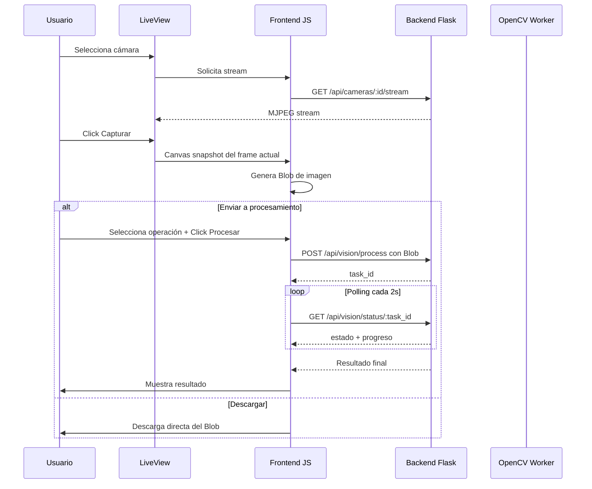
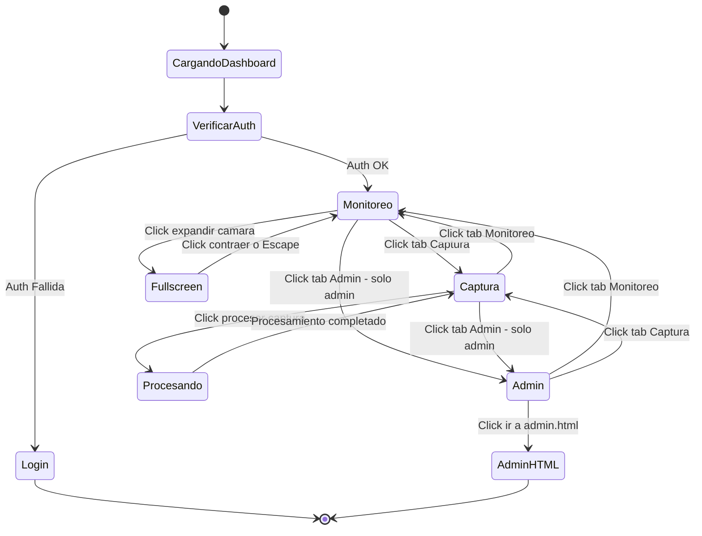
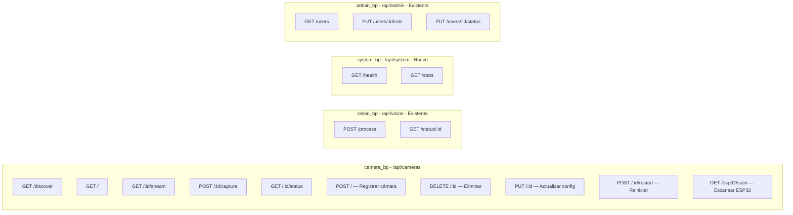
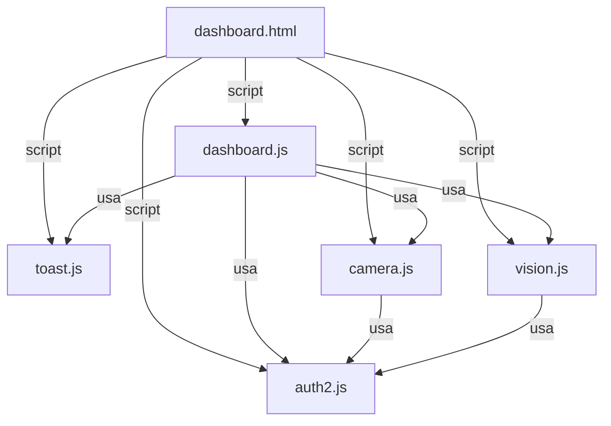
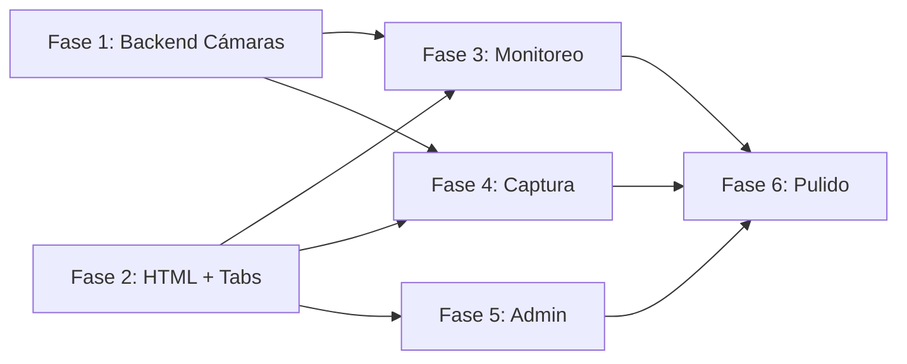

# Plan de Dashboard — Argos2

> **Documento de arquitectura, estética y diseño** para el rediseño integral del dashboard de Argos2.  
> **Fecha:** 2026-06-01  
> **Estado:** Borrador para revisión

---

## Tabla de Contenidos

1. [Visión General](#1-visión-general)
2. [Arquitectura de Pantallas](#2-arquitectura-de-pantallas)
3. [Flujo de Navegación](#3-flujo-de-navegación)
4. [Endpoints del Backend Necesarios](#4-endpoints-del-backend-necesarios)
5. [Estructura de Archivos Nueva](#5-estructura-de-archivos-nueva)
6. [Componentes JavaScript](#6-componentes-javascript)
7. [Estilos CSS Adicionales](#7-estilos-css-adicionales)
8. [SVGs — Código Completo Embebido](#8-svgs--código-completo-embebido)
9. [Mockups ASCII / Descripción Visual](#9-mockups-ascii--descripción-visual)
10. [Plan de Implementación por Fases](#10-plan-de-implementación-por-fases)
11. [Decisiones de Compatibilidad](#11-decisiones-de-compatibilidad)

---

## 1. Visión General

### 1.1 Estado Actual

El dashboard actual de Argos2 es una página simple con una sola funcionalidad: **upload de imágenes estáticas** para procesamiento. La arquitectura existente es:

```
Frontend (vision.js)                Backend (vision.py)
┌─────────────────────┐             ┌──────────────────────────┐
│  Upload de imagen   │──POST──────>│  /api/vision/process     │
│  (FormData)         │             │  → Guarda archivo        │
│                     │             │  → Crea tarea asíncrona  │
│  Polling de estado  │──GET───────>│  /api/vision/status/:id  │
│  (cada 2s)          │             │  → Retorna progreso      │
│                     │<──JSON──────│  → Resultado final       │
└─────────────────────┘             └──────────────────────────┘
```

### 1.2 Objetivo del Rediseño

Transformar el dashboard en un **centro de monitoreo y captura en tiempo real** con tres áreas funcionales:

| Área | Descripción | Usuarios |
|------|-------------|----------|
| **Monitoreo en Vivo** | Grid de cámaras con streaming continuo | Todos |
| **Captura Individual** | Selección de cámara, captura, procesamiento | Todos |
| **Panel Admin (Espejo)** | Resumen rápido + acceso a admin.html | Solo admin |

### 1.3 Stack Tecnológico

| Componente | Tecnología | Notas |
|------------|-----------|-------|
| Backend | Flask + OpenCV | Sin frameworks adicionales |
| Streaming de video | MJPEG sobre HTTP | Ver [`docs/opciones-camara.md`](opciones-camara.md) |
| Frontend | HTML/CSS/JS vanilla | Sin React/Vue/Angular |
| Autenticación | JWT con roles | `usuario` / `admin` |
| Estilo | Glassmorphism cyber/industrial | Variables CSS existentes |

### 1.4 Paleta de Colores Existente

```css
/* De styles.css — NO modificar, solo extender */
--color-primary: #6A1B9A;          /* Púrpura principal */
--color-primary-hover: #8E24AA;    /* Púrpura hover */
--color-text: #FFFFFF;             /* Texto blanco */
--color-text-secondary: rgba(255, 255, 255, 0.7);
--glass-bg: rgba(255, 255, 255, 0.1);
--glass-border: rgba(255, 255, 255, 0.2);
--color-error: #D32F2F;
--color-success: #388E3C;
--color-warning: #F57C00;
--color-info: #1976D2;
```

### 1.5 Convención de SVGs Existentes

Los iconos actuales en [`Frontend/assets/icons/`](../Frontend/assets/icons/) siguen este patrón:

```xml
<svg xmlns="http://www.w3.org/2000/svg" width="24" height="24" viewBox="0 0 24 24"
     fill="none" stroke="white" stroke-width="2"
     stroke-linecap="round" stroke-linejoin="round">
  <!-- paths aquí -->
</svg>
```

Los nuevos SVGs mantendrán esta misma convención pero usarán `stroke="currentColor"` para heredar color CSS.

---

## 2. Arquitectura de Pantallas

### 2.1 Diagrama de Arquitectura General

```mermaid
graph TB
    subgraph Frontend
        DASH[dashboard.html]
        TABS[Tab Navigation]
        
        subgraph Tab Monitoreo
            GRID[Camera Grid View]
            SINGLE_PAN[Single Camera Panoramic]
            FULLSCREEN[Fullscreen Modal]
        end
        
        subgraph Tab Captura
            SELECTOR[Camera Selector]
            LIVEVIEW[Live View]
            CAPTURE[Capture Button]
            PREVIEW[Preview Panel]
            GALLERY[Recent Gallery]
        end
        
        subgraph Tab Admin - Solo rol admin
            SUMMARY[System Summary]
            ADMIN_LINK[Link to admin.html]
        end
    end
    
    subgraph Backend
        API_CAM[/api/cameras/*]
        API_VISION[/api/vision/*]
        STREAM[MJPEG Stream Endpoint]
    end
    
    DASH --> TABS
    TABS --> Tab Monitoreo
    TABS --> Tab Captura
    TABS --> Tab Admin - Solo rol admin
    
    GRID --> API_CAM
    SINGLE_PAN --> STREAM
    LIVEVIEW --> STREAM
    CAPTURE --> API_CAM
    PREVIEW --> API_VISION
```

### 2.2 Pantalla de Monitoreo en Vivo

#### Propósito
Vista principal del dashboard. Muestra todas las cámaras disponibles en tiempo real con indicadores de estado.

#### Comportamiento según cantidad de cámaras

| Cámaras | Layout | Comportamiento |
|---------|--------|---------------|
| 0 | Mensaje de estado | "No se detectaron cámaras" con botón de re-escaneo |
| 1 | Vista panorámica | Imagen grande centrada, actualización a 1-2 fps, diseño elegante |
| 2-4 | Grid 2x2 | Cada cámara en su celda con indicador de estado |
| 5-9 | Grid 3x3 | Celdas más pequeñas, scrollable en móvil |
| 10+ | Grid 4xN | Scroll vertical, paginación opcional |

#### Elementos de la Pantalla

```
┌─────────────────────────────────────────────────────┐
│  [Navbar: Logo | Argos2 - Monitoreo | Usuario|Salir]│
├─────────────────────────────────────────────────────┤
│  [Monitoreo]  [Captura]  [Admin]                    │
├─────────────────────────────────────────────────────┤
│                                                     │
│  ┌─────────────────┐  ┌─────────────────┐          │
│  │  Cam 1    🟢    │  │  Cam 2    🟢    │          │
│  │                 │  │                 │          │
│  │  [Stream Live]  │  │  [Stream Live]  │          │
│  │                 │  │                 │          │
│  │    [Expandir]   │  │    [Expandir]   │          │
│  └─────────────────┘  └─────────────────┘          │
│  ┌─────────────────┐  ┌─────────────────┐          │
│  │  Cam 3    🔴    │  │  Cam 4    🟢    │          │
│  │  Desconectada   │  │  [Stream Live]  │          │
│  │                 │  │                 │          │
│  │    [Expandir]   │  │    [Expandir]   │          │
│  └─────────────────┘  └─────────────────┘          │
│                                                     │
└─────────────────────────────────────────────────────┘
```

#### Componentes específicos

1. **CameraCard** — Tarjeta glass por cada cámara:
   - Header: Nombre de cámara + indicador de estado (LED animado)
   - Body: `` con stream MJPEG o placeholder de error
   - Footer: Botón expandir + botón ir a Captura
   - Animación: `pulse` sutil en el borde cuando está activa

2. **CameraGrid** — Contenedor responsive:
   - CSS Grid con `auto-fit` y `minmax(300px, 1fr)`
   - Gap de 16px entre celdas
   - Scroll suave en overflow

3. **FullscreenModal** — Modal de pantalla completa:
   - Overlay oscuro al 95% del viewport
   - Stream de la cámara expandido
   - Botón contraer en esquina superior derecha
   - Tecla `Escape` para cerrar

4. **StatusBar** — Barra inferior de estado:
   - Cantidad de cámaras conectadas vs totales
   - Última actualización
   - Botón de re-escaneo de red

#### Vista panorámica (1 cámara)

Cuando solo hay 1 cámara detectada:

```
┌─────────────────────────────────────────────────────┐
│  [Navbar]                                           │
├─────────────────────────────────────────────────────┤
│  [Monitoreo]  [Captura]  [Admin]                    │
├─────────────────────────────────────────────────────┤
│                                                     │
│  ┌───────────────────────────────────────────┐      │
│  │                                           │      │
│  │          Cam 1              🟢            │      │
│  │                                           │      │
│  │     [Stream panorámico a 1-2 fps]         │      │
│  │                                           │      │
│  │                                           │      │
│  │              [Expandir]                   │      │
│  └───────────────────────────────────────────┘      │
│                                                     │
│  Estado: 1 cámara conectada | Actualizado hace 2s   │
│                                                     │
└─────────────────────────────────────────────────────┘
```

### 2.3 Pantalla de Captura Individual

#### Propósito
Permitir al usuario seleccionar una cámara, ver su stream en vivo, capturar fotos y enviarlas a procesamiento.

#### Layout

```
┌─────────────────────────────────────────────────────┐
│  [Navbar]                                           │
├─────────────────────────────────────────────────────┤
│  [Monitoreo]  [Captura]  [Admin]                    │
├─────────────────────────────────────────────────────┤
│                                                     │
│  Seleccionar Cámara: [▼ Cam 1 - Frente  ]          │
│                                                     │
│  ┌───────────────────────────────────────────┐      │
│  │                                           │      │
│  │                                           │      │
│  │        [Vista en vivo de cámara]          │      │
│  │                                           │      │
│  │                                           │      │
│  │              [📸 Capturar]                │      │
│  └───────────────────────────────────────────┘      │
│                                                     │
│  ── Captura reciente ──                             │
│  ┌──────────┐  ┌──────────┐  ┌──────────┐          │
│  │  img 1   │  │  img 2   │  │  img 3   │          │
│  │ [Proc]   │  │ [Proc]   │  │ [Proc]   │          │
│  └──────────┘  └──────────┘  └──────────┘          │
│                                                     │
└─────────────────────────────────────────────────────┘
```

#### Elementos de la Pantalla

1. **CameraSelector** — Dropdown o cards de selección:
   - Lista de cámaras disponibles con nombre y estado
   - Al seleccionar, actualiza el LiveView
   - Si no hay cámaras, muestra mensaje con instrucciones

2. **LiveView** — Vista en vivo de la cámara seleccionada:
   - `` con stream MJPEG a mayor frame rate (5-10 fps)
   - Overlay con nombre de cámara y timestamp
   - Botón de captura flotante en la parte inferior

3. **CaptureButton** — Botón de captura de foto:
   - Icono de cámara fotográfica
   - Animación de flash al capturar
   - Al capturar: congela el frame actual → genera preview

4. **PreviewPanel** — Vista previa de la captura:
   - Se muestra debajo del LiveView tras capturar
   - Muestra la imagen capturada con opciones:
     - **Enviar a procesamiento** (detección/clasificación/mejora)
     - **Descargar** la imagen
     - **Descartar** y volver al LiveView
   - Selector de tipo de operación antes de enviar

5. **RecentGallery** — Galería de capturas recientes:
   - Scroll horizontal de thumbnails
   - Máximo 10 capturas recientes (almacenadas en memoria del navegador)
   - Cada thumbnail tiene botón de enviar a procesamiento
   - Se limpia al cerrar sesión

#### Flujo de Captura → Procesamiento



### 2.4 Panel de Admin (Espejo)

#### Propósito
Ofrecer acceso rápido al panel de administración desde el dashboard, visible solo para usuarios con rol `admin`.

#### Comportamiento

- **Si el usuario NO es admin**: El tab "Admin" no se muestra en la navegación
- **Si el usuario ES admin**: Se muestra un tercer tab "Admin" con un panel resumido

#### Layout

```
┌─────────────────────────────────────────────────────┐
│  [Navbar]                                           │
├─────────────────────────────────────────────────────┤
│  [Monitoreo]  [Captura]  [Admin ⚙️]                │
├─────────────────────────────────────────────────────┤
│                                                     │
│  ┌───────────────────────────────────────────┐      │
│  │  ⚙️ Panel de Administración               │      │
│  │                                           │      │
│  │  ┌─────────┐  ┌─────────┐  ┌─────────┐  │      │
│  │  │ 👤 12   │  │ 🟢 4    │  │ 📷 3    │  │      │
│  │  │Usuarios │  │Activos  │  │Cámaras  │  │      │
│  │  └─────────┘  └─────────┘  └─────────┘  │      │
│  │                                           │      │
│  │  ┌───────────────────────────────────┐    │      │
│  │  │  Ir a Panel de Administración →   │    │      │
│  │  │  (navega a admin.html)            │    │      │
│  │  └───────────────────────────────────┘    │      │
│  └───────────────────────────────────────────┘      │
│                                                     │
└─────────────────────────────────────────────────────┘
```

#### Elementos del Panel

1. **StatsCards** — Tarjetas de resumen rápido:
   - Total de usuarios registrados (desde `GET /api/admin/users`)
   - Usuarios activos actualmente
   - Cámaras conectadas
   - Cada tarjeta con icono SVG + número + label

2. **AdminLink** — Botón prominente de navegación:
   - Estilo glass con borde púrpura
   - Icono de escudo/admin
   - Texto: "Ir a Panel de Administración"
   - Al hacer click: `window.location.href = 'admin.html'`

3. **SystemStatus** — Indicador de estado del sistema:
   - Estado del backend (ping a `/api/health`)
   - Última conexión
   - Versión del sistema

#### Detección de Rol Admin

```javascript
// En la inicialización del dashboard
const session = getSession();
const userRole = session?.user?.rol || session?.rol;
const isAdminUser = userRole === 'admin';

// Mostrar/ocultar tab de admin
if (isAdminUser) {
    document.getElementById('tab-admin').style.display = 'flex';
}
```

---

## 3. Flujo de Navegación

### 3.1 Diagrama de Estados



### 3.2 Transiciones entre Tabs

Las transiciones entre pantallas se manejan con CSS transitions:

```javascript
// Cambio de tab con transición suave
function switchTab(tabName) {
    // Ocultar todos los paneles con fade-out
    document.querySelectorAll('.tab-panel').forEach(panel => {
        panel.classList.remove('active');
    });
    
    // Mostrar panel seleccionado con fade-in
    const targetPanel = document.getElementById(`panel-${tabName}`);
    targetPanel.classList.add('active');
    
    // Actualizar indicador activo en tabs
    document.querySelectorAll('.tab-btn').forEach(btn => {
        btn.classList.remove('active');
    });
    document.querySelector(`[data-tab="${tabName}"]`).classList.add('active');
}
```

### 3.3 Estructura HTML de Navegación

```html
<!-- Tab Bar -->
<div class="tab-bar glass-container">
    <button class="tab-btn active" data-tab="monitoreo">
        
        <span>Monitoreo</span>
    </button>
    <button class="tab-btn" data-tab="captura">
        
        <span>Captura</span>
    </button>
    <!-- Solo visible si el usuario es admin -->
    <button class="tab-btn" data-tab="admin" id="tab-admin" style="display: none;">
        
        <span>Admin</span>
    </button>
</div>

<!-- Paneles de contenido -->
<div id="panel-monitoreo" class="tab-panel active">
    <!-- Contenido de monitoreo -->
</div>
<div id="panel-captura" class="tab-panel">
    <!-- Contenido de captura -->
</div>
<div id="panel-admin" class="tab-panel">
    <!-- Contenido de admin -->
</div>
```

---

## 4. Endpoints del Backend Necesarios

### 4.1 Endpoints de Cámaras — Nuevo Blueprint `camera_bp`

#### `GET /api/cameras/discover`
Descubre cámaras disponibles en la red local o conectadas directamente.

| Campo | Valor |
|-------|-------|
| **Método** | `GET` |
| **Auth** | `@token_required` |
| **Rate limit** | `5/minute` |
| **Response 200** | Lista de cámaras descubiertas |

```json
{
    "cameras": [
        {
            "id": "cam_001",
            "name": "Cámara Frente",
            "type": "usb",
            "source": "0",
            "status": "online",
            "resolution": "1920x1080",
            "fps": 30
        },
        {
            "id": "cam_002",
            "name": "iPhone Juan",
            "type": "ip",
            "source": "http://192.168.1.100:8080/video",
            "status": "online",
            "resolution": "1280x720",
            "fps": 30
        }
    ],
    "total": 2
}
```

#### `GET /api/cameras`
Lista todas las cámaras registradas/conocidas.

| Campo | Valor |
|-------|-------|
| **Método** | `GET` |
| **Auth** | `@token_required` |
| **Response 200** | Lista de cámaras |

#### `GET /api/cameras/<camera_id>/stream`
Stream MJPEG de una cámara específica.

| Campo | Valor |
|-------|-------|
| **Método** | `GET` |
| **Auth** | `@token_required` |
| **Response** | `multipart/x-mixed-replace` (MJPEG stream) |
| **Content-Type** | `multipart/x-mixed-replace; boundary=frame` |

```python
def generate_frames(camera_source):
    """Generador de frames MJPEG para streaming."""
    cap = cv2.VideoCapture(camera_source)
    while True:
        ret, frame = cap.read()
        if not ret:
            continue
        ret, buffer = cv2.imencode('.jpg', frame, 
                                    [cv2.IMWRITE_JPEG_QUALITY, 80])
        frame_bytes = buffer.tobytes()
        yield (b'--frame\r\n'
               b'Content-Type: image/jpeg\r\n\r\n' + frame_bytes + b'\r\n')
```

#### `POST /api/cameras/<camera_id>/capture`
Captura un frame de la cámara y lo guarda.

| Campo | Valor |
|-------|-------|
| **Método** | `POST` |
| **Auth** | `@token_required` |
| **Rate limit** | `10/minute` |
| **Response 200** | Datos de la captura |

```json
{
    "capture_id": "cap_abc123",
    "camera_id": "cam_001",
    "filename": "capture_20260601_143022.jpg",
    "filepath": "/uploads/capture_20260601_143022.jpg",
    "timestamp": "2026-06-01T14:30:22Z",
    "resolution": "1920x1080"
}
```

#### `GET /api/cameras/<camera_id>/status`
Estado actual de una cámara específica.

| Campo | Valor |
|-------|-------|
| **Método** | `GET` |
| **Auth** | `@token_required` |
| **Response 200** | Estado de la cámara |

```json
{
    "id": "cam_001",
    "status": "online",
    "fps_actual": 28,
    "resolution": "1920x1080",
    "uptime_seconds": 3600
}
```

#### `POST /api/cameras`
Registrar una nueva cámara IP o ESP32. Requiere rol admin.

| Campo | Valor |
|-------|-------|
| **Método** | `POST` |
| **Auth** | `@token_required` + `@admin_required` |
| **Rate limit** | `5/minute` |
| **Response 201** | Datos de la cámara registrada |

**Request body:**
```json
{
    "name": "Cámara Pasillo",
    "type": "ip",
    "source": "http://192.168.1.100:8080/video",
    "resolution": "1280x720"
}
```

**Response:**
```json
{
    "id": "cam_003",
    "name": "Cámara Pasillo",
    "type": "ip",
    "source": "http://192.168.1.100:8080/video",
    "status": "registered",
    "created_at": "2026-06-01T15:00:00Z"
}
```

#### `DELETE /api/cameras/<camera_id>`
Eliminar una cámara registrada. Requiere rol admin.

| Campo | Valor |
|-------|-------|
| **Método** | `DELETE` |
| **Auth** | `@token_required` + `@admin_required` |
| **Response 200** | Confirmación de eliminación |

```json
{
    "message": "Cámara cam_003 eliminada correctamente",
    "deleted_id": "cam_003"
}
```

#### `PUT /api/cameras/<camera_id>`
Actualizar configuración de una cámara (nombre, source, resolución). Requiere rol admin.

| Campo | Valor |
|-------|-------|
| **Método** | `PUT` |
| **Auth** | `@token_required` + `@admin_required` |
| **Rate limit** | `10/minute` |
| **Response 200** | Datos actualizados de la cámara |

**Request body:**
```json
{
    "name": "Cámara Pasillo Norte",
    "resolution": "1920x1080"
}
```

#### `POST /api/cameras/<camera_id>/restart`
Reiniciar la conexión de una cámara. Requiere rol admin.

| Campo | Valor |
|-------|-------|
| **Método** | `POST` |
| **Auth** | `@token_required` + `@admin_required` |
| **Rate limit** | `3/minute` |
| **Response 200** | Estado de la reconexión |

```json
{
    "id": "cam_001",
    "status": "reconnecting",
    "message": "Reiniciando conexión de cámara..."
}
```

#### `GET /api/cameras/esp32/scan`
Escanear la red local buscando módulos ESP32-CAM activos.

| Campo | Valor |
|-------|-------|
| **Método** | `GET` |
| **Auth** | `@token_required` + `@admin_required` |
| **Rate limit** | `2/minute` |
| **Timeout** | ~30s (escaneo de red) |
| **Response 200** | Lista de ESP32-CAM descubiertos |

```json
{
    "esp32_devices": [
        {
            "ip": "192.168.1.150",
            "port": 81,
            "stream_url": "http://192.168.1.150:81/stream",
            "status": "reachable"
        },
        {
            "ip": "192.168.1.151",
            "port": 81,
            "stream_url": "http://192.168.1.151:81/stream",
            "status": "reachable"
        }
    ],
    "total": 2,
    "scan_duration_seconds": 12
}
```

### 4.2 Endpoints de Sistema — Nuevo Blueprint `system_bp`

#### `GET /api/health`
Health check del sistema. No requiere autenticación.

```json
{
    "status": "ok",
    "version": "2.0.0",
    "uptime": "2h 30m",
    "opencv": true
}
```

#### `GET /api/system/stats`
Estadísticas del sistema para el panel admin.

| Campo | Valor |
|-------|-------|
| **Método** | `GET` |
| **Auth** | `@token_required` + `@admin_required` |

```json
{
    "users": {
        "total": 12,
        "active": 4,
        "admins": 2
    },
    "cameras": {
        "total": 3,
        "online": 2,
        "offline": 1
    },
    "system": {
        "version": "2.0.0",
        "uptime_seconds": 9000,
        "processing_queue": 0
    }
}
```

### 4.3 Endpoints Existentes (sin cambios)

| Endpoint | Método | Descripción |
|----------|--------|-------------|
| `/api/vision/process` | POST | Procesa imagen estática — reutilizado para capturas |
| `/api/vision/status/<task_id>` | GET | Polling de estado de tarea |
| `/api/admin/users` | GET | Lista usuarios (admin) |
| `/api/admin/users/<id>/role` | PUT | Cambia rol (admin) |
| `/api/admin/users/<id>/status` | PUT | Activa/desactiva (admin) |

### 4.4 Diagrama de Endpoints



---

## 5. Estructura de Archivos Nueva

### 5.1 Archivos a Crear

```
Argos2/
├── Backend/
│   ├── routes/
│   │   ├── vision.py              ← Existente - sin cambios
│   │   ├── auth.py                ← Existente - sin cambios
│   │   ├── admin.py               ← Existente - sin cambios
│   │   └── camera.py              ← NUEVO - Blueprint de cámaras
│   ├── services/
│   │   ├── __init__.py            ← Existente
│   │   ├── email_service.py       ← Existente - sin cambios
│   │   └── camera_service.py      ← NUEVO - VideoSource ABC + subclases + CameraManager
│   ├── cameras_config.json        ← NUEVO - Persistencia de cámaras IP/ESP32
│   └── captures/                  ← NUEVO - Carpeta para capturas
│       └── .gitkeep
│
├── Frontend/
│   ├── dashboard.html             ← MODIFICAR - Rediseño completo
│   ├── css/
│   │   └── styles.css             ← MODIFICAR - Agregar estilos de dashboard
│   ├── js/
│   │   ├── vision.js              ← MODIFICAR - Extender con captura
│   │   ├── auth2.js               ← Existente - sin cambios
│   │   ├── toast.js               ← Existente - sin cambios
│   │   ├── camera.js              ← NUEVO - Módulo de cámaras
│   │   └── dashboard.js           ← NUEVO - Lógica del dashboard (tabs, navegación)
│   └── assets/
│       └── icons/
│           ├── camara.svg         ← NUEVO
│           ├── camara-grid.svg    ← NUEVO
│           ├── captura.svg        ← NUEVO
│           ├── expandir.svg       ← NUEVO
│           ├── contraer.svg       ← NUEVO
│           ├── senal.svg          ← NUEVO
│           ├── senal-off.svg      ← NUEVO
│           ├── admin-dashboard.svg← NUEVO
│           ├── procesar.svg       ← NUEVO
│           └── galeria.svg        ← NUEVO
│
└── docs/
    └── plan-dashboard.md          ← Este documento
```

### 5.2 Descripción de Archivos Nuevos

| Archivo | Responsabilidad |
|---------|----------------|
| [`Backend/routes/camera.py`](../Backend/routes/camera.py) | Blueprint con endpoints de cámaras: discover, list, stream, capture, status |
| [`Backend/services/camera_service.py`](../Backend/services/camera_service.py) | Lógica de negocio: abstracción `VideoSource` (ABC), subclases `LocalCamera`, `IPStreamCamera`, `ESP32Camera`, gestor `CameraManager` con thread por cámara y `deque(maxlen=2)` |
| [`Backend/cameras_config.json`](../Backend/cameras_config.json) | Persistencia de cámaras IP y ESP32 registradas (sobrevive reinicios del servidor) |
| [`Frontend/js/camera.js`](../Frontend/js/camera.js) | Módulo frontend: comunicación con API de cámaras, rendering de streams |
| [`Frontend/js/dashboard.js`](../Frontend/js/dashboard.js) | Módulo frontend: tabs, navegación, fullscreen, galería, orquestación general |
| [`Backend/captures/`](../Backend/captures/) | Carpeta para almacenar capturas de cámara (similar a uploads/) |

### 5.3 Archivos a Modificar

| Archivo | Cambios |
|---------|---------|
| [`Frontend/dashboard.html`](../Frontend/dashboard.html) | Rediseño completo: agregar tabs, paneles de monitoreo/captura/admin |
| [`Frontend/css/styles.css`](../Frontend/css/styles.css) | Agregar secciones: tabs, camera-grid, live-view, gallery, fullscreen |
| [`Frontend/js/vision.js`](../Frontend/js/vision.js) | Extender para aceptar Blobs de captura además de File upload |
| [`Backend/app.py`](../Backend/app.py) | Registrar nuevo blueprint `camera_bp` |
| [`Backend/routes/__init__.py`](../Backend/routes/__init__.py) | Exportar nuevo blueprint |

---

### 5.3 Arquitectura de `camera_service.py` — VideoSource ABC

El servicio de cámaras se construye sobre una jerarquía de abstracción que permite tratar cualquier fuente de video de forma uniforme:

```python
# Backend/services/camera_service.py — Arquitectura base

from abc import ABC, abstractmethod
import cv2
import threading
import json
import os
import time
from collections import deque
from typing import Optional
import numpy as np

# ─── Abstracción base ───

class VideoSource(ABC):
    """Interfaz unificada para cualquier fuente de video."""

    @abstractmethod
    def start(self) -> None:
        """Inicia la captura de video."""
        ...

    @abstractmethod
    def get_frame(self) -> Optional[np.ndarray]:
        """Retorna el último frame disponible como numpy array."""
        ...

    @abstractmethod
    def stop(self) -> None:
        """Detiene la captura y libera recursos."""
        ...

    @property
    @abstractmethod
    def is_running(self) -> bool:
        """Indica si la fuente está activa."""
        ...

# ─── Subclases concretas ───

class LocalCamera(VideoSource):
    """Cámara USB/local conectada directamente al servidor."""
    # Usa cv2.VideoCapture(index) con CAP_DSHOW en Windows
    # Thread dedicado con deque(maxlen=2) para minimizar latencia
    ...

class IPStreamCamera(VideoSource):
    """Cámara IP que transmite MJPEG/RTSP por red."""
    # Usa cv2.VideoCapture(url)
    # Auto-reconexión con backoff exponencial
    # Thread dedicado con deque(maxlen=2)
    ...

class ESP32Camera(VideoSource):
    """Módulo ESP32-CAM con stream MJPEG por WiFi."""
    # Usa cv2.VideoCapture(http://ip:port/stream)
    # Auto-reconexión con reintentos cada 5s
    # Thread dedicado con deque(maxlen=2)
    ...

# ─── Gestor de cámaras ───

class CameraManager:
    """
    Gestiona todas las fuentes de video del sistema.
    - Un thread por cámara activa
    - deque(maxlen=2) por cámara para minimizar latencia
    - Auto-reconexión para fuentes de red (IP y ESP32)
    - Persistencia de configuración en cameras_config.json
    """

    def __init__(self, config_path='cameras_config.json'):
        self._sources: dict[str, VideoSource] = {}
        self._threads: dict[str, threading.Thread] = {}
        self._frames: dict[str, deque] = {}
        self._config_path = config_path
        self._load_config()

    def register_camera(self, cam_id: str, source: VideoSource) -> None: ...
    def unregister_camera(self, cam_id: str) -> None: ...
    def start_camera(self, cam_id: str) -> None: ...
    def stop_camera(self, cam_id: str) -> None: ...
    def restart_camera(self, cam_id: str) -> None: ...
    def get_frame(self, cam_id: str) -> Optional[np.ndarray]: ...
    def discover_local(self) -> list: ...
    def scan_esp32(self) -> list: ...
    def _save_config(self) -> None: ...
    def _load_config(self) -> None: ...

# Singleton
camera_manager = CameraManager()
```

#### Notas de diseño:

- **`deque(maxlen=2)`**: Cada cámara almacena solo los 2 frames más recientes, descartando los anteriores. Esto garantiza que `get_frame()` siempre retorne el frame más reciente sin acumular latencia.
- **Auto-reconexión**: Las subclases `IPStreamCamera` y `ESP32Camera` implementan reconexión automática con backoff exponencial (1s, 2s, 4s, 8s, max 30s) cuando se pierde la conexión.
- **Persistencia**: Las cámaras IP y ESP32 registradas vía `POST /api/cameras` se guardan en [`Backend/cameras_config.json`](../Backend/cameras_config.json). Al reiniciar el servidor, el `CameraManager` carga automáticamente las cámaras persistidas y reconecta las que estaban activas.

---

## 6. Componentes JavaScript

### 6.1 Módulo `camera.js` — Gestión de Cámaras

```javascript
/**
 * Módulo de Cámaras - Argos2
 * Maneja descubrimiento, streaming, captura y administración de cámaras.
 *
 * Tipos de cámara soportados (campo `type`):
 *   - "usb"    → Cámara USB/local (OpenCV VideoCapture)
 *   - "ip"     → Cámara IP (stream MJPEG/RTSP por red)
 *   - "esp32"  → Módulo ESP32-CAM (stream MJPEG por WiFi)
 *   - "webRTC" → Cámara web de laptop vía getUserMedia() (solo frontend)
 */
const CAMERA = {
    API_BASE: `${window.location.origin}/api/cameras`,

    // Estado interno
    _cameras: [],                          // Lista de cámaras con campo `type`
    _activeStreams: new Map(),             // cameraId -> img element
    _localWebRTCStream: null,             // MediaStream para tipo "webRTC"

    // ─── Métodos de API ───

    async discover() { /* GET /api/cameras/discover */ },
    async list() { /* GET /api/cameras */ },
    async getStatus(cameraId) { /* GET /api/cameras/:id/status */ },

    /**
     * captureBackend(cameraId) — MÉTODO PRIMARIO de captura.
     * Solicita al backend que capture el frame actual directamente desde
     * la fuente de video (OpenCV). Retorna un Blob JPEG.
     *
     * Este es el método preferido porque:
     * - No depende de CORS ni de canvas
     * - El frame se captura en el backend directamente desde VideoCapture
     * - Funciona con cualquier tipo de cámara (usb, ip, esp32)
     */
    async captureBackend(cameraId) {
        /* POST /api/cameras/:id/capture → retorna Blob JPEG */
    },

    /**
     * captureCanvas(imgElement) — MÉTODO SECUNDARIO/ALTERNATIVO.
     * Captura el frame actual desde un  o <video> usando canvas.
     *
     * ⚠️ NOTA: Este método puede fallar por restricciones CORS cuando
     * el  carga un stream MJPEG de un origen cruzado. El canvas
     * se "contamina" (tainted) y toBlob()/toDataURL() lanza SecurityError.
     * Por esto, captureBackend() es el método primario.
     */
    async captureCanvas(imgElement) {
        /* Canvas drawImage → toBlob() → retorna Blob JPEG */
    },

    // ─── Métodos de Streaming ───

    getStreamUrl(cameraId) {
        return `${this.API_BASE}/${cameraId}/stream?token=${getAccessToken()}`;
    },

    startStream(cameraId, imgElement) { /* Asigna URL MJPEG al img */ },
    stopStream(cameraId) { /* Detiene el stream */ },

    // ─── Administración de cámaras (solo admin) ───

    /**
     * Registrar una nueva cámara IP o ESP32.
     * config: { name, type: "ip"|"esp32", source, resolution? }
     */
    async addCamera(config) {
        /* POST /api/cameras — requiere rol admin */
    },

    /**
     * Eliminar una cámara registrada.
     */
    async removeCamera(cameraId) {
        /* DELETE /api/cameras/:id — requiere rol admin */
    },

    /**
     * Reiniciar conexión de una cámara.
     */
    async restartCamera(cameraId) {
        /* POST /api/cameras/:id/restart — requiere rol admin */
    },

    /**
     * Escanear red local buscando módulos ESP32-CAM.
     */
    async scanESP32() {
        /* GET /api/cameras/esp32/scan — requiere rol admin */
    },

    // ─── WebRTC (opcional, solo para tipo "webRTC") ───

    /**
     * Inicia cámara web de laptop vía getUserMedia().
     * Solo se usa cuando el tipo de cámara es "webRTC".
     * Para tipos "usb", "ip", "esp32" se usa el stream MJPEG del backend.
     */
    async startLocalWebRTC(videoElement) {
        /* navigator.mediaDevices.getUserMedia({ video: {...} }) */
    },

    stopLocalWebRTC() {
        /* Detiene tracks del MediaStream local */
    },

    // ─── Métodos de UI ───

    renderGrid(containerId) { /* Renderiza grid de cámaras */ },
    renderCameraCard(camera) { /* Crea tarjeta glass para una cámara */ },
    updateStatusIndicators() { /* Actualiza LEDs de estado */ },
};
```

> **Nota sobre captura**: El método primario de captura es [`CAMERA.captureBackend()`](#) que realiza un `POST /api/cameras/:id/capture` al backend. La captura por canvas frontend ([`CAMERA.captureCanvas()`](#)) existe como método alternativo pero tiene riesgo de `SecurityError` por CORS cuando el `` carga un stream MJPEG de origen cruzado (canvas tainted). Ver sección 11 "Decisiones de Compatibilidad" para más detalles.

### 6.2 Módulo `dashboard.js` — Orquestación del Dashboard

```javascript
/**
 * Módulo Dashboard - Argos2
 * Maneja tabs, navegación, fullscreen y galería
 */
const DASHBOARD = {
    _currentTab: 'monitoreo',
    _gallery: [],          // Capturas recientes en memoria
    _maxGalleryItems: 10,
    _isFullscreen: false,
    _fullscreenCameraId: null,
    
    // ─── Inicialización ───
    
    async init() {
        // 1. Verificar auth
        // 2. Detectar rol admin
        // 3. Inicializar tabs
        // 4. Cargar cámaras
        // 5. Iniciar monitoreo
    },
    
    // ─── Tabs ───
    
    switchTab(tabName) { /* Cambia de panel con transición */ },
    
    // ─── Monitoreo ───
    
    async loadMonitoreo() { /* Descubre cámaras y renderiza grid */ },
    renderSingleCamera(camera) { /* Vista panorámica para 1 cámara */ },
    renderCameraGrid(cameras) { /* Grid para múltiples cámaras */ },
    
    // ─── Fullscreen ───
    
    openFullscreen(cameraId) { /* Modal de pantalla completa */ },
    closeFullscreen() { /* Cierra modal */ },
    
    // ─── Captura ───
    
    async loadCaptura() { /* Carga selector de cámaras */ },
    selectCamera(cameraId) { /* Muestra live view */ },
    async takeCapture() { /* Captura frame actual */ },
    
    // ─── Galería ───
    
    addToGallery(captureData) { /* Agrega captura a la galería */ },
    renderGallery() { /* Renderiza thumbnails */ },
    
    // ─── Admin ───
    
    async loadAdminPanel() { /* Carga estadísticas del sistema */ },
    
    // ─── Utilidades ───
    
    _handleEscape(e) { /* Listener de tecla Escape */ },
    _startAutoRefresh(intervalMs) { /* Auto-refresh de cámaras */ },
};
```

### 6.3 Extensión de `vision.js`

Se extiende el módulo `VISION` existente para aceptar capturas de cámara:

```javascript
// Nuevo método en VISION
async processCapture(imageBlob, operation = 'deteccion') {
    const formData = new FormData();
    const filename = `capture_${Date.now()}.jpg`;
    formData.append('file', imageBlob, filename);
    formData.append('operation', operation);
    
    // Reutiliza la misma lógica de processImage
    const response = await authenticatedFetch(`${this.API_BASE}/process`, {
        method: 'POST',
        body: formData
    });
    // ... mismo manejo de errores que processImage
}
```

### 6.4 Diagrama de Dependencias JS



### 6.5 Orden de Carga de Scripts

```html
<!-- En dashboard.html -->
<script src="js/toast.js"></script>
<script src="js/auth2.js"></script>
<script src="js/vision.js"></script>
<script src="js/camera.js"></script>
<script src="js/dashboard.js"></script>
```

---

## 7. Estilos CSS Adicionales

### 7.1 Nuevas Variables CSS

```css
/* Agregar al bloque :root existente en styles.css */
:root {
    /* ... variables existentes ... */
    
    /* Nuevas variables para dashboard */
    --tab-height: 48px;
    --camera-card-min-width: 300px;
    --camera-card-aspect-ratio: 16 / 9;
    --gallery-thumb-size: 120px;
    --fullscreen-z-index: 1000;
    
    /* Colores de estado de cámara */
    --color-cam-online: #4CAF50;
    --color-cam-offline: #F44336;
    --color-cam-error: #FF9800;
    --color-cam-connecting: #2196F3;
    
    /* Animaciones */
    --transition-tab: 0.3s cubic-bezier(0.4, 0, 0.2, 1);
    --animation-pulse: pulse-glow 2s ease-in-out infinite;
}
```

### 7.2 Estilos de Tabs

```css
/* ============================================
   Tab Navigation
   ============================================ */
.tab-bar {
    display: flex;
    gap: 4px;
    padding: 6px;
    margin: 0 24px;
    border-radius: 16px;
}

.tab-btn {
    flex: 1;
    display: flex;
    align-items: center;
    justify-content: center;
    gap: 8px;
    padding: 12px 20px;
    border: none;
    border-radius: 12px;
    background: transparent;
    color: var(--color-text-secondary);
    font-size: 14px;
    font-weight: 600;
    cursor: pointer;
    transition: all var(--transition-tab);
}

.tab-btn img {
    width: 20px;
    height: 20px;
}

.tab-btn:hover {
    background: rgba(255, 255, 255, 0.1);
    color: var(--color-text);
}

.tab-btn.active {
    background: var(--color-primary);
    color: var(--color-text);
    box-shadow: 0 4px 12px rgba(106, 27, 154, 0.4);
}

/* Tab Panels */
.tab-panel {
    display: none;
    opacity: 0;
    transform: translateY(10px);
    transition: opacity 0.3s ease, transform 0.3s ease;
}

.tab-panel.active {
    display: flex;
    flex-direction: column;
    gap: 20px;
    opacity: 1;
    transform: translateY(0);
}
```

### 7.3 Estilos de Camera Grid

```css
/* ============================================
   Camera Grid
   ============================================ */
.camera-grid {
    display: grid;
    grid-template-columns: repeat(auto-fit, minmax(var(--camera-card-min-width), 1fr));
    gap: 16px;
    padding: 0;
}

.camera-card {
    background: var(--glass-bg);
    backdrop-filter: blur(10px);
    border: 1px solid var(--glass-border);
    border-radius: 16px;
    overflow: hidden;
    transition: all 0.3s ease;
    position: relative;
}

.camera-card:hover {
    border-color: var(--color-primary);
    box-shadow: 0 4px 20px rgba(106, 27, 154, 0.3);
    transform: translateY(-2px);
}

.camera-card-header {
    display: flex;
    align-items: center;
    justify-content: space-between;
    padding: 10px 14px;
    background: rgba(0, 0, 0, 0.3);
}

.camera-card-name {
    font-size: 13px;
    font-weight: 600;
    color: var(--color-text);
}

.camera-status-led {
    width: 10px;
    height: 10px;
    border-radius: 50%;
    display: inline-block;
}

.camera-status-led.online {
    background: var(--color-cam-online);
    box-shadow: 0 0 8px var(--color-cam-online);
    animation: var(--animation-pulse);
}

.camera-status-led.offline {
    background: var(--color-cam-offline);
}

.camera-status-led.error {
    background: var(--color-cam-error);
}

.camera-card-body {
    aspect-ratio: var(--camera-card-aspect-ratio);
    background: rgba(0, 0, 0, 0.5);
    display: flex;
    align-items: center;
    justify-content: center;
    overflow: hidden;
    position: relative;
}

.camera-card-body img {
    width: 100%;
    height: 100%;
    object-fit: cover;
}

.camera-card-body .placeholder {
    color: var(--color-text-secondary);
    font-size: 14px;
    text-align: center;
}

.camera-card-footer {
    display: flex;
    gap: 8px;
    padding: 8px 14px;
    background: rgba(0, 0, 0, 0.2);
}

.camera-card-footer button {
    flex: 1;
    padding: 6px 12px;
    border: 1px solid var(--glass-border);
    border-radius: 8px;
    background: transparent;
    color: var(--color-text-secondary);
    font-size: 12px;
    cursor: pointer;
    transition: all 0.2s ease;
    display: flex;
    align-items: center;
    justify-content: center;
    gap: 6px;
}

.camera-card-footer button:hover {
    background: var(--color-primary);
    border-color: var(--color-primary);
    color: var(--color-text);
}

.camera-card-footer button img {
    width: 14px;
    height: 14px;
}
```

### 7.4 Estilos de Live View y Captura

```css
/* ============================================
   Live View (Captura)
   ============================================ */
.camera-selector {
    display: flex;
    align-items: center;
    gap: 12px;
    padding: 16px 20px;
}

.camera-selector label {
    font-size: 14px;
    font-weight: 600;
    color: var(--color-text);
    white-space: nowrap;
}

.camera-selector select {
    flex: 1;
    padding: 10px 16px;
    border-radius: 12px;
    border: 1px solid var(--glass-border);
    background: var(--glass-bg);
    color: var(--color-text);
    font-size: 14px;
    outline: none;
    cursor: pointer;
}

.camera-selector select option {
    background: #1a1a2e;
    color: var(--color-text);
}

.live-view-container {
    position: relative;
    border-radius: 16px;
    overflow: hidden;
    background: rgba(0, 0, 0, 0.5);
    aspect-ratio: 16 / 9;
    max-height: 500px;
}

.live-view-container img {
    width: 100%;
    height: 100%;
    object-fit: contain;
}

.live-view-overlay {
    position: absolute;
    top: 0;
    left: 0;
    right: 0;
    padding: 10px 14px;
    background: linear-gradient(to bottom, rgba(0,0,0,0.7), transparent);
    display: flex;
    justify-content: space-between;
    align-items: center;
    font-size: 12px;
    color: var(--color-text-secondary);
}

.btn-capture {
    position: absolute;
    bottom: 20px;
    left: 50%;
    transform: translateX(-50%);
    width: 60px;
    height: 60px;
    border-radius: 50%;
    border: 4px solid var(--color-text);
    background: rgba(106, 27, 154, 0.8);
    color: var(--color-text);
    cursor: pointer;
    transition: all 0.2s ease;
    display: flex;
    align-items: center;
    justify-content: center;
}

.btn-capture:hover {
    background: var(--color-primary);
    transform: translateX(-50%) scale(1.1);
    box-shadow: 0 0 20px rgba(106, 27, 154, 0.6);
}

.btn-capture:active {
    transform: translateX(-50%) scale(0.95);
}

.btn-capture img {
    width: 28px;
    height: 28px;
}

/* Flash animation al capturar */
@keyframes flash-capture {
    0% { opacity: 0; }
    50% { opacity: 0.8; }
    100% { opacity: 0; }
}

.flash-overlay {
    position: absolute;
    inset: 0;
    background: white;
    opacity: 0;
    pointer-events: none;
}

.flash-overlay.active {
    animation: flash-capture 0.3s ease-out;
}
```

### 7.5 Estilos de Galería

```css
/* ============================================
   Gallery
   ============================================ */
.gallery-section h4 {
    font-size: 14px;
    font-weight: 600;
    color: var(--color-text-secondary);
    text-transform: uppercase;
    letter-spacing: 1px;
    margin-bottom: 12px;
    display: flex;
    align-items: center;
    gap: 8px;
}

.gallery-scroll {
    display: flex;
    gap: 12px;
    overflow-x: auto;
    padding-bottom: 8px;
    scroll-behavior: smooth;
}

.gallery-scroll::-webkit-scrollbar {
    height: 6px;
}

.gallery-scroll::-webkit-scrollbar-track {
    background: rgba(255, 255, 255, 0.1);
    border-radius: 3px;
}

.gallery-scroll::-webkit-scrollbar-thumb {
    background: var(--color-primary);
    border-radius: 3px;
}

.gallery-thumb {
    flex-shrink: 0;
    width: var(--gallery-thumb-size);
    height: var(--gallery-thumb-size);
    border-radius: 12px;
    overflow: hidden;
    position: relative;
    border: 1px solid var(--glass-border);
    cursor: pointer;
    transition: all 0.2s ease;
}

.gallery-thumb:hover {
    border-color: var(--color-primary);
    transform: scale(1.05);
}

.gallery-thumb img {
    width: 100%;
    height: 100%;
    object-fit: cover;
}

.gallery-thumb .thumb-actions {
    position: absolute;
    inset: 0;
    background: rgba(0, 0, 0, 0.7);
    display: flex;
    align-items: center;
    justify-content: center;
    gap: 8px;
    opacity: 0;
    transition: opacity 0.2s ease;
}

.gallery-thumb:hover .thumb-actions {
    opacity: 1;
}

.gallery-thumb .thumb-actions button {
    width: 32px;
    height: 32px;
    border-radius: 8px;
    border: 1px solid var(--glass-border);
    background: var(--glass-bg);
    color: var(--color-text);
    cursor: pointer;
    display: flex;
    align-items: center;
    justify-content: center;
    transition: all 0.2s ease;
}

.gallery-thumb .thumb-actions button:hover {
    background: var(--color-primary);
    border-color: var(--color-primary);
}

.gallery-thumb .thumb-actions button img {
    width: 16px;
    height: 16px;
}
```

### 7.6 Estilos de Fullscreen Modal

```css
/* ============================================
   Fullscreen Modal
   ============================================ */
.fullscreen-modal {
    position: fixed;
    inset: 0;
    z-index: var(--fullscreen-z-index);
    background: rgba(0, 0, 0, 0.95);
    display: none;
    align-items: center;
    justify-content: center;
    flex-direction: column;
    padding: 20px;
}

.fullscreen-modal.active {
    display: flex;
    animation: fade-in 0.3s ease;
}

.fullscreen-modal img {
    max-width: 95vw;
    max-height: 90vh;
    object-fit: contain;
    border-radius: 8px;
}

.fullscreen-close {
    position: absolute;
    top: 20px;
    right: 20px;
    width: 44px;
    height: 44px;
    border-radius: 50%;
    border: 1px solid var(--glass-border);
    background: var(--glass-bg);
    color: var(--color-text);
    cursor: pointer;
    display: flex;
    align-items: center;
    justify-content: center;
    transition: all 0.2s ease;
}

.fullscreen-close:hover {
    background: var(--color-error);
    border-color: var(--color-error);
}

.fullscreen-camera-name {
    position: absolute;
    top: 20px;
    left: 20px;
    font-size: 16px;
    font-weight: 600;
    color: var(--color-text);
    background: rgba(0, 0, 0, 0.5);
    padding: 8px 16px;
    border-radius: 8px;
}
```

### 7.7 Estilos del Panel Admin

```css
/* ============================================
   Admin Panel (Dashboard Mirror)
   ============================================ */
.admin-mirror-panel {
    display: flex;
    flex-direction: column;
    gap: 20px;
}

.admin-stats-grid {
    display: grid;
    grid-template-columns: repeat(auto-fit, minmax(140px, 1fr));
    gap: 16px;
}

.stat-card {
    background: var(--glass-bg);
    backdrop-filter: blur(10px);
    border: 1px solid var(--glass-border);
    border-radius: 16px;
    padding: 20px;
    text-align: center;
    transition: all 0.3s ease;
}

.stat-card:hover {
    border-color: var(--color-primary);
    transform: translateY(-2px);
}

.stat-card .stat-icon {
    width: 32px;
    height: 32px;
    margin: 0 auto 10px;
}

.stat-card .stat-value {
    font-size: 28px;
    font-weight: 700;
    color: var(--color-text);
    margin-bottom: 4px;
}

.stat-card .stat-label {
    font-size: 12px;
    font-weight: 600;
    text-transform: uppercase;
    letter-spacing: 1px;
    color: var(--color-text-secondary);
}

.admin-link-card {
    background: var(--glass-bg);
    backdrop-filter: blur(10px);
    border: 2px solid var(--color-primary);
    border-radius: 16px;
    padding: 24px;
    display: flex;
    align-items: center;
    gap: 16px;
    cursor: pointer;
    transition: all 0.3s ease;
    text-decoration: none;
    color: var(--color-text);
}

.admin-link-card:hover {
    background: rgba(106, 27, 154, 0.2);
    box-shadow: 0 4px 20px rgba(106, 27, 154, 0.4);
    transform: translateY(-2px);
}

.admin-link-card .link-icon {
    width: 48px;
    height: 48px;
    flex-shrink: 0;
}

.admin-link-card .link-text h4 {
    font-size: 16px;
    font-weight: 700;
    margin-bottom: 4px;
}

.admin-link-card .link-text p {
    font-size: 13px;
    color: var(--color-text-secondary);
}
```

### 7.8 Animaciones

```css
/* ============================================
   Animaciones
   ============================================ */
@keyframes pulse-glow {
    0%, 100% { box-shadow: 0 0 4px currentColor; }
    50% { box-shadow: 0 0 12px currentColor; }
}

@keyframes fade-in {
    from { opacity: 0; }
    to { opacity: 1; }
}

@keyframes fade-in-up {
    from {
        opacity: 0;
        transform: translateY(20px);
    }
    to {
        opacity: 1;
        transform: translateY(0);
    }
}

@keyframes slide-in-right {
    from {
        opacity: 0;
        transform: translateX(20px);
    }
    to {
        opacity: 1;
        transform: translateX(0);
    }
}

/* Clase utilitaria para animar entrada */
.animate-in {
    animation: fade-in-up 0.4s ease forwards;
}

/* Delay escalonado para grid items */
.camera-card:nth-child(1) { animation-delay: 0s; }
.camera-card:nth-child(2) { animation-delay: 0.1s; }
.camera-card:nth-child(3) { animation-delay: 0.2s; }
.camera-card:nth-child(4) { animation-delay: 0.3s; }
.camera-card:nth-child(5) { animation-delay: 0.4s; }
.camera-card:nth-child(6) { animation-delay: 0.5s; }
```

### 7.9 Responsive

```css
/* ============================================
   Responsive - Tablet (max-width: 768px)
   ============================================ */
@media (max-width: 768px) {
    .tab-bar {
        margin: 0 16px;
    }
    
    .tab-btn {
        padding: 10px 12px;
        font-size: 12px;
    }
    
    .tab-btn span {
        display: none;  /* Solo iconos en móvil */
    }
    
    .camera-grid {
        grid-template-columns: 1fr;  /* 1 columna */
    }
    
    .live-view-container {
        max-height: 300px;
    }
    
    .admin-stats-grid {
        grid-template-columns: repeat(2, 1fr);
    }
}

/* ============================================
   Responsive - Mobile (max-width: 480px)
   ============================================ */
@media (max-width: 480px) {
    .camera-selector {
        flex-direction: column;
        align-items: stretch;
    }
    
    .btn-capture {
        width: 50px;
        height: 50px;
    }
    
    .gallery-thumb {
        width: 90px;
        height: 90px;
    }
    
    .admin-stats-grid {
        grid-template-columns: 1fr;
    }
}
```

### 7.10 Status Bar

```css
/* ============================================
   Status Bar (bottom bar)
   ============================================ */
.status-bar {
    display: flex;
    align-items: center;
    justify-content: space-between;
    padding: 10px 20px;
    font-size: 12px;
    color: var(--color-text-secondary);
    background: rgba(0, 0, 0, 0.3);
    border-radius: 12px;
    margin-top: 8px;
}

.status-bar .status-item {
    display: flex;
    align-items: center;
    gap: 6px;
}

.status-bar .status-item img {
    width: 14px;
    height: 14px;
}

.btn-rescan {
    padding: 6px 14px;
    border-radius: 8px;
    border: 1px solid var(--glass-border);
    background: transparent;
    color: var(--color-text-secondary);
    font-size: 12px;
    cursor: pointer;
    transition: all 0.2s ease;
}

.btn-rescan:hover {
    background: var(--color-primary);
    border-color: var(--color-primary);
    color: var(--color-text);
}
```

### 7.11 Indicador de Latencia por Cámara

```css
/* ============================================
   Latency Badge — Indicador de ms por cámara
   ============================================ */
.latency-badge {
    display: inline-flex;
    align-items: center;
    gap: 4px;
    padding: 2px 8px;
    border-radius: 10px;
    font-size: 11px;
    font-weight: 600;
    font-variant-numeric: tabular-nums;
    backdrop-filter: blur(4px);
}

.latency-badge.latency-good {
    background: rgba(76, 175, 80, 0.2);
    color: #4CAF50;
    border: 1px solid rgba(76, 175, 80, 0.3);
}

.latency-badge.latency-medium {
    background: rgba(255, 152, 0, 0.2);
    color: #FF9800;
    border: 1px solid rgba(255, 152, 0, 0.3);
}

.latency-badge.latency-bad {
    background: rgba(244, 67, 54, 0.2);
    color: #F44336;
    border: 1px solid rgba(244, 67, 54, 0.3);
}

/* Rangos de latencia:
   good    → < 150 ms (verde)
   medium  → 150-400 ms (naranja)
   bad     → > 400 ms (rojo)
*/
```

### 7.12 Badge de Tipo de Cámara

```css
/* ============================================
   Camera Type Badge — USB / IP / ESP32 / WebRTC
   ============================================ */
.camera-type-badge {
    display: inline-flex;
    align-items: center;
    gap: 4px;
    padding: 2px 8px;
    border-radius: 6px;
    font-size: 10px;
    font-weight: 700;
    text-transform: uppercase;
    letter-spacing: 0.5px;
}

.camera-type-badge.type-usb {
    background: rgba(33, 150, 243, 0.2);
    color: #64B5F6;
    border: 1px solid rgba(33, 150, 243, 0.3);
}

.camera-type-badge.type-ip {
    background: rgba(156, 39, 176, 0.2);
    color: #CE93D8;
    border: 1px solid rgba(156, 39, 176, 0.3);
}

.camera-type-badge.type-esp32 {
    background: rgba(255, 152, 0, 0.2);
    color: #FFB74D;
    border: 1px solid rgba(255, 152, 0, 0.3);
}

.camera-type-badge.type-webrtc {
    background: rgba(0, 150, 136, 0.2);
    color: #4DB6AC;
    border: 1px solid rgba(0, 150, 136, 0.3);
}
```

### 7.13 Formulario de Agregar Cámara (Admin)

```css
/* ============================================
   Add Camera Form — Panel Admin
   ============================================ */
.add-camera-form {
    background: var(--glass-bg);
    backdrop-filter: blur(10px);
    border: 1px solid var(--glass-border);
    border-radius: 16px;
    padding: 24px;
    display: flex;
    flex-direction: column;
    gap: 16px;
}

.add-camera-form h4 {
    font-size: 16px;
    font-weight: 700;
    color: var(--color-text);
    display: flex;
    align-items: center;
    gap: 8px;
}

.add-camera-form .form-row {
    display: flex;
    gap: 12px;
    flex-wrap: wrap;
}

.add-camera-form .form-group {
    flex: 1;
    min-width: 200px;
    display: flex;
    flex-direction: column;
    gap: 6px;
}

.add-camera-form label {
    font-size: 12px;
    font-weight: 600;
    color: var(--color-text-secondary);
    text-transform: uppercase;
    letter-spacing: 0.5px;
}

.add-camera-form input,
.add-camera-form select {
    padding: 10px 14px;
    border-radius: 10px;
    border: 1px solid var(--glass-border);
    background: rgba(0, 0, 0, 0.3);
    color: var(--color-text);
    font-size: 14px;
    outline: none;
    transition: border-color 0.2s ease;
}

.add-camera-form input:focus,
.add-camera-form select:focus {
    border-color: var(--color-primary);
}

.add-camera-form input::placeholder {
    color: rgba(255, 255, 255, 0.3);
}

.add-camera-form .form-actions {
    display: flex;
    gap: 8px;
    justify-content: flex-end;
}

.add-camera-form .btn-add-camera {
    padding: 10px 24px;
    border-radius: 10px;
    border: none;
    background: var(--color-primary);
    color: var(--color-text);
    font-size: 14px;
    font-weight: 600;
    cursor: pointer;
    transition: all 0.2s ease;
}

.add-camera-form .btn-add-camera:hover {
    background: var(--color-primary-hover);
    box-shadow: 0 4px 12px rgba(106, 27, 154, 0.4);
}

.add-camera-form .btn-scan-esp32 {
    padding: 10px 20px;
    border-radius: 10px;
    border: 1px solid var(--glass-border);
    background: transparent;
    color: var(--color-text-secondary);
    font-size: 14px;
    font-weight: 600;
    cursor: pointer;
    transition: all 0.2s ease;
    display: flex;
    align-items: center;
    gap: 6px;
}

.add-camera-form .btn-scan-esp32:hover {
    background: rgba(255, 152, 0, 0.15);
    border-color: #FF9800;
    color: #FFB74D;
}

.add-camera-form .btn-scan-esp32.scanning {
    opacity: 0.6;
    cursor: wait;
}
```

---

## 8. SVGs — Código Completo Embebido

Todos los SVGs siguen la convención existente: `viewBox="0 0 24 24"`, estilo lineal con `stroke`, y usan `currentColor` para heredar color CSS.

### 8.1 `camara.svg` — Cámara de seguridad/vigilancia

Icono de cámara de seguridad estilo dome/industrial con base de montaje.

```xml
<svg xmlns="http://www.w3.org/2000/svg" width="24" height="24" viewBox="0 0 24 24"
     fill="none" stroke="currentColor" stroke-width="2"
     stroke-linecap="round" stroke-linejoin="round">
  <!-- Base de montaje -->
  <path d="M2 8 L6 8 L6 6 L2 6 Z"></path>
  <!-- Cuerpo de la cámara -->
  <path d="M6 6 L18 3 L20 9 L8 12 Z"></path>
  <!-- Lente -->
  <circle cx="17" cy="6" r="2"></circle>
  <!-- Indicador LED -->
  <circle cx="9" cy="10" r="0.5" fill="currentColor" stroke="none"></circle>
  <!-- Soporte inferior -->
  <line x1="4" y1="8" x2="4" y2="14"></line>
  <line x1="2" y1="14" x2="6" y2="14"></line>
</svg>
```

### 8.2 `camara-grid.svg` — Grid/rejilla de cámaras

Cuatro rectángulos representando un grid de cámaras.

```xml
<svg xmlns="http://www.w3.org/2000/svg" width="24" height="24" viewBox="0 0 24 24"
     fill="none" stroke="currentColor" stroke-width="2"
     stroke-linecap="round" stroke-linejoin="round">
  <!-- Primera fila -->
  <rect x="2" y="2" width="9" height="9" rx="2"></rect>
  <rect x="13" y="2" width="9" height="9" rx="2"></rect>
  <!-- Segunda fila -->
  <rect x="2" y="13" width="9" height="9" rx="2"></rect>
  <rect x="13" y="13" width="9" height="9" rx="2"></rect>
  <!-- Indicadores de cámara en cada celda -->
  <circle cx="6.5" cy="6.5" r="1.5" fill="currentColor" stroke="none" opacity="0.5"></circle>
  <circle cx="17.5" cy="6.5" r="1.5" fill="currentColor" stroke="none" opacity="0.5"></circle>
  <circle cx="6.5" cy="17.5" r="1.5" fill="currentColor" stroke="none" opacity="0.5"></circle>
  <circle cx="17.5" cy="17.5" r="1.5" fill="currentColor" stroke="none" opacity="0.5"></circle>
</svg>
```

### 8.3 `captura.svg` — Captura de foto (cámara fotográfica)

Cámara fotográfica con botón de captura.

```xml
<svg xmlns="http://www.w3.org/2000/svg" width="24" height="24" viewBox="0 0 24 24"
     fill="none" stroke="currentColor" stroke-width="2"
     stroke-linecap="round" stroke-linejoin="round">
  <!-- Cuerpo de la cámara -->
  <path d="M23 19a2 2 0 0 1-2 2H3a2 2 0 0 1-2-2V8a2 2 0 0 1 2-2h4l2-3h6l2 3h4a2 2 0 0 1 2 2z"></path>
  <!-- Lente -->
  <circle cx="12" cy="13" r="4"></circle>
  <!-- Flash -->
  <line x1="10" y1="6" x2="14" y2="6"></line>
</svg>
```

### 8.4 `expandir.svg` — Expandir a pantalla completa

Cuatro esquinas apuntando hacia afuera.

```xml
<svg xmlns="http://www.w3.org/2000/svg" width="24" height="24" viewBox="0 0 24 24"
     fill="none" stroke="currentColor" stroke-width="2"
     stroke-linecap="round" stroke-linejoin="round">
  <!-- Esquina superior izquierda -->
  <polyline points="15 3 21 3 21 9"></polyline>
  <!-- Esquina inferior derecha -->
  <polyline points="9 21 3 21 3 15"></polyline>
  <!-- Diagonal superior -->
  <line x1="21" y1="3" x2="14" y2="10"></line>
  <!-- Diagonal inferior -->
  <line x1="3" y1="21" x2="10" y2="14"></line>
</svg>
```

### 8.5 `contraer.svg` — Contraer/minimizar

Cuatro esquinas apuntando hacia adentro.

```xml
<svg xmlns="http://www.w3.org/2000/svg" width="24" height="24" viewBox="0 0 24 24"
     fill="none" stroke="currentColor" stroke-width="2"
     stroke-linecap="round" stroke-linejoin="round">
  <!-- Esquina superior izquierda -->
  <polyline points="4 14 10 14 10 20"></polyline>
  <!-- Esquina inferior derecha -->
  <polyline points="20 10 14 10 14 4"></polyline>
  <!-- Diagonal superior -->
  <line x1="10" y1="14" x2="3" y2="21"></line>
  <!-- Diagonal inferior -->
  <line x1="14" y1="10" x2="21" y2="3"></line>
</svg>
```

### 8.6 `senal.svg` — Señal conectada (WiFi/onda)

Tres arcos de señal ascendentes con punto base.

```xml
<svg xmlns="http://www.w3.org/2000/svg" width="24" height="24" viewBox="0 0 24 24"
     fill="none" stroke="currentColor" stroke-width="2"
     stroke-linecap="round" stroke-linejoin="round">
  <!-- Punto base -->
  <circle cx="12" cy="18" r="1" fill="currentColor" stroke="none"></circle>
  <!-- Arco 1 (señal baja) -->
  <path d="M9.5 15.5a3.5 3.5 0 0 1 5 0"></path>
  <!-- Arco 2 (señal media) -->
  <path d="M7 13a7 7 0 0 1 10 0"></path>
  <!-- Arco 3 (señal alta) -->
  <path d="M4.5 10.5a10.5 10.5 0 0 1 15 0"></path>
</svg>
```

### 8.7 `senal-off.svg` — Señal desconectada

Arcos de señal con línea diagonal de "sin señal".

```xml
<svg xmlns="http://www.w3.org/2000/svg" width="24" height="24" viewBox="0 0 24 24"
     fill="none" stroke="currentColor" stroke-width="2"
     stroke-linecap="round" stroke-linejoin="round">
  <!-- Punto base (vacío) -->
  <circle cx="12" cy="18" r="1"></circle>
  <!-- Arco 1 -->
  <path d="M9.5 15.5a3.5 3.5 0 0 1 5 0" opacity="0.4"></path>
  <!-- Arco 2 -->
  <path d="M7 13a7 7 0 0 1 10 0" opacity="0.4"></path>
  <!-- Arco 3 -->
  <path d="M4.5 10.5a10.5 10.5 0 0 1 15 0" opacity="0.4"></path>
  <!-- Línea diagonal de "sin señal" -->
  <line x1="1" y1="1" x2="23" y2="23" stroke-width="2.5"></line>
</svg>
```

### 8.8 `admin-dashboard.svg` — Panel de administración

Escudo con engranaje, representando administración del sistema.

```xml
<svg xmlns="http://www.w3.org/2000/svg" width="24" height="24" viewBox="0 0 24 24"
     fill="none" stroke="currentColor" stroke-width="2"
     stroke-linecap="round" stroke-linejoin="round">
  <!-- Escudo exterior -->
  <path d="M12 22s8-4 8-10V5l-8-3-8 3v7c0 6 8 10 8 10z"></path>
  <!-- Engranaje interior simplificado -->
  <circle cx="12" cy="11" r="2"></circle>
  <!-- Dientes del engranaje -->
  <path d="M12 7 L12 8.5"></path>
  <path d="M12 13.5 L12 15"></path>
  <path d="M8.5 11 L7 11"></path>
  <path d="M15.5 11 L17 11"></path>
  <path d="M9.5 8.5 L8.4 7.4"></path>
  <path d="M14.5 13.5 L15.6 14.6"></path>
  <path d="M9.5 13.5 L8.4 14.6"></path>
  <path d="M14.5 8.5 L15.6 7.4"></path>
</svg>
```

### 8.9 `procesar.svg` — Procesamiento de imagen

Imagen con engranaje/rueda dentada superpuesta.

```xml
<svg xmlns="http://www.w3.org/2000/svg" width="24" height="24" viewBox="0 0 24 24"
     fill="none" stroke="currentColor" stroke-width="2"
     stroke-linecap="round" stroke-linejoin="round">
  <!-- Marco de imagen -->
  <rect x="2" y="3" width="16" height="14" rx="2"></rect>
  <!-- Montaña/paisaje dentro de la imagen -->
  <polyline points="6 13 9 9 12 12 14 10 18 13"></polyline>
  <!-- Sol dentro de la imagen -->
  <circle cx="14" cy="7" r="1.5"></circle>
  <!-- Engranaje superpuesto (esquina inferior derecha) -->
  <circle cx="18" cy="18" r="2.5"></circle>
  <path d="M18 14.5 L18 15.5"></path>
  <path d="M18 20.5 L18 21.5"></path>
  <path d="M14.5 18 L15.5 18"></path>
  <path d="M20.5 18 L21.5 18"></path>
</svg>
```

### 8.10 `galeria.svg` — Galería de imágenes

Tres imágenes/fotos superpuestas.

```xml
<svg xmlns="http://www.w3.org/2000/svg" width="24" height="24" viewBox="0 0 24 24"
     fill="none" stroke="currentColor" stroke-width="2"
     stroke-linecap="round" stroke-linejoin="round">
  <!-- Imagen trasera (izquierda) -->
  <rect x="1" y="5" width="14" height="12" rx="2" opacity="0.4"></rect>
  <!-- Imagen media -->
  <rect x="4" y="3" width="14" height="12" rx="2" opacity="0.7"></rect>
  <!-- Imagen frontal (derecha) -->
  <rect x="7" y="1" width="14" height="12" rx="2"></rect>
  <!-- Paisaje en imagen frontal -->
  <polyline points="10 10 13 7 16 9 19 6"></polyline>
  <circle cx="17" cy="4.5" r="1"></circle>
</svg>
```

### 8.11 Resumen de SVGs

| # | Archivo | Descripción | Uso principal |
|---|---------|-------------|---------------|
| 1 | `camara.svg` | Cámara de seguridad | Tab monitoreo, cards de cámara |
| 2 | `camara-grid.svg` | Grid de cámaras | Tab monitoreo (icono) |
| 3 | `captura.svg` | Cámara fotográfica | Tab captura, botón capturar |
| 4 | `expandir.svg` | Expandir pantalla | Botón en cada cámara |
| 5 | `contraer.svg` | Contraer pantalla | Botón en fullscreen modal |
| 6 | `senal.svg` | Señal conectada | Indicador online |
| 7 | `senal-off.svg` | Señal desconectada | Indicador offline |
| 8 | `admin-dashboard.svg` | Panel admin | Tab admin |
| 9 | `procesar.svg` | Procesamiento | Botón enviar a procesamiento |
| 10 | `galeria.svg` | Galería de imágenes | Sección galería |

---

## 9. Mockups ASCII / Descripción Visual

### 9.1 Dashboard Completo — Vista Monitoreo (Múltiples Cámaras)

```
┌─────────────────────────────────────────────────────────────────────┐
│  [🖼 Logo]  ARGOS2 - VISIÓN COMPUTACIONAL       [👤 Admin] [Salir] │
├─────────────────────────────────────────────────────────────────────┤
│                                                                     │
│  ┌─────────────────────────────────────────────────────────────┐   │
│  │  [🔲 Monitoreo]    [📸 Captura]    [⚙️ Admin]               │   │
│  └─────────────────────────────────────────────────────────────┘   │
│                                                                     │
│  ┌────────────────────────┐  ┌────────────────────────┐           │
│  │ [USB] Cámara Frente 🟢 │  │ [IP] Cámara Pasillo 🟢 │           │
│  │      85ms              │  │      230ms             │           │
│  │ ┌────────────────────┐ │  │ ┌────────────────────┐ │           │
│  │ │                    │ │  │ │                    │ │           │
│  │ │   [Stream MJPEG]   │ │  │ │   [Stream MJPEG]   │ │           │
│  │ │                    │ │  │ │                    │ │           │
│  │ └────────────────────┘ │  │ └────────────────────┘ │           │
│  │  [🔲 Expandir] [📸]    │  │  [🔲 Expandir] [📸]    │           │
│  └────────────────────────┘  └────────────────────────┘           │
│                                                                     │
│  ┌────────────────────────┐  ┌────────────────────────┐           │
│  │ [IP] iPhone Juan  🔴   │  │ [ESP32] Estaciona 🟢  │           │
│  │      ---ms             │  │      320ms             │           │
│  │ ┌────────────────────┐ │  │ ┌────────────────────┐ │           │
│  │ │                    │ │  │ │                    │ │           │
│  │ │   DESCONECTADA     │ │  │ │   [Stream MJPEG]   │ │           │
│  │ │                    │ │  │ │                    │ │           │
│  │ └────────────────────┘ │  │ └────────────────────┘ │           │
│  │  [🔄 Reconectar]       │  │  [🔲 Expandir] [📸]    │           │
│  └────────────────────────┘  └────────────────────────┘           │
│                                                                     │
│  ┌─────────────────────────────────────────────────────────────┐   │
│  │  📷 3/4 cámaras  │  hace 3s  [🔄]  │  [⚙️ Gestionar]      │   │
│  └─────────────────────────────────────────────────────────────┘   │
│                                                                     │
└─────────────────────────────────────────────────────────────────────┘
```

### 9.2 Dashboard Completo — Vista Captura

```
┌─────────────────────────────────────────────────────────────────────┐
│  [🖼 Logo]  ARGOS2 - VISIÓN COMPUTACIONAL       [👤 Admin] [Salir] │
├─────────────────────────────────────────────────────────────────────┤
│                                                                     │
│  ┌─────────────────────────────────────────────────────────────┐   │
│  │  [🔲 Monitoreo]    [📸 Captura]    [⚙️ Admin]               │   │
│  └─────────────────────────────────────────────────────────────┘   │
│                                                                     │
│  Seleccionar Cámara: [▼ Cámara Frente — USB              ]          │
│                                                                     │
│  ┌───────────────────────────────────────────────────────────┐     │
│  │  [USB] Cámara Frente                     🟢 85ms 14:30  │     │
│  │ ┌───────────────────────────────────────────────────────┐ │     │
│  │ │                                                       │ │     │
│  │ │                                                       │ │     │
│  │ │              [Vista en vivo - Stream MJPEG]            │ │     │
│  │ │                                                       │ │     │
│  │ │                                                       │ │     │
│  │ │                    [ 📸 CAPTURAR ]                     │ │     │
│  │ └───────────────────────────────────────────────────────┘ │     │
│  └───────────────────────────────────────────────────────────┘     │
│                                                                     │
│  ── Captura reciente ──────────────────────────────────────────    │
│  ┌──────────┐  ┌──────────┐  ┌──────────┐  ┌──────────┐          │
│  │  img 1   │  │  img 2   │  │  img 3   │  │  img 4   │  →       │
│  │ [⚙️ Proc] │  │ [⚙️ Proc] │  │ [⚙️ Proc] │  │ [⚙️ Proc] │          │
│  └──────────┘  └──────────┘  └──────────┘  └──────────┘          │
│                                                                     │
└─────────────────────────────────────────────────────────────────────┘
```

### 9.3 Dashboard Completo — Vista Admin (solo rol admin)

```
┌─────────────────────────────────────────────────────────────────────┐
│  [🖼 Logo]  ARGOS2 - VISIÓN COMPUTACIONAL       [👤 Admin] [Salir] │
├─────────────────────────────────────────────────────────────────────┤
│                                                                     │
│  ┌─────────────────────────────────────────────────────────────┐   │
│  │  [🔲 Monitoreo]    [📸 Captura]    [⚙️ Admin ✓]             │   │
│  └─────────────────────────────────────────────────────────────┘   │
│                                                                     │
│  ┌───────────────────────────────────────────────────────────┐     │
│  │                                                           │     │
│  │   ⚙️ Panel de Administración                              │     │
│  │                                                           │     │
│  │   ┌──────────┐  ┌──────────┐  ┌──────────┐               │     │
│  │   │  👤 12   │  │  🟢 4    │  │  📷 3    │               │     │
│  │   │ Usuarios │  │ En línea │  │ Cámaras  │               │     │
│  │   └──────────┘  └──────────┘  └──────────┘               │     │
│  │                                                           │     │
│  │   ┌───────────────────────────────────────────────────┐   │     │
│  │   │  🏛️ Estado del Sistema                            │   │     │
│  │   │  Backend: ✅ En línea  |  v2.0.0  |  Uptime: 2h   │   │     │
│  │   └───────────────────────────────────────────────────┘   │     │
│  │                                                           │     │
│  │   ┌───────────────────────────────────────────────────┐   │     │
│  │   │  📷 Gestión de Cámaras                            │   │     │
│  │   │                                                   │   │     │
│  │   │  [USB] Cámara Frente    🟢 85ms   [🔄] [🗑️]     │   │     │
│  │   │  [IP]  Cámara Pasillo   🟢 230ms  [🔄] [🗑️]     │   │     │
│  │   │  [IP]  iPhone Juan      🔴 ---    [🔄] [🗑️]     │   │     │
│  │   │  [ESP32] Estacionamiento🟢 320ms  [🔄] [🗑️]     │   │     │
│  │   │                                                   │   │     │
│  │   │  [+ Agregar Cámara IP/ESP32]  [🔍 Escanear ESP32]│   │     │
│  │   └───────────────────────────────────────────────────┘   │     │
│  │                                                           │     │
│  │   ┌───────────────────────────────────────────────────┐   │     │
│  │   │  ⚙️ Ir a Panel de Administración Completo    →    │   │     │
│  │   │     Gestión de usuarios, roles y configuración     │   │     │
│  │   └───────────────────────────────────────────────────┘   │     │
│  │                                                           │     │
│  └───────────────────────────────────────────────────────────┘     │
│                                                                     │
└─────────────────────────────────────────────────────────────────────┘
```

### 9.4 Modal Fullscreen

```
┌─────────────────────────────────────────────────────────────────────┐
│                                                                     │
│  Cámara Frente                                          [✕ Cerrar]  │
│                                                                     │
│  ┌───────────────────────────────────────────────────────────┐     │
│  │                                                           │     │
│  │                                                           │     │
│  │                                                           │     │
│  │              [Stream MJPEG a pantalla completa]            │     │
│  │                                                           │     │
│  │                                                           │     │
│  │                                                           │     │
│  │                                                           │     │
│  └───────────────────────────────────────────────────────────┘     │
│                                                                     │
│  🟢 En línea  |  1920x1080  |  28 fps  |  14:30:22               │
│                                                                     │
└─────────────────────────────────────────────────────────────────────┘
```

### 9.5 Vista Móvil — Monitoreo (scrollable vertical)

```
┌─────────────────────────┐
│ [🖼] ARGOS2    [👤][Salir]│
├─────────────────────────┤
│ [🔲] [📸] [⚙️]           │
├─────────────────────────┤
│ ┌─────────────────────┐ │
│ │ Cam Frente     🟢   │ │
│ │ ┌─────────────────┐ │ │
│ │ │  [Stream Live]  │ │ │
│ │ └─────────────────┘ │ │
│ │ [🔲] [📸]           │ │
│ └─────────────────────┘ │
│                         │
│ ┌─────────────────────┐ │
│ │ Cam Pasillo    🟢   │ │
│ │ ┌─────────────────┐ │ │
│ │ │  [Stream Live]  │ │ │
│ │ └─────────────────┘ │ │
│ │ [🔲] [📸]           │ │
│ └─────────────────────┘ │
│                         │
│ ┌─────────────────────┐ │
│ │ iPhone Juan    🔴   │ │
│ │ ┌─────────────────┐ │ │
│ │ │  DESCONECTADA   │ │ │
│ │ └─────────────────┘ │ │
│ └─────────────────────┘ │
│                         │
│ 📷 2/3 | hace 3s [🔄] │ │
└─────────────────────────┘
```

---

## 10. Plan de Implementación por Fases

### Fase 1: Infraestructura Base de Cámaras

**Objetivo:** Crear el backend de cámaras con abstracción `VideoSource`, subclases concretas, `CameraManager`, y el endpoint de streaming MJPEG.

| Tarea | Archivos | Descripción |
|-------|----------|-------------|
| 1.1 | [`Backend/services/camera_service.py`](../Backend/services/camera_service.py) | Crear `VideoSource` ABC con `start()`, `get_frame()`, `stop()` |
| 1.1a | [`Backend/services/camera_service.py`](../Backend/services/camera_service.py) | Implementar subclases: `LocalCamera`, `IPStreamCamera`, `ESP32Camera` |
| 1.1b | [`Backend/services/camera_service.py`](../Backend/services/camera_service.py) | Implementar `CameraManager` con thread por cámara y `deque(maxlen=2)` |
| 1.1c | [`Backend/services/camera_service.py`](../Backend/services/camera_service.py) | Implementar auto-reconexión para `IPStreamCamera` y `ESP32Camera` |
| 1.1d | [`Backend/services/camera_service.py`](../Backend/services/camera_service.py) | Implementar persistencia en `cameras_config.json` (carga/guardado) |
| 1.2 | [`Backend/routes/camera.py`](../Backend/routes/camera.py) | Crear blueprint con endpoints: discover, list, stream, capture, status, CRUD, restart, esp32/scan |
| 1.3 | [`Backend/routes/__init__.py`](../Backend/routes/__init__.py) | Exportar nuevo blueprint `camera_bp` |
| 1.4 | [`Backend/app.py`](../Backend/app.py) | Registrar `camera_bp` en la app Flask |
| 1.5 | [`Backend/captures/`](../Backend/captures/) | Crear carpeta para capturas con `.gitkeep` |
| 1.6 | [`Backend/cameras_config.json`](../Backend/cameras_config.json) | Crear archivo vacío `{}` para persistencia de cámaras |

**Notas importantes:**
- **CORS headers obligatorios**: Los streams MJPEG deben incluir `Access-Control-Allow-Origin` en la respuesta para permitir que el frontend pueda capturar frames desde canvas como método secundario. Ver sección 11.
- **Rate limiting de streams**: Implementar límite de streams MJPEG simultáneos por usuario (sugerido: 4 streams concurrentes) para proteger el ancho de banda del servidor.
- **Reconexión automática en frontend**: El módulo `camera.js` debe implementar reconexión automática cuando un stream MJPEG se interrumpe (reintentar con backoff exponencial: 1s, 2s, 4s, 8s, max 30s).

**Criterio de aceptación:** Los endpoints `/api/cameras/*` responden correctamente, el stream MJPEG funciona en navegador, las subclases de `VideoSource` se instancian según el tipo de cámara, y la configuración de cámaras IP/ESP32 persiste en `cameras_config.json`.

### Fase 2: Rediseño del Dashboard — Estructura HTML y Tabs

**Objetivo:** Transformar `dashboard.html` en un dashboard con tabs.

| Tarea | Archivos | Descripción |
|-------|----------|-------------|
| 2.1 | [`Frontend/assets/icons/*.svg`](../Frontend/assets/icons/) | Crear los 10 archivos SVG nuevos |
| 2.2 | [`Frontend/dashboard.html`](../Frontend/dashboard.html) | Rediseñar HTML: agregar navbar, tab-bar, 3 paneles |
| 2.3 | [`Frontend/js/dashboard.js`](../Frontend/js/dashboard.js) | Crear módulo de orquestación: tabs, navegación, fullscreen |
| 2.4 | [`Frontend/css/styles.css`](../Frontend/css/styles.css) | Agregar estilos de tabs, transiciones, responsive |

**Criterio de aceptación:** Las 3 tabs navegan correctamente con transiciones suaves. El tab Admin solo aparece si el usuario es admin.

### Fase 3: Pantalla de Monitoreo

**Objetivo:** Implementar la vista de grid de cámaras con streaming.

| Tarea | Archivos | Descripción |
|-------|----------|-------------|
| 3.1 | [`Frontend/js/camera.js`](../Frontend/js/camera.js) | Crear módulo de cámaras: discover, stream, render |
| 3.2 | [`Frontend/js/dashboard.js`](../Frontend/js/dashboard.js) | Implementar `loadMonitoreo()`, `renderCameraGrid()`, `renderSingleCamera()` |
| 3.3 | [`Frontend/css/styles.css`](../Frontend/css/styles.css) | Agregar estilos de camera-grid, camera-card, status-led, status-bar |
| 3.4 | [`Frontend/js/dashboard.js`](../Frontend/js/dashboard.js) | Implementar fullscreen modal con `openFullscreen()` y `closeFullscreen()` |

**Criterio de aceptación:** El grid muestra cámaras con streaming MJPEG, indicadores de estado, y fullscreen funciona.

### Fase 4: Pantalla de Captura

**Objetivo:** Implementar captura de fotos desde cámara y envío a procesamiento.

| Tarea | Archivos | Descripción |
|-------|----------|-------------|
| 4.1 | [`Frontend/js/dashboard.js`](../Frontend/js/dashboard.js) | Implementar `loadCaptura()`, `selectCamera()`, `takeCapture()` |
| 4.2 | [`Frontend/js/vision.js`](../Frontend/js/vision.js) | Agregar método `processCapture()` para aceptar Blobs |
| 4.3 | [`Frontend/css/styles.css`](../Frontend/css/styles.css) | Agregar estilos de live-view, capture-button, flash, preview |
| 4.4 | [`Frontend/js/dashboard.js`](../Frontend/js/dashboard.js) | Implementar galería de capturas recientes en memoria |

**Criterio de aceptación:** El usuario puede capturar fotos, ver preview, enviar a procesamiento y ver la galería.

### Fase 5: Panel Admin (Espejo)

**Objetivo:** Implementar el panel resumido de admin dentro del dashboard.

| Tarea | Archivos | Descripción |
|-------|----------|-------------|
| 5.1 | [`Backend/routes/camera.py`](../Backend/routes/camera.py) | Agregar endpoint `GET /api/system/stats` (o nuevo blueprint) |
| 5.2 | [`Frontend/js/dashboard.js`](../Frontend/js/dashboard.js) | Implementar `loadAdminPanel()` con fetch de stats |
| 5.3 | [`Frontend/css/styles.css`](../Frontend/css/styles.css) | Agregar estilos de stat-cards, admin-link-card |

**Criterio de aceptación:** El tab Admin muestra estadísticas y el botón navega a `admin.html`.

### Fase 6: Pulido y Responsive

**Objetivo:** Optimizar la experiencia en todos los dispositivos.

| Tarea | Archivos | Descripción |
|-------|----------|-------------|
| 6.1 | [`Frontend/css/styles.css`](../Frontend/css/styles.css) | Ajustar media queries para tablet y móvil |
| 6.2 | [`Frontend/js/dashboard.js`](../Frontend/js/dashboard.js) | Agregar auto-refresh de cámaras, manejo de reconexión |
| 6.3 | [`Frontend/js/camera.js`](../Frontend/js/camera.js) | Manejar errores de stream, timeouts, reconexión automática |
| 6.4 | [`Frontend/css/styles.css`](../Frontend/css/styles.css) | Agregar animaciones finales: pulse, fade-in, stagger |
| 6.5 | Todos | Testing manual en Chrome, Firefox, Safari, móvil |

**Criterio de aceptación:** El dashboard funciona correctamente en desktop, tablet y móvil. Las animaciones son fluidas y los errores se manejan gracefulmente.

### Diagrama de Fases

```mermaid
gantt
    title Fases de Implementación del Dashboard
    dateFormat X
    axisFormat %s

    section Fase 1
    Backend cámaras + streaming     :f1a, 0, 1

    section Fase 2
    HTML tabs + navegación          :f2a, 1, 2

    section Fase 3
    Monitoreo en vivo + grid        :f3a, 2, 3

    section Fase 4
    Captura + procesamiento          :f4a, 3, 4

    section Fase 5
    Panel admin espejo               :f5a, 4, 5

    section Fase 6
    Responsive + pulido              :f6a, 5, 6
```



### Dependencias entre Fases



> **Nota:** Las Fases 2 y 1 pueden realizarse en paralelo. Las Fases 3, 4 y 5 dependen de ambas. La Fase 6 es la final de integración y pulido.

---

## 11. Decisiones de Compatibilidad

Esta sección documenta las decisiones técnicas clave tomadas para asegurar la coherencia entre [`docs/plan-dashboard.md`](plan-dashboard.md) y [`docs/opciones-camara.md`](opciones-camara.md).

### 11.1 `/api/cameras/` sobre `/api/vision/stream/`

**Decisión:** Se usa el prefijo `/api/cameras/` para todos los endpoints de cámaras en lugar de `/api/vision/stream/`.

**Justificación:**
- Separación de responsabilidades: el blueprint `camera_bp` gestiona cámaras, mientras que `vision_bp` gestiona procesamiento de imágenes.
- `/api/cameras/` es semánticamente más claro para operaciones CRUD de cámaras (registrar, eliminar, actualizar).
- Permite que el módulo de cámaras crezca independientemente del módulo de visión.
- Los endpoints de visión (`/api/vision/process`, `/api/vision/status`) se mantienen sin cambios.

### 11.2 MJPEG sobre WebSocket para video

**Decisión:** El transporte principal de video es MJPEG sobre HTTP, no WebSocket.

**Justificación:**
- **Simplicidad:** MJPEG es un estándar soportado nativamente por `` en todos los navegadores, sin JavaScript adicional.
- **Compatibilidad universal:** Funciona en Chrome, Firefox, Safari, Edge, y navegadores móviles sin polyfills.
- **Sin dependencias:** No requiere Flask-SocketIO ni librerías WebSocket adicionales.
- **Fácil debugging:** El stream MJPEG es visible directamente en el navegador accediendo a la URL.
- **Firewall-friendly:** Usa HTTP estándar (puerto 80/443), no requiere puertos adicionales.

**WebSocket reservado para futuro:** Cuando se implemente detección en tiempo real con notificaciones push (ej: "persona detectada en cámara 3"), se usará WebSocket exclusivamente para eventos de detección, no para transporte de video.

### 11.3 Captura backend sobre canvas frontend

**Decisión:** El método primario de captura de frames es `POST /api/cameras/<id>/capture` (backend), no canvas frontend.

**Justificación:**
- **Sin riesgo CORS:** La captura backend no depende de CORS ni de canvas. El frame se captura directamente desde `VideoCapture` en el servidor.
- **Funciona con cualquier tipo de cámara:** USB, IP, ESP32 — el backend siempre tiene acceso al frame actual.
- **Calidad garantizada:** El frame se captura antes de cualquier compresión o redimensionamiento del stream MJPEG.
- **Canvas tainted:** Cuando un `` carga un stream MJPEG de un origen cruzado, el canvas se "contamina" y `toBlob()`/`toDataURL()` lanza `SecurityError`. La captura backend evita este problema completamente.

**Canvas como fallback:** La captura por canvas (`CAMERA.captureCanvas()`) se mantiene como método secundario para escenarios donde el backend no está disponible o para el tipo `"webRTC"` (cámara local del navegador).

### 11.4 `VideoSource` ABC como base

**Decisión:** Toda fuente de video implementa la interfaz abstracta `VideoSource` con `start()`, `get_frame()`, `stop()`.

**Justificación:**
- **Polimorfismo:** El `CameraManager` y los endpoints tratan todas las cámaras uniformemente, sin lógica condicional por tipo.
- **Extensibilidad:** Agregar un nuevo tipo de cámara (ej: RTSP dedicado, cámara térmica) solo requiere crear una nueva subclase.
- **Testabilidad:** Cada subclase se puede testear independientemente con mocks.
- **Consistencia:** Garantiza que todas las fuentes implementen los mismos métodos con la misma semántica.

### 11.5 WebSocket reservado solo para eventos futuros

**Decisión:** WebSocket se reserva exclusivamente para eventos de detección en tiempo real (futuro), no para transporte de video.

**Justificación:**
- **Separación de concerns:** Video = MJPEG (simple, universal). Eventos = WebSocket (bidireccional, baja latencia).
- **Escalabilidad:** Los streams MJPEG se pueden servir con HTTP caching/CDN. Los eventos de detección requieren WebSocket para push en tiempo real.
- **Ejemplo de uso futuro:** Cuando un modelo de detección detecte un objeto, el backend emitirá un evento WebSocket:
  ```json
  { "type": "detection", "camera_id": "cam_001", "objects": [...], "timestamp": "..." }
  ```
- **No sobrecargar:** Usar WebSocket para video requeriría manejar reconexión, buffering y sincronización de frames, lo cual MJPEG ya resuelve de forma nativa.

---

## Apéndice A: Referencia Rápida de Funciones Existentes

| Función | Archivo | Descripción |
|---------|---------|-------------|
| `getSession()` | [`auth2.js`](../Frontend/js/auth2.js) | Obtiene sesión del localStorage |
| `isAdmin()` | [`auth2.js`](../Frontend/js/auth2.js) | Verifica si el usuario es admin |
| `checkAuth(requireAdmin)` | [`auth2.js`](../Frontend/js/auth2.js) | Verifica autenticación al cargar página |
| `authenticatedFetch(url, options)` | [`auth2.js`](../Frontend/js/auth2.js) | Fetch con JWT automático |
| `getAccessToken()` | [`auth2.js`](../Frontend/js/auth2.js) | Obtiene token JWT actual |
| `logout()` | [`auth2.js`](../Frontend/js/auth2.js) | Cierra sesión |
| `showToast(message, type, duration)` | [`toast.js`](../Frontend/js/toast.js) | Muestra notificación toast |
| `VISION.processImage(file, operation)` | [`vision.js`](../Frontend/js/vision.js) | Envía imagen a procesamiento |
| `VISION.pollTaskStatus(taskId, ...)` | [`vision.js`](../Frontend/js/vision.js) | Polling de estado de tarea |
| `updateTaskStatus(status)` | [`vision.js`](../Frontend/js/vision.js) | Actualiza UI de progreso |
| `showResult(status)` | [`vision.js`](../Frontend/js/vision.js) | Muestra resultado en UI |

## Apéndice B: Convención de Nombres

| Elemento | Convención | Ejemplo |
|----------|-----------|---------|
| Blueprint Flask | `snake_case_bp` | `camera_bp` |
| Endpoint URL | `/api/recurso/accion` | `/api/cameras/discover` |
| Función JS | `camelCase` | `loadMonitoreo()` |
| Objeto JS módulo | `UPPER_CASE` | `CAMERA`, `DASHBOARD` |
| Clase CSS | `kebab-case` | `camera-card`, `tab-btn` |
| Variable CSS | `--kebab-case` | `--color-cam-online` |
| Archivo JS | `kebab-case.js` | `dashboard.js`, `camera.js` |
| Archivo SVG | `kebab-case.svg` | `camara-grid.svg` |
| ID HTML | `kebab-case` | `panel-monitoreo` |
| Data attribute | `data-tab="value"` | `data-tab="captura"` |