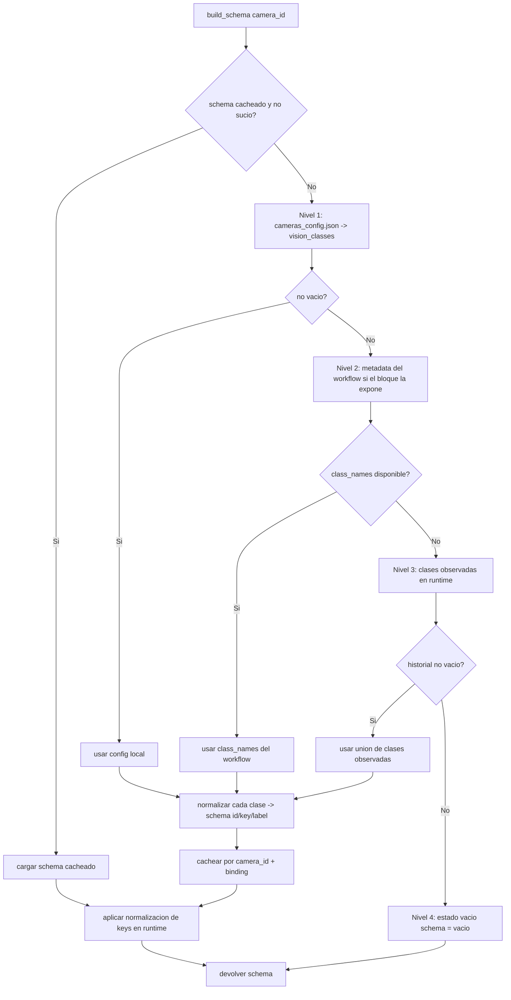
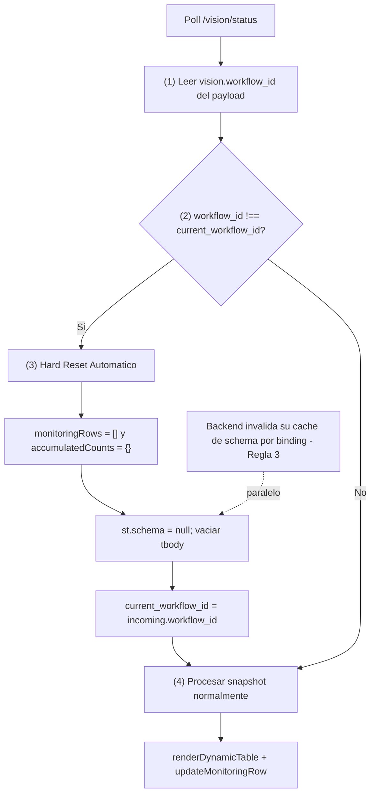

# Plan de Arquitectura — Tabla de Monitoreo Dinámico (Frontend Argos2)

> **Documento de DISEÑO / ESPECIFICACIÓN** — no contiene código productivo.
> **Fecha:** 2026-06-22
> **Estado:** Borrador para revisión
> **Modo:** Arquitecto (sólo se edita este `.md`)
> **Endpoint mapeado:** `GET /api/cameras/<camera_id>/vision/status` (FastAPI)
> **Documentos base:** [`docs/plan-dashboard.md`](plan-dashboard.md:1), [`docs/plan-vision-local-cloud.md`](plan-vision-local-cloud.md:1)

---

## Tabla de Contenidos

1. [Resumen Ejecutivo y Decisiones Asumidas](#1-resumen-ejecutivo-y-decisiones-asumidas)
2. [Estado Actual del Código (línea base)](#2-estado-actual-del-código-línea-base)
3. [Contrato JSON del Endpoint](#3-contrato-json-del-endpoint)
4. [Fuente de Verdad — Jerarquía de Clases](#4-fuente-de-verdad--jerarquía-de-clases)
5. [Backend — Pseudocódigo](#5-backend--pseudocódigo)
6. [Frontend — Estructura de Funciones JS](#6-frontend--estructura-de-funciones-js)
7. [Lógica de Reset](#7-lógica-de-reset)
8. [Manejo de Estados de Error](#8-manejo-de-estados-de-error)
9. [Testing — Casos de Prueba](#9-testing--casos-de-prueba)
10. [Riesgos, Supuestos y Orden de Implementación](#10-riesgos-supuestos-y-orden-de-implementación)

---

## 1. Resumen Ejecutivo y Decisiones Asumidas

Este documento especifica una **Tabla de Monitoreo Dinámica** para el frontend de Argos2 que **no está hardcodeada**: sus columnas se derivan de un `schema` de clases publicado por el backend, y sobreviven a frames donde la clase no aparece. El backend (FastAPI) extiende el endpoint existente [`GET /<camera_id>/vision/status`](../Backend/routes/camera.py:748) con un contrato **versionado y estricto** (`schema_version`, `vision`, `schema`, `detections`).

### Decisiones validadas con el usuario

| # | Decisión | Valor adoptado |
|---|----------|----------------|
| D1 | **Alcance de la tabla** | **Por cámara**: al seleccionar una cámara se muestra su historial de filas y columnas dinámicas según el `schema` de *esa* cámara. Estado aislado `currentDetections` / `monitoringRows` / `accumulatedCounts` **por cámara**. |
| D2 | **Nivel 2 de la jerarquía (metadata del modelo)** | **Híbrido**: se obtiene de la **metadata estática** del *workflow* (`class_names` — **sólo nombres/claves, NUNCA conteos ni detecciones**) **sólo si el bloque la expone**, leída del `result` ya recibido en `process_frame` **sin llamada extra a API**. Si no está disponible, cae al nivel 3 (runtime). Ver §4 (Regla 3). |
| D3 | **Volatilidad total del estado frontend** (Regla 1) | El estado de monitoreo (`monitoringRows`, `accumulatedCounts`, `currentDetections`, `current_workflow_id`) es **volátil y vive sólo en memoria (RAM del navegador)**. **NO** se usa `localStorage`, `sessionStorage` ni `IndexedDB` para el estado de monitoreo. Al refrescar la página (**F5**) el estado **se reinicia por completo**. *Justificación:* garantiza que el operario vea siempre datos frescos y evita basura acumulada de sesiones anteriores (clases obsoletas, totales inflados, workflow_id desincronizado). |
| D4 | **`workflow_id` como "ID de sesión" + Hard Reset automático** (Regla 2) | `vision.workflow_id` (`string|null`) identifica el modelo/workflow activo. El frontend compara `incoming.vision.workflow_id` contra `current_workflow_id` en **cada poll**; si **difieren**, dispara un **Hard Reset automático** de `monitoringRows` + `accumulatedCounts` de esa cámara y actualiza `current_workflow_id`. Mecanismo **stateless** (sin flag `session_changed`/`reset_required`, sin estado de sesión en el servidor): el frontend es el dueño de su sesión visual y el backend no necesita recordar qué `workflow_id` sirvió antes. *Justificación:* evita datos cruzados entre modelos y garantiza la integridad de la línea de montaje. Ver §7.2 y §6.3 (Regla 5). |

### Principios rectores (restricciones)

- **Cero hardcoding de labels**: las columnas siempre derivan de `schema`.
- **Persistencia de columnas *en sesión***: una columna creada se mantiene (durante la sesión, **en memoria**) aunque la clase no aparezca en el frame. No implica persistencia tras F5.
- **Volatilidad del estado de monitoreo** (Regla 1): el estado del frontend vive **sólo en RAM**. F5 ⇒ estado en blanco. **Prohibido** `localStorage`/`sessionStorage`/`IndexedDB` para `monitoringRows`/`accumulatedCounts`/`currentDetections`/`current_workflow_id`.
- **`workflow_id` = identidad de sesión** (Regla 2): cambio de `workflow_id` ⇒ **Hard Reset automático** del estado del frontend para esa cámara. Además invalida el caché de schema (Regla 3).
- **Compatibilidad con la arquitectura actual**: FastAPI, stream MJPEG, conteo atómico `len(predictions)`, fallback `tracked_predictions`, normalización tolerante a fallos existente ([`normalize_predictions`](../Backend/services/vision_engine.py:505)).
- **No invasivo**: no se rompe el badge actual; el polling existente ([`refreshDetectionsBadges`](../Frontend/js/camera.js:798)) se reutiliza.

---

## 2. Estado Actual del Código (línea base)

Lo que **ya existe** y se debe respetar / reutilizar:

| Componente | Ubicación | Qué hace hoy |
|------------|-----------|--------------|
| Handler del endpoint | [`vision_status()`](../Backend/routes/camera.py:750) | Llama a `camera_manager.get_vision_status(camera_id)` y `jsonify`. |
| Ensamblado del estado | [`get_vision_status()`](../Backend/services/camera_service.py:1176) | Devuelve `{active, mode, available, detections:{count, labels, timestamp}}`. |
| Detecciones (motor) | [`get_detections()` Cloud](../Backend/services/vision_engine.py:1305) y [`get_detections()` Local](../Backend/services/vision_engine.py:1523) | Devuelven `{count, labels, timestamp, stale}` (cálculo de `stale` ya implementado). |
| Conteo | `process_frame` ([Cloud L1267](../Backend/services/vision_engine.py:1267), Local L1504) | `total_count = len(predictions)` atómico; ignora `counts_by_label`/`total_count` del JSON por corrupción de tracking. |
| Normalización de predicciones | [`normalize_predictions()`](../Backend/services/vision_engine.py:505) / [`_extract_workflow_predictions()`](../Backend/services/vision_engine.py:389) | Lista plana de `{class, confidence, ...}`. |
| Polling frontend | [`refreshDetectionsBadges()`](../Frontend/js/camera.js:798) | Cada ~10s, lee `data.detections` por cámara y pinta un badge. **No lee `stale`**. |
| Config local | [`cameras_config.json`](../Backend/cameras_config.json:1) | Sólo hardware (id, type, name, camera_index, fps, resolution). **Sin clases**. |

### Gaps detectados (lo que NO existe hoy)

1. **No hay fuente de "clases del modelo"** (taxonomía completa). El workflow entrega `class` de objetos *detectados en el frame*, no la lista completa del modelo. → Impacto directo en el nivel 2 de la jerarquía (ver §4).
2. **No existe `normalize_class_key`**: las `labels` llegan crudas desde Roboflow (ej. `"Pill Blister"`, `"café"`). → Se debe normalizar para usarlas como `key` estable de columna.
3. **La UI no consume `stale`**: el flag se calcula pero se ignora. → El contrato lo expone formalmente y la tabla lo usa.
4. **No hay tabla de monitoreo**, ni separación de estado `currentDetections` / `monitoringRows` / `accumulatedCounts`.

---

## 3. Contrato JSON del Endpoint

### 3.1 Esquema estricto (versionado)

> Endpoint: `GET /api/cameras/<camera_id>/vision/status`
> Codificación: `application/json; charset=utf-8`

```jsonc
{
  "schema_version": "1.0",            // string SEMVER corto. Permite evolucionar sin romper la UI.

  "vision": {                         // estado del SERVICIO de visión de la cámara
    "enabled": true,                  // bool — el usuario tiene visión activada para esta cámara
    "active": true,                   // bool — hay motor instanciado y corriendo (engine is not None)
    "available": true,                // bool — el motor está listo para procesar (credenciales OK)
    "mode": "cloud",                  // "cloud" | "local" | "none"
    "workflow_id": "fab-123-abc",     // string|null — IDENTIDAD DE SESIÓN del monitoreo (Regla 2).
                                      //   cloud(workflow) = WORKFLOW_ID; cloud(modelo estándar)/local = MODEL_ID; none = null.
                                      //   El frontend lo compara con current_workflow_id cada poll: si difieren => Hard Reset automático (§7.3).
                                      //   También es la clave de binding del caché de schema (Regla 3, §4.2): si cambia, el caché se invalida.
    "stale": false,                   // bool — el último cache de detecciones superó STALE_TIMEOUT_SECONDS
    "timestamp": 1719064800.123       // float epoch del último frame procesado con éxito | null
  },

  "schema": [                         // definición de CLASES para construir columnas.
                                      // INDEPENDIENTE de detections: si una clase no aparece,
                                      // la columna se mantiene.
    {
      "id": 0,                        // int — índice estable de orden (0-based)
      "key": "pill_blister",          // string normalizado (snake_case, sin acentos/símbolos)
      "label": "Pill Blister"         // string de display (legible, el original más bonito visto)
    }
  ],

  "detections": {                     // snapshot de inferencia DEL ÚLTIMO frame
    "count": 3,                       // int — total de objetos (== len(predictions), atómico)
    "labels": {                       // dict {key_normalizado: int} — conteo por clase normalizada
      "pill_blister": 2,
      "box": 1
    },
    "items": [                        // lista opcional de detecciones individuales (para detalle/bbox)
      {
        "key": "pill_blister",
        "label": "Pill Blister",
        "confidence": 0.92,
        "bbox": { "x": 12, "y": 30, "width": 48, "height": 40 }  // opcional
      }
    ],
    "timestamp": 1719064800.123,      // float epoch | null
    "stale": false                    // bool — replica de vision.stale para consumo directo
  }
}
```

### 3.2 Invariantes del contrato

| Invariante | Regla |
|------------|-------|
| **`schema` independiente de `detections`** | `schema` refleja la taxonomía; `detections.labels` sólo las clases presentes en el frame. Una clave puede estar en `schema` y NO en `detections.labels` (valor implícito `0`). |
| **Claves normalizadas** | Toda `key` (en `schema[].key` y `detections.labels`) pasa por [`normalize_class_key`](#51-normalize_class_keylabel). `display_label(key)` invierte usando `schema`. |
| **`count == sum(detections.labels.values()) == len(items)`** | Cuando `items` está presente. Si se omite `items` (payload liviano), `count == sum(labels)`. |
| **`stale` consistente** | `detections.stale === vision.stale`. |
| **`vision.workflow_id` = identidad de binding / sesión** | `string\|null`. Identifica el modelo/workflow activo y **liga el `schema`** a él. Reglas: `none` ⇒ `workflow_id=null`; `cloud`(workflow) ⇒ `WORKFLOW_ID`; `cloud`(modelo estándar) ⇒ `MODEL_ID`; `local` ⇒ `MODEL_ID` local (o `null`). Un **cambio de `workflow_id`** ⇒ (a) invalidación **inmediata** del caché de schema backend (Regla 3, §4.2) y (b) **Hard Reset automático** del estado frontend (Regla 2, §7.3). Aunque el campo se llame `workflow_id`, porta el `model_id` en los modos estándar/local porque es la **identidad de binding**, no el identificador literal del workflow. |
| **`mode == "none"`** ⇒ `vision.active=false`, `vision.workflow_id=null`, `schema=[]` admisible, `detections.count=0`, `detections.stale=false`. | |

### 3.3 Ejemplos

#### A) Saludable con detecciones

```json
{
  "schema_version": "1.0",
  "vision": { "enabled": true, "active": true, "available": true, "mode": "cloud", "workflow_id": "fab-123-abc", "stale": false, "timestamp": 1719064800.123 },
  "schema": [
    { "id": 0, "key": "pill_blister", "label": "Pill Blister" },
    { "id": 1, "key": "box", "label": "Box" }
  ],
  "detections": {
    "count": 3,
    "labels": { "pill_blister": 2, "box": 1 },
    "items": [
      { "key": "pill_blister", "label": "Pill Blister", "confidence": 0.92, "bbox": { "x": 12, "y": 30, "width": 48, "height": 40 } },
      { "key": "pill_blister", "label": "Pill Blister", "confidence": 0.88, "bbox": { "x": 70, "y": 28, "width": 45, "height": 42 } },
      { "key": "box", "label": "Box", "confidence": 0.79, "bbox": { "x": 130, "y": 60, "width": 90, "height": 70 } }
    ],
    "timestamp": 1719064800.123,
    "stale": false
  }
}
```

#### B) Cero detecciones (escena observada, vacía) — `schema` persistente

```json
{
  "schema_version": "1.0",
  "vision": { "enabled": true, "active": true, "available": true, "mode": "cloud", "workflow_id": "fab-123-abc", "stale": false, "timestamp": 1719064810.456 },
  "schema": [
    { "id": 0, "key": "pill_blister", "label": "Pill Blister" },
    { "id": 1, "key": "box", "label": "Box" }
  ],
  "detections": {
    "count": 0,
    "labels": {},
    "items": [],
    "timestamp": 1719064810.456,
    "stale": false
  }
}
```

> **Importante:** `schema` se mantiene aunque `detections` esté vacío. La tabla muestra las columnas con valor `0`.

#### C) Stale / error (sin datos recientes)

```json
{
  "schema_version": "1.0",
  "vision": { "enabled": true, "active": true, "available": true, "mode": "cloud", "workflow_id": "fab-123-abc", "stale": true, "timestamp": 1719064700.000 },
  "schema": [
    { "id": 0, "key": "pill_blister", "label": "Pill Blister" }
  ],
  "detections": {
    "count": 0,
    "labels": {},
    "items": [],
    "timestamp": 1719064700.000,
    "stale": true
  }
}
```

#### D) Visión desactivada (`mode = none`)

```json
{
  "schema_version": "1.0",
  "vision": { "enabled": false, "active": false, "available": false, "mode": "none", "workflow_id": null, "stale": false, "timestamp": null },
  "schema": [],
  "detections": { "count": 0, "labels": {}, "items": [], "timestamp": null, "stale": false }
}
```

### 3.4 Compatibilidad con el consumidor actual (badge)

El frontend actual lee `data.available`, `data.mode`, `data.detections.{count,labels,timestamp}` (ver [`camera.js:811`](../Frontend/js/camera.js:811) y [`camera.js:776`](../Frontend/js/camera.js:776)). El nuevo contrato **anida bajo `vision`** y **añade `schema` + `items`**.

Estrategia de migración **no disruptiva** (capa de adaptación en el cliente):

```text
// Shim de compatibilidad dentro de syncAllVisionStatus / refreshDetectionsBadges:
const v = data.vision ?? {};
const legacy = {
  active:      v.active,
  available:   v.available,
  mode:        v.mode,
  workflow_id: v.workflow_id,     // NUEVO — identidad de sesión (Regla 2): el handler de la tabla lo compara con current_workflow_id
  detections:  data.detections,   // {count, labels, timestamp, stale}
  schema:      data.schema,
  vision:      v
};
// El badge existente sigue usando legacy.detections.count; la tabla nueva usa legacy.schema y
// ejecuta la verificación de sesión sobre legacy.workflow_id (Regla 5, §6.3).
```

Esto permite que el badge y la tabla coexistan durante la transición, y que el backend publique **un único contrato nuevo** (se elimina la forma plana antigua al confirmar la migración).

---

## 4. Fuente de Verdad — Jerarquía de Clases

El `schema` se pobla con una jerarquía estricta de prioridad. **El primer nivel no vacío gana** y los inferiores se ignoran para esa cámara.

> 🔒 **Regla 3 — Caché de schema = METADATOS, indexado por `workflow_id` (Seguridad de metadatos).**
> El **Nivel 2** del caché es **estrictamente de METADATOS** (nombres/claves de clase, p. ej. `class_names`): **NUNCA** se cachean conteos ni detecciones ahí (los conteos van en `detections`, siempre frescos por poll; ver R4: `counts_by_label` es corruptible por el tracking de Roboflow). Además, el caché de schema está **indexado por `workflow_id`**: si el `workflow_id` cambia, el caché **se invalida inmediatamente** (§4.2 y §5.4). Esto garantiza que **nunca se muestren etiquetas/columnas de un modelo anterior en uno nuevo**, evitando confusiones visuales y mezcla de taxonomías.



### 4.1 Niveles

| Nivel | Fuente | Cuándo aplica | Notas |
|-------|--------|---------------|-------|
| **1 — Config local** | `cameras_config.json` → nuevo campo opcional `vision_classes: string[]` por cámara (o por workflow). | El operador quiere fijar las clases manualmente. | **No existe hoy**: se añade como extensión opcional del JSON. Si está, es vinculante. |
| **2 — Metadata del workflow (híbrido)** | **Sólo METADATOS estáticos**: `class_names` (lista de nombres/claves de clase) expuesta por el bloque de output del workflow, leída del `result` ya recibido en `process_frame`. **Sin llamada extra a API.** **NUNCA** `counts_by_label` ni conteos ni detecciones (Regla 3). | Workflow con bloque que publica `class_names`. | **No existe hoy**: requiere que el workflow exponga el class map. Si el bloque no lo entrega, este nivel queda vacío y se cae al 3. **El caché resultante se indexa por `workflow_id`.** |
| **3 — Runtime observadas** | Unión de clases vistas históricamente (set ordenado por primer avistaje, persistido en el motor). | Fallback dinámico cuando 1 y 2 no aplican. | **No existe hoy**: el motor mantiene `_observed_classes`. Es **monótono creciente** mientras el binding no cambie. |
| **4 — Vacío** | `schema = []`. | Sin config, sin metadata y sin detecciones todavía. | La tabla muestra "Sin clases definidas" (ver §8). |

### 4.2 Política de "congelamiento" vs regeneración

> 🔒 **Regla 3 (enlace con el frontend):** el `schema` viaja ligado al `workflow_id` activo (`vision.workflow_id`, §3). El frontend, al detectar un cambio de `workflow_id` (Regla 2), **sabe** que el schema que recibirá pertenece a otro binding; de ahí que el Hard Reset automático limpie primero el historial y luego se procese el nuevo snapshot con el schema nuevo.

El schema se **cachea por cámara** con una **clave de binding** = `(mode, workflow_id)`, donde `workflow_id` porta el `model_id` en los modos estándar/local (Regla 3). **El caché almacena sólo METADATOS** (nombres/claves de clase, nunca inferencia ni conteos). **El cambio de `workflow_id` fuerza la invalidación inmediata del caché.**

| Evento | Acción sobre el schema |
|--------|------------------------|
| Poll normal (sin cambio de binding) | **Devolver caché** (congelado). Columnas persistentes aunque la clase no aparezca. |
| Llega una clase *nueva* (key no presente) en runtime y nivel activo = 3 | **Append** monótono + re-cache (la columna se agrega, no se reconstruye desde cero). |
| Cambio de `mode` (cloud ↔ local) | **Regenerar** (binding cambia). Invalidar caché. |
| Cambio de `workflow_id` (o `model_id`) | **Regenerar** (binding cambia) ⇒ **invalidar caché inmediatamente** y limpiar `_observed_classes`. *Garantiza que nunca queden etiquetas de un modelo anterior* (Regla 3). En el frontend este mismo cambio dispara el Hard Reset automático (Regla 2, §7.3). |
| Edición de `vision_classes` en config | **Regenerar** (nivel 1 vinculante). Invalidar caché. |
| [`reload_vision_engines()`](../Backend/services/camera_service.py:1230) | **Invalidar todos los cachés** (los motores se recrean). |
| Reset de la tabla (frontend) | **No afecta el schema** (es estado local de la UI; ver §7). |

> **Por qué nivel 3 es monótono creciente:** garantiza la invariante "columna persistente". Una vez vista la clase `box`, la columna `box` permanece aunque el frame ya no la tenga. No se "olvida" clases hasta que el binding cambia.

---

## 5. Backend — Pseudocódigo

> Todo es **pseudocódigo** para guiar la implementación en [`Backend/services/vision_engine.py`](../Backend/services/vision_engine.py:1) y [`Backend/services/camera_service.py`](../Backend/services/camera_service.py:1). Reutiliza [`normalize_predictions`](../Backend/services/vision_engine.py:505) y [`_count_predictions`](../Backend/services/vision_engine.py:536) sin alterarlos.

### 5.1 `normalize_class_key(label)`

```text
fun normalize_class_key(label):
    # 1. Null-safety + tipo string
    s = "" if label es None else str(label).strip()
    # 2. Normalización Unicode NFKC (separaciones compatibles)
    s = unicodedata.normalize("NFKC", s)
    # 3. Minúsculas
    s = s.lower()
    # 4. Quitar acentos: NFD + eliminar categoría Mark-Nonspacing (Mn)
    s = "".join(c for c in unicodedata.normalize("NFD", s)
                if not unicodedata.combining(c))
    # 5. Cualquier run de caracteres NO alfanuméricos -> un solo "_"
    s = regex_replace(s, r"[^a-z0-9]+", "_")
    # 6. Recortar "_" a los extremos y colapsar duplicados
    s = trim(s, "_")
    # 7. Fallback si quedó vacío
    retornar s si s != "" sino "object"
```

| Entrada (label cruda de Roboflow) | Salida `key` |
|-----------------------------------|--------------|
| `"Pill Blister"` | `pill_blister` |
| `"Café"` | `cafe` |
| `"Persona (mayor)"` | `persona_mayor` |
| `"Caja / Box"` | `caja_box` |
| `"  "` / `None` | `object` |

### 5.2 `display_label(key)` (mapeo inverso)

```text
# Mantiene un dict global por cámara {key: label_display} poblado al construir el schema.
# Reglas:
#   1) Si key existe en el schema cacheado -> retornar schema[key].label  (preserva el original más bonito).
#   2) Si no existe (clase nueva observada en runtime antes de re-cachear):
#        -> Title Case reemplazando "_" por espacio: "pill_blister" -> "Pill Blister".
#   3) Si key == "object" -> "Objeto".
fun display_label(key, schema_cache):
    if key in schema_cache: retornar schema_cache[key].label
    if key == "object": retornar "Objeto"
    retornar title_case(key.replace("_", " "))
```

> **Preservación del "label bonito":** cuando el nivel 1/2 entrega un label con mayúsculas/acentos (`"Café"`), el `schema[].label` guarda `"Café"` y `key` guarda `"cafe"`. Así la UI muestra `Café` aunque la columna se indexe por `cafe`.

### 5.3 `build_vision_status_response(camera_id)`

Reemplaza el cuerpo de [`get_vision_status`](../Backend/services/camera_service.py:1176) (o lo envuelve). **No toca** `process_frame` ni el conteo atómico.

```text
fun build_vision_status_response(camera_id):
    engine = self._vision_engines.get(camera_id)   # bajo lock, como hoy

    # ---- Caso: sin motor (mode = none) ----
    si engine es None:
        retornar {
            schema_version: "1.0",
            vision: { enabled: False, active: False, available: False,
                      mode: "none", workflow_id: None, stale: False, timestamp: None },
            schema: [],
            detections: { count: 0, labels: {}, items: [], timestamp: None, stale: False }
        }

    # ---- Detecciones (snapshot vivo del motor) ----
    det = engine.get_detections()            # {count, labels:{RAW: int}, timestamp, stale}
    # Normalizar claves de labels RAW -> keys estables
    labels_norm = {}
    for raw_label, n in det.labels.items():
        labels_norm[normalize_class_key(raw_label)] = labels_norm.get(normalize_class_key(raw_label), 0) + n

    # items: opcional. Se construyen desde las últimas predicciones normalizadas si el motor las expone.
    items = []
    preds = engine.get_last_predictions()    # NUEVO getter opcional (cache de la última lista normalizada)
    for p in preds or []:
        items.append({
            key:    normalize_class_key(p.class),
            label:  display_label(normalize_class_key(p.class), schema_cache_para(camera_id)),
            confidence: round(float(p.confidence), 3) si p.confidence != None sino None,
            bbox:   normalizar_bbox(p)        # {x,y,width,height} o None si el modelo no lo trae
        })

    # ---- Schema (jerarquía §4, con caché) ----
    schema = build_schema(camera_id, engine)  # ve §5.4
    # Asegurar que TODA clase observada en items/labels esté en el schema (append nivel 3)
    schema = ensure_schema_covers(schema, set(labels_norm.keys()), camera_id)

    # ---- Bloque vision ----
    vision = {
        enabled:     True,                     # hay motor => visión habilitada para esta cámara
        active:      True,
        available:   engine.is_available,
        mode:        engine.mode,              # "cloud" | "local"
        workflow_id: engine.workflow_id o engine.model_id,   # IDENTIDAD DE SESIÓN (Regla 2); null si mode=none.
                                                             # Es también la clave de binding del caché de schema (Regla 3).
        stale:       bool(det.stale),
        timestamp:   det.timestamp
    }

    retornar {
        schema_version: "1.0",
        vision:     vision,
        schema:     schema,                    # [{id, key, label}]
        detections: {
            count:     int(det.count),
            labels:    labels_norm,            # {key_normalizado: int}
            items:     items,                  # lista (puede ir vacía si se quiere payload liviano)
            timestamp: det.timestamp,
            stale:     bool(det.stale)
        }
    }
```

**Notas de implementación:**

- `engine.get_last_predictions()`: nuevo **getter** (no muta). Los motores ya calculan `predictions` en `process_frame` ([L1225](../Backend/services/vision_engine.py:1225), [L1285](../Backend/services/vision_engine.py:1285)); basta cachearlas en `self._last_predictions` junto con [`_store_detections`](../Backend/services/vision_engine.py:800). Si no se quiere exponer `items` de entrada, se omite y `items: []`.
- `normalizar_bbox(p)`: Roboflow entrega `bbox` o `x/y/width/height`; se homogeneiza a `{x,y,width,height}`.
- `stale` se reutiliza del cálculo existente ([Cloud L1335](../Backend/services/vision_engine.py:1335), Local L1551); **no se recomputa**.

### 5.4 `build_schema(camera_id, engine)` + caché

```text
# Caché en memoria, por cámara: { camera_id: { binding, schema, key_to_label } }
# IMPORTANTE (Regla 3): este caché guarda SOLO METADATOS (nombres/claves de clase, key_to_label).
# NUNCA conteos ni detecciones. Su clave (binding) incluye el workflow_id => si éste cambia, se invalida.
SCHEMA_CACHE = {}

fun schema_binding(engine):
    retornar (engine.mode, engine.workflow_id o engine.model_id)   # = vision.workflow_id; clave del caché

fun build_schema(camera_id, engine):
    binding = schema_binding(engine)
    cached  = SCHEMA_CACHE.get(camera_id)

    # 1) Reutilizar caché si el binding no cambió
    si cached y cached.binding == binding:
        retornar cached.schema

    # 2) Resolver clases por jerarquía (primer nivel no vacío gana)
    clases = resolver_clases_nivel1(camera_id)        # cameras_config.json -> vision_classes
    fuente = "config"
    si vacio(clases):
        clases = resolver_clases_nivel2(engine)        # class_names del workflow si el bloque los expone
        fuente = "workflow_meta"
    si vacio(clases):
        clases = resolver_clases_nivel3(engine)        # _observed_classes (runtime, monótono)
        fuente = "runtime"

    # 3) Construir schema normalizado
    schema = []
    key_to_label = {}
    para i, raw en enumerate(clases):
        k = normalize_class_key(raw)
        lbl = raw si raw.strip() != "" sino display_label(k, {})   # preservar original bonito
        schema.append({ id: i, key: k, label: lbl })
        key_to_label[k] = lbl        # gana el primer label visto para esa key

    # 4) Congelar en caché
    SCHEMA_CACHE[camera_id] = { binding, schema, key_to_label }
    retornar schema

fun ensure_schema_covers(schema, observed_keys, camera_id):
    # Append monótono de clases nuevas vistas en runtime (invariante: columna persistente)
    cached = SCHEMA_CACHE[camera_id]
    next_id = len(schema)
    para k en observed_keys:
        si k no en cached.key_to_label:
            lbl = display_label(k, cached.key_to_label)   # Title Case
            schema.append({ id: next_id, key: k, label: lbl })
            cached.key_to_label[k] = lbl
            next_id += 1
    retornar schema
```

- `resolver_clases_nivel3(engine)` lee `engine._observed_classes` (set ordenado por primer avistaje), actualizado en `process_frame` con `normalize_predictions(...)` ya existente.
- `resolver_clases_nivel2(engine)` inspecciona el último `result` del workflow buscando **sólo `class_names`** (metadatos estáticos de clase) **sin llamada HTTP extra**. **No lee `counts_by_label` ni conteos** (Regla 3; R4: corruptible por el tracking). Si el bloque no lo expone, devuelve `[]`.

### 5.5 Invalidación del caché

- En [`disable_vision`](../Backend/services/camera_service.py:1) y [`reload_vision_engines`](../Backend/services/camera_service.py:1230): `SCHEMA_CACHE.pop(camera_id, None)` y `engine._observed_classes.clear()`.
- En `enable_vision`: no pre-poblar; el primer poll construye y cachea.

---

## 6. Frontend — Estructura de Funciones JS

> Archivo: [`Frontend/js/camera.js`](../Frontend/js/camera.js:1). JS vanilla, sin frameworks. Se **reutiliza** el polling de [`refreshDetectionsBadges`](../Frontend/js/camera.js:798) y [`updateDetectionsBadge`](../Frontend/js/camera.js:1).

### 6.1 Separación de estado (por cámara)

Se mantiene el `visionState[cameraId]` existente y se añaden tres objetos **aislados por cámara** dentro de un nuevo `monitorState`:

```text
monitorState = {
  [cameraId]: {
    currentDetections: {                // snapshot VIVO del último poll (se sobreescribe cada vez)
      count, labels:{key:int}, items:[], timestamp, stale
    },
    schema: [ {id,key,label} ],         // último schema recibido (columnas vigentes)
    monitoringRows: [                   // HISTORIAL de filas (acumulable, con marca temporal)
      { ts, count, values: {key:int}, stale }
    ],
    accumulatedCounts: { key:int },     // TOTALES históricos por clase (suma de todas las filas)
    current_workflow_id: null,          // "ID de sesión" del monitoreo (Regla 2/5); se compara cada poll con vision.workflow_id
    renderToken: 0                      // anti-reentrancia / reconciliación de columnas
  }
}
```

> 🔒 **Regla 1 — Volatilidad total del estado frontend:** todo `monitorState` (incluido `current_workflow_id`) vive **sólo en memoria (RAM del navegador)**. **Prohibido** persistirlo en `localStorage`/`sessionStorage`/`IndexedDB`. Al recargar la página (**F5**) el objeto se reconstruye vacío (`nuevo_estado()`) y `current_workflow_id` arranca en `null`; el primer poll lo fija desde `vision.workflow_id`. (Como `null !== workflow_id_real`, en el primer poll post-F5 **no** se necesita hard reset: el estado ya está vacío — la verificación simplemente fija el ID de sesión. Esto evita basura acumulada y garantiza datos frescos.)

**Por qué tres objetos separados:**

| Objeto | Rol | Ciclo de vida |
|--------|-----|---------------|
| `currentDetections` | "qué hay AHORA" (badge + highlight). | Se reescribe en cada poll. **No** se toca en el reset. |
| `monitoringRows` | "historial de la tabla". FIFO con tope `MAX_ROWS`. | Se limpia en el reset. |
| `accumulatedCounts` | totales por clase para pie de tabla. | Se limpia en el reset; se incrementa con cada fila. |

### 6.2 Funciones

#### `renderDynamicTable(schema, cameraId)`

Crea/destruye columnas **según `schema`**, sin hardcoding. Reconciliación por `key`.

```text
fun renderDynamicTable(schema, cameraId):
    st = monitorState[cameraId]
    header = tabla.tHead
    body   = tabla.tBodies[0]
    st.renderToken += 1   // marca de "rebuild en curso"

    # --- Cabecera dinámica: columnas fijas + una por clase ---
    columnas = ["#", "Hora"] + [c.key para c en schema] + ["Total", "Estado"]
    # Reconciliación: si el set de columnas data-aware cambió, reconstruir <thead>
    si columnas_actuales(header) != columnas:
        reconstruir <thead> con columnas
        # MARCAR las filas existentes como "obsoletas de columnas": se re-renderizan
        para cada <tr> en body: marcar data-stale-cols=true

    # No tocar <tbody> aquí: las filas las pinta updateMonitoringRow.
    st.schema = schema
```

- **Destrucción de columnas**: al cambiar de `workflow_id` (Regla 2 ⇒ `hard_reset`), se reconstruye `<thead>` y se **vacía `<tbody>`** porque las filas viejas ya no mapean a las columnas nuevas (ver §7.3, "hard_reset"). Las `accumulatedCounts` se reinician en ese caso.
- **Columna persistente**: si `schema` incluye `pill_blister` pero el frame trae `count=0`, la columna sigue existiendo; el valor se pinta como `0`.

#### `updateMonitoringRow(detections, cameraId)`

Añade una fila al historial y actualiza totales. Se invoca desde el polling (§6.3).

```text
fun updateMonitoringRow(detections, cameraId):
    st = monitorState[cameraId]
    schema = st.schema o []

    # Regla count=0 (§6.4): decidir si se inserta fila
    si no debe_insertar_fila(detections, st): retornar

    # Vector de valores por clase (0 si la clase no está en labels)
    values = {}
    para c en schema:
        values[c.key] = detections.labels[c.key] o 0

    fila = {
        ts:      detections.timestamp o Date.now()/1000,
        count:   detections.count,
        values:  values,
        stale:   bool(detections.stale)
    }

    # Append + FIFO eviction
    st.monitoringRows.push(fila)
    si st.monitoringRows.length > MAX_ROWS:   // p.ej. 200
        st.monitoringRows.shift()

    # Totales acumulados (sólo de filas no-stale, para no inflar con datos obsoletos)
    si no fila.stale:
        para k, v en values: st.accumulatedCounts[k] = (st.accumulatedCounts[k] o 0) + v

    render_fila_en_DOM(fila, cameraId)
    render_pie_totales(st.accumulatedCounts, schema, cameraId)
```

#### `resetMonitoring(cameraId)`

Ver §7.

### 6.3 Integración con el polling existente

Dentro de [`refreshDetectionsBadges`](../Frontend/js/camera.js:798), **por cada cámara**, tras actualizar el badge:

```text
# (pseudocódigo que se añade al bucle existente de refreshDetectionsBadges)
const data = await res.json();
const vision = data.vision ?? {};
const schema = data.schema ?? [];
const det    = data.detections ?? { count:0, labels:{}, items:[], timestamp:null, stale:false };

monitorState[camera.id] = monitorState[camera.id] o nuevo_estado();   // post-F5 => estado vacío (Regla 1)
const st = monitorState[camera.id];

# ===== Regla 5 — Verificación de sesión (dispara Hard Reset automático, Regla 2) =====
# (1) Leer workflow_id del payload
const incoming_wf = vision.workflow_id ?? null;
# (2) Comparar con el "ID de sesión" actual del frontend
if (incoming_wf !== st.current_workflow_id):
    # (3) Si difieren => Hard Reset automático (§7.3): limpia monitoringRows + accumulatedCounts,
    #     vacía <tbody> y reconstruye <thead> con el nuevo schema. NO toca MJPEG ni el backend.
    hard_reset(camera.id);
    #     Actualiza el "ID de sesión" del frontend para los próximos polls.
    st.current_workflow_id = incoming_wf;

# (4) Procesar normalmente el snapshot
st.currentDetections = det;

# Render dinámico de columnas (idempotente). Tras hard_reset, renderDynamicTable reconstruye
# <thead> con el schema nuevo (claves nuevas) — las filas viejas ya se vaciaron en hard_reset.
renderDynamicTable(schema, camera.id);

# Sólo la cámara SELECCIONADA alimenta la tabla visible (D1)
si camera.id == camaraSeleccionada:
    si vision.active y no vision.stale y schema.length > 0:
        updateMonitoringRow(det, camera.id);
    actualizar_banner_estado(vision, camera.id);   // "Sin datos recientes" etc.
```

- El badge actual (`updateDetectionsBadge`) **sigue llamándose** sin cambios (usa `det.count`).
- La tabla sólo procesa la **cámara seleccionada** (D1), evitando mezclar schemas distintos.

### 6.4 Regla `count=0` y `stale=true`

| Condición | ¿Inserta fila en `monitoringRows`? | Justificación |
|-----------|------------------------------------|---------------|
| `vision.active=true`, `stale=false`, `schema` no vacío, `count=0` | **SÍ** (fila con todos los valores en `0`). | Una fila "todo ceros" **es información**: la escena fue observada y estaba vacía. Omitirla rompería la continuidad temporal y ocultaría periodos sin detecciones (necesario para auditoría). |
| `stale=true` | **NO** (no agrega fila; muestra banner). | Los datos están obsoletos; sumarlos falsearía `accumulatedCounts`. |
| `vision.active=false` / `mode="none"` | **NO** (tabla en estado "Visión desactivada"). | No hay inferencia; no hay serie temporal válida. |
| `schema=[]` | **NO** (no hay columnas; estado "Sin clases definidas"). | Sin columnas, una fila no aporta nada. |
| Cambio de `workflow_id` detectado | **NO directamente**; primero `hard_reset()` (Regla 2/5) y luego continúa normal con el nuevo schema. | Las filas viejas no mapean a columnas nuevas. |

> Tope de filas: `MAX_ROWS = 200` (FIFO). Si se necesita más历史, exportar a CSV antes de evocar reset.

---

## 7. Lógica de Reset

Existen **dos** formas de reset, **ambas frontend-only** (no tocan el MJPEG, la inferencia ni el contador del backend). Lo que las distingue es el **trigger** y la **semántica**:

| | **Reset Manual** (Regla 4) | **Hard Reset Automático** (Regla 2) |
|---|----------------------------|-------------------------------------|
| **Quién dispara** | El operario (botón "Reiniciar monitoreo" en la UI). | El sistema, al detectar cambio de `workflow_id`. |
| **Trigger** | Click del usuario. | `incoming.vision.workflow_id !== st.current_workflow_id` en cada poll (§6.3). |
| **Qué limpia** | `monitoringRows` + `accumulatedCounts` de la cámara **seleccionada**. | `monitoringRows` + `accumulatedCounts` de la cámara cuyo `workflow_id` cambió (y descarta `st.schema` para que se reconstruya con el nuevo). |
| **`current_workflow_id`** | **No** se cambia (sigue el mismo modelo). | **Sí** se actualiza al nuevo `workflow_id`. |
| **`<thead>` / columnas** | Se conservan (mismo schema). | Se reconstruyen con el schema nuevo (claves distintas). |
| **Semántica** | "Quiero vaciar mi vista de esta cámara sin parar nada". | "Cambió el modelo; los datos previos ya no pertenecen a esta sesión". |
| **¿Toca backend?** | **No** (frontend-only). | **No** en el reset frontend; el backend invalida **su** caché de schema por binding de forma **independiente** (Regla 3, §4.2). |

> 🔒 **Regla 4 — Reset Manual es 100% local:** el botón "Reiniciar monitoreo" **sólo** limpia el estado del frontend para la cámara seleccionada. **No** interrumpe el stream MJPEG, **no** reinicia el contador del backend, **no** detiene la inferencia. Es ortogonal al Hard Reset Automático (no cambia `workflow_id`).

### 7.1 Estado que limpian ambos (común)

| Estado | Acción |
|--------|--------|
| `monitorState[cameraId].monitoringRows` | `= []` (vaciar) |
| `monitorState[cameraId].accumulatedCounts` | `= {}` (vaciar) |
| `<tbody>` de la tabla visible | `innerHTML = ""` |
| Pie de totales | Re-render con ceros |

### 7.2 Reset Manual — `resetMonitoring(cameraId)` (Regla 4)

Operación **local** invocada por el botón de la UI para la cámara seleccionada.

```text
fun resetMonitoring(cameraId):                       # Reset MANUAL (operario)
    st = monitorState[cameraId]
    si no st: retornar
    st.monitoringRows = []
    st.accumulatedCounts = {}
    vaciar <tbody>
    render_pie_totales({}, st.schema, cameraId)      # totales en 0, columnas intactas
    # NO: no tocar currentDetections, no tocar <thead>, no tocar stream,
    #     no tocar current_workflow_id, no llamar al backend.
    mostrar toast "Monitoreo reiniciado" (info, 2s)
```

### 7.3 Hard Reset Automático — `hard_reset(cameraId)` (Regla 2)

Lo dispara el handler de poll (§6.3, Regla 5) cuando `incoming.vision.workflow_id !== st.current_workflow_id`. Limpia lo mismo que el manual **y además** descarta el schema/columnas viejas (pertenecen a otro modelo).

```text
fun hard_reset(cameraId):                            # Hard Reset AUTOMÁTICO (por workflow_id)
    st = monitorState[cameraId]
    si no st: retornar
    st.monitoringRows = []
    st.accumulatedCounts = {}
    st.schema = null                                 # obliga a renderDynamicTable a reconstruir <thead> con el schema nuevo
    vaciar <tbody>
    render_pie_totales({}, [], cameraId)
    # current_workflow_id lo actualiza el llamador (§6.3) tras invocar hard_reset.
    # NO: no tocar currentDetections, no tocar stream, no llamar al backend.
    #     (El backend invalida SU caché de schema por binding de forma independiente — Regla 3.)
    log DEBUG "Hard reset automatico (workflow_id cambio)"
```

Flujo del hard reset:



### 7.4 Qué **NO** se toca (crítico, común a ambos resets)

| Recurso | Razón |
|---------|-------|
| Conexión MJPEG (``) | El video sigue fluyendo. |
| Proceso de inferencia backend (`process_frame`, sampler thread) | La inferencia sigue corriendo en el servidor. |
| `monitorState[cameraId].currentDetections` (snapshot vivo) | Se conserva: es el último dato real, se reescribe en el siguiente poll. |
| `visionState[cameraId]` (modo/disponibilidad) | No se altera. |
| Contador backend / `_observed_classes` | El reset del frontend **no** reinicia el contador del backend ni limpia `_observed_classes` (eso lo hace el backend solo al cambiar el binding, Regla 3). |

> **Invariantes:** tras cualquier reset, el siguiente poll repuebla `monitoringRows` desde cero con el `schema` vigente (manual: mismo schema; hard reset: schema nuevo). El video y la inferencia **nunca** se interrumpen. El `current_workflow_id` sólo cambia en el hard reset.

---

## 8. Manejo de Estados de Error

Matriz de reglas explícitas. "UI" = comportamiento visible en la tabla.

| Estado / Evento | Señal (contrato) | UI — Tabla | UI — Badge | Acción backend |
|-----------------|------------------|------------|------------|----------------|
| **`stale=true`** | `vision.stale=true` y `detections.stale=true` | Banner "Sin datos recientes". **No** agregar fila. Resaltar última fila en gris. | Badge en gris/atenuado con `⚠️`. | Mantener `stale` (ya calculado). |
| **`count=0`** (activo, no stale, schema ≠ ∅) | `detections.count=0`, `labels={}` | Agregar fila con ceros (§6.4). | Badge "0". | — |
| **`schema=[]`** | `schema` vacío | Placeholder "Sin clases definidas — esperando detecciones". No columnas, no filas. | Badge normal con count. | Nivel 3 (runtime) irá poblando al detectar. |
| **`vision.enabled=false` / `mode="none"`** | `vision.active=false`, `mode="none"` | Placeholder "Visión desactivada para esta cámara". | Ocultar badge. | — |
| **`vision.available=false`** (motor creado, credenciales malas) | `available=false` | Placeholder "Motor no disponible — revisa API key/modelo en Ajustes". | Badge de error. | Ya existe feedback en [`start_vision`](../Backend/routes/camera.py:666). |
| **Pérdida de conexión** (fetch falla/timeout) | Sin respuesta | Mantener última fila; banner "Reconectando…". Reintentar en siguiente ciclo. | Mantener último. | `refreshDetectionsBadges` ya es silencioso ([L820](../Frontend/js/camera.js:820)). |
| **Cambio de `workflow_id`** (Regla 2) | `vision.workflow_id` ≠ `current_workflow_id` | **Hard Reset automático** (§7.3): `hard_reset` limpia `<tbody>` + `monitoringRows=[]` + `accumulatedCounts={}`, descarta `schema` viejo, reconstruye `<thead>`; actualiza `current_workflow_id`. | — | Invalidar caché de schema (binding cambió, Regla 3). |
| **404 cámara** | HTTP 404 | Banner "Cámara no encontrada". | — | Ya existe en [`vision_status`](../Backend/routes/camera.py:754). |

### 8.1 Limpieza de columnas (absorbida por `hard_reset`)

> El helper `resetColumnas(st)` del borrador previo **queda subsumido** por `hard_reset(cameraId)` (§7.3). Ambos vacían `<tbody>`, `monitoringRows` y `accumulatedCounts`; `hard_reset` además descarta `st.schema` (para que `renderDynamicTable` reconstruya `<thead>` con el nuevo) y lo dispara el cambio de `workflow_id` (Regla 2). Ya **no** existe un helper separado de "cambio de modelo": el disparador canónico es la verificación `workflow_id !== current_workflow_id` (§6.3, Regla 5).

---

## 9. Testing — Casos de Prueba

> Cobertura backend + frontend. `STALE_TIMEOUT_SECONDS` y `MAX_ROWS` como variables configurables en los tests.

| # | Escenario | Precondición | Acción | Resultado esperado (Backend) | Resultado esperado (Frontend) |
|---|-----------|--------------|--------|------------------------------|-------------------------------|
| T1 | **1 clase detectada** | Motor cloud activo; workflow devuelve 1 `prediction` `class="Pill Blister"`. | `GET /vision/status`. | `schema_version="1.0"`; `detections.count=1`; `labels={"pill_blister":1}`; `items[0].key="pill_blister"`; `schema` contiene `pill_blister`. | Se crea 1 columna `Pill Blister`; 1 fila con valor `1`; `accumulatedCounts.pill_blister=1`. |
| T2 | **2 clases detectadas** | 2 predicciones `Pill Blister` + 1 `Box`. | `GET /vision/status`. | `count=3`; `labels={"pill_blister":2,"box":1}`; `items` con 3 elementos. | 2 columnas; fila `{pill_blister:2, box:1}`; totales `{pill_blister:2, box:1}`. |
| T3 | **0 detecciones** (activo, schema conocido) | Frame válido sin objetos; `schema` ya cacheado con 2 clases. | `GET /vision/status`. | `count=0`; `labels={}`; `schema` sigue con las 2 clases (persistente). | Columnas intactas; **se agrega fila** con `{pill_blister:0, box:0}` (§6.4). |
| T4 | **Cambio de `workflow_id` / modelo** (Reglas 2, 3) | Cámara A con workflow W1 (`pill_blister, box`, `workflow_id="W1"`); se conmuta a W2 (`car, person`, `workflow_id="W2"`). | Poll posterior a recarga. | `vision.workflow_id="W2"`; `schema` regenerado (`car, person`); **caché invalidado**; `_observed_classes` limpio. | `hard_reset` (auto): `<tbody>` vacío, `monitoringRows=[]`, `accumulatedCounts={}`, `<thead>` reconstruido con `Car, Person`; `current_workflow_id="W2"`. |
| T5 | **Reset Manual** (Regla 4) | Tabla con N filas y video/inferencia activos. | Click "Reiniciar monitoreo". | (Sin llamada al backend.) | `monitoringRows=[]`, `accumulatedCounts={}`; `<tbody>` vacío; **MJPEG e inferencia siguen activos**; `schema`/`<thead>` y `current_workflow_id` intactos; próximo poll repuebla **sin** hard reset. |
| T6 | **Error / stale** | Stream detenido sin excepción; cache > `STALE_TIMEOUT_SECONDS`. | `GET /vision/status`. | `vision.stale=true`; `detections.count=0`, `stale=true`. | Banner "Sin datos recientes"; **no** se agrega fila; última fila en gris. |
| T7 | **`schema=[]`** (vacío inicial) | Motor activo, sin config, workflow sin `class_names`, sin detecciones previas. | `GET /vision/status`. | `schema=[]`; `detections.count=0`. | Placeholder "Sin clases definidas". Tras la 1ª detección, nivel 3 agrega la columna (T1). |
| T8 | **Normalización de keys** | `class="Café (grano)"`. | Construir schema. | `key="cafe_grano"`; `label="Café (grano)"`. | Columna indexada por `cafe_grano`, mostrada como `Café (grano)`. |
| T9 | **Columna persistente tras ausencia** | Schema `{pill_blister, box}`; siguiente frame sólo detecta `box`. | Poll. | `labels={"box":1}`; `schema` sigue `{pill_blister, box}`. | Fila `{pill_blister:0, box:1}`; columna `Pill Blister` persiste con `0`. |
| T10 | **Modo `none`** | Visión desactivada. | `GET /vision/status`. | `vision={enabled:false,active:false,mode:"none",workflow_id:null}`; `schema=[]`. | Placeholder "Visión desactivada"; sin columnas. |
| T11 | **Append monótono nivel 3** | Schema runtime `{a}`; llega clase nueva `b`. | Poll. | `ensure_schema_covers` agrega `b`; `schema={a,b}`. | Nueva columna `b` aparece sin perder `a`. |
| T12 | **Hard Reset automático por `workflow_id`** (Regla 2) | Cámara con `current_workflow_id="W1"`, tabla con N filas; llega poll con `vision.workflow_id="W2"`. | Poll. | (Sin estado de sesión en backend.) | `hard_reset`: `monitoringRows=[]`, `accumulatedCounts={}`, `<tbody>` vacío, `st.schema=null`; `current_workflow_id="W2"`; MJPEG/inferencia intactos. |
| T13 | **F5 reinicia el estado, no persiste** (Regla 1) | Tabla con N filas y `current_workflow_id="W1"`; storage del navegador inspeccionable. | Recargar la página (F5). | — | `monitorState` reconstruido vacío (`nuevo_estado()`); `monitoringRows=[]`, `accumulatedCounts={}`, `current_workflow_id=null`; **no hay** claves de monitoreo en `localStorage`/`sessionStorage`/`IndexedDB`; el primer poll fija `current_workflow_id` sin hard reset espurio. |
| T14 | **Reset Manual no afecta backend** (Regla 4) | Video/inferencia activos; backend con contador=K y `_observed_classes`={a,b}. | Click "Reiniciar monitoreo". | **No** hay llamada HTTP; contador backend y `_observed_classes` **sin cambios**; inferencia sigue corriendo. | Frontend: `monitoringRows=[]`, `accumulatedCounts={}`; `<tbody>` vacío; stream MJPEG **no** se corta; `current_workflow_id` sin cambios. |
| T15 | **Caché de schema invalidado al cambiar `workflow_id`** (Regla 3) | `SCHEMA_CACHE[A]={binding:(cloud,"W1"), schema:[pill_blister]}`; llega `workflow_id="W2"`. | `build_schema(A, engine)` con nuevo binding. | Caché de A **invalidado** (clave de binding cambia); `schema` regenerado desde la jerarquía; **no** se muestran etiquetas de W1. | El frontend recibe `schema` nuevo (sin `pill_blister`) ligado a `vision.workflow_id="W2"`. |

---

## 10. Riesgos, Supuestos y Orden de Implementación

### 10.1 Riesgos y supuestos detectados al leer el código

| # | Riesgo / Supuesto | Impacto | Mitigación / Recomendación |
|---|-------------------|---------|----------------------------|
| R1 | **No hay fuente de "clases del modelo" hoy.** Ni `cameras_config.json` ni el workflow exponen la taxonomía completa; sólo `class` de objetos detectados. | Medio: el nivel 2 puede quedar vacío y todo recaer en el nivel 3 (runtime). | (D2) Probar primero si el **bloque de output del workflow** publica `class_names`. Si no, documentar nivel 2 como deuda y operar con nivel 1 + nivel 3. Como **opción futura**, evaluar el endpoint de metadata de Roboflow (`GET .../model` o `load_model(...)`) con caché de larga duración (no por poll). |
| R2 | **`items` requiere cachear las últimas predicciones** (`_last_predictions`), que hoy no se guardan (sólo el conteo). | Bajo: `items` es opcional. | Añadir `_last_predictions` en [`_store_detections`](../Backend/services/vision_engine.py:800). Si no se quiere, publicar `items: []` desde el inicio. |
| R3 | **`stale` ya se calcula pero la UI no lo usa.** | Bajo. | El contrato lo formaliza y la tabla lo consume (§6.4, §8). |
| R4 | **Tracking de Roboflow corrompe `counts_by_label`/`total_count`** (motivo por el que hoy se ignora y se usa `len(predictions)`). | Alto si se usara nivel 2 basado en `counts_by_label`. | **No** usar `counts_by_label` como fuente de clases: es mutable y corruptible. El nivel 2 debe leer `class_names` (estático) o, en su defecto, caer al nivel 3. |
| R5 | **Cambio de binding no detectado** si `workflow_id`/`model_id` son `None` a la vez. | Bajo. | `schema_binding` debe incluir `mode` siempre; si ambos IDs son `None`, el binding sigue distinguible por `mode`. |
| R6 | **Crecimiento ilimitado de `monitoringRows`** y de `_observed_classes`. | Bajo. | FIFO `MAX_ROWS=200` en UI; `_observed_classes` se limpia al cambiar binding. |
| R7 | **Cámara seleccionada vs. polling de todas las cámaras.** `refreshDetectionsBadges` itera todas; la tabla sólo debe pintar la seleccionada. | Bajo. | Filtrar por `camaraSeleccionada` en el paso de tabla (§6.3). |
| R8 | **Compatibilidad del badge durante la migración.** | Bajo. | Shim de adaptación (§3.4) hasta confirmar el despliegue. |

### 10.2 Orden recomendado de implementación

```mermaid
flowchart LR
    B1[Paso 1 Backend: normalize_class_key + display_label] --> B2
    B2[Paso 2 Backend: _observed_classes + get_last_predictions en motores] --> B3
    B3[Paso 3 Backend: build_schema + cache + invalidacion] --> B4
    B4[Paso 4 Backend: build_vision_status_response y adaptar get_vision_status] --> B5
    B5[Paso 5 Backend: tests T1-T4, T6-T8, T11, T15] --> F1
    F1[Paso 6 Frontend: monitorState + renderDynamicTable + updateMonitoringRow] --> F2
    F2[Paso 7 Frontend: integracion en refreshDetectionsBadges + shim compat] --> F3
    F3[Paso 8 Frontend: resetMonitoring + estados de error] --> F4
    F4[Paso 9 Frontend: tests E2E T1-T15] --> CIERRE
```



**Secuencia y理由:**

1. **Backend primero** (Pasos 1–5): sin `schema` en el contrato, el frontend no puede construir columnas. Empezar por la normalización (es pura y testeable de forma aislada), luego el caché de schema, y por último el ensamblado del response. Mantener el badge funcionando con el shim (§3.4).
2. **Frontend después** (Pasos 6–9): una vez estable el contrato, implementar el estado separado, el render dinámico y el reset. El polling existente se extiende, no se reemplaza.
3. **Pruebas** en cada capa: backend con los fixtures ya existentes en [`Backend/tests/test_vision_engine.py`](../Backend/tests/test_vision_engine.py:1); frontend con escenarios E2E mapeados a la tabla T1–T15.

> **Desacoplamiento clave:** `schema` es independiente de `detections`. Esto permite implementar y testear el backend del schema **antes** de tocar el frontend, y migrar la tabla sin romper el badge actual.

---

## Apéndice A — Mapeo campo a campo (actual → nuevo)

| Campo actual (`data.*`) | Campo nuevo | Origen backend |
|-------------------------|-------------|----------------|
| `data.active` | `vision.active` | engine ≠ None |
| `data.available` | `vision.available` | [`engine.is_available`](../Backend/services/vision_engine.py:769) |
| `data.mode` | `vision.mode` | [`engine.mode`](../Backend/services/vision_engine.py:764) |
| — (no existía) | `vision.workflow_id` | binding del motor (`workflow_id` en cloud-workflow / `model_id` en estándar·local / `null` si `mode=none`) — **identidad de sesión** (Regla 2) y clave de binding del caché (Regla 3) |
| — (no existía) | `vision.enabled` | derivado de `active` |
| — (calculado, no expuesto) | `vision.stale` / `detections.stale` | [`get_detections`](../Backend/services/vision_engine.py:1343) |
| — (no existía) | `vision.timestamp` / `detections.timestamp` | `_last_detections.timestamp` |
| `data.detections.count` | `detections.count` | `len(predictions)` atómico |
| `data.detections.labels` | `detections.labels` (normalizado) | [`_count_predictions`](../Backend/services/vision_engine.py:536) + `normalize_class_key` |
| — (no existía) | `detections.items[]` | `_last_predictions` (opcional) |
| — (no existía) | `schema[]` | `build_schema` (§5.4) |
| — (no existía) | `schema_version` | `"1.0"` |
