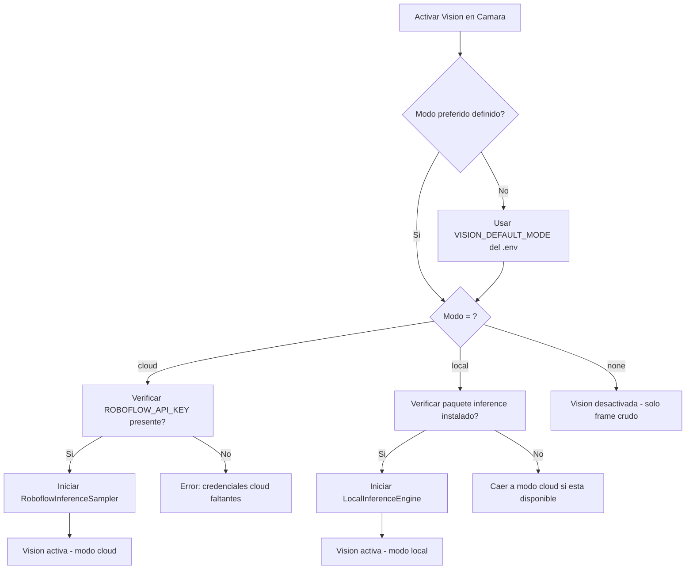
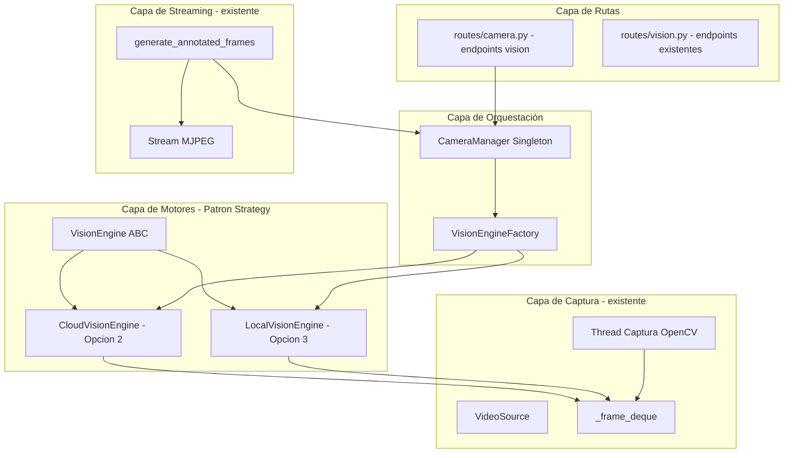
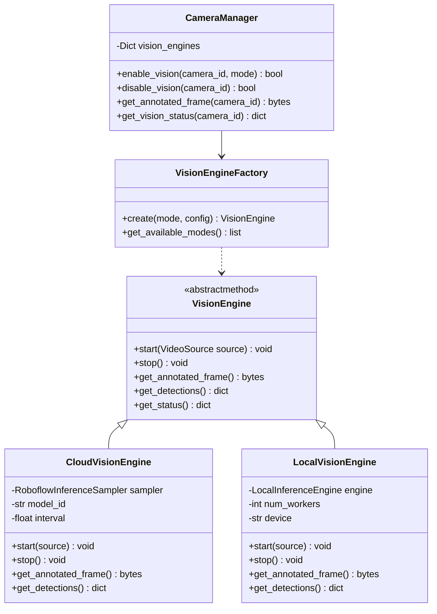
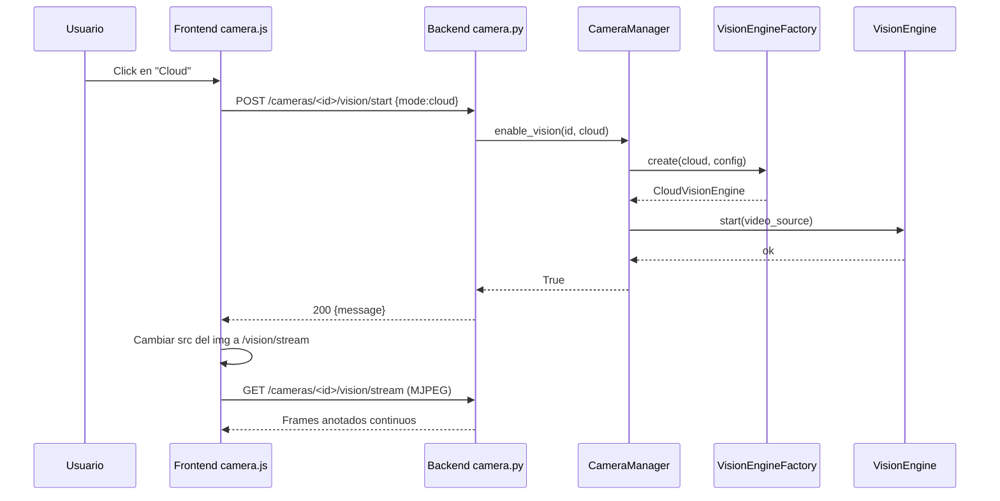
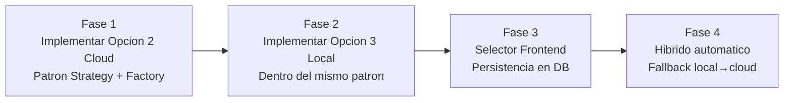

# Plan de Arquitectura — Visión Local vs Cloud y Coexistencia de Opciones 2 y 3

> **Documento de planificación** — Argos2 · Sistema de Videovigilancia
> **Fecha:** 2026-06-15
> **Estado:** Borrador para revisión
> **Modo:** Arquitectura / Planificación (sin implementación de código)
> **Documentos base:** [`docs/opciones-vision-roboflow.md`](opciones-vision-roboflow.md:1), [`docs/comparativa-vision-roboflow.md`](comparativa-vision-roboflow.md:1)

---

## Tabla de Contenidos

1. [Resumen Ejecutivo](#1-resumen-ejecutivo)
2. [Identificación de las Opciones 2 y 3](#2-identificación-de-las-opciones-2-y-3)
3. [Evaluación de Coexistencia](#3-evaluación-de-coexistencia)
4. [Arquitectura Propuesta para Selección Local/Cloud](#4-arquitectura-propuesta-para-selección-localcloud)
5. [Plan de Implementación Backend](#5-plan-de-implementación-backend)
6. [Plan de Implementación Frontend](#6-plan-de-implementación-frontend)
7. [Consideraciones de Migración y Riesgos](#7-consideraciones-de-migración-y-riesgos)
8. [Estimación de Esfuerzo por Componente](#8-estimación-de-esfuerzo-por-componente)

---

## 1. Resumen Ejecutivo

Este documento evalúa la **viabilidad de mantener simultáneamente** las dos opciones de visión computacional recomendadas para Argos2:

- **Opción 2 — Muestreo HTTP Cloud + Overlay**: procesa frames en la nube de Roboflow con pago por inferencia.
- **Opción 3 — Inferencia Local/Edge**: procesa frames localmente con cero costo cloud y máxima privacidad.

**Conclusión principal: La coexistencia es viable y recomendable.** Ambas opciones comparten el mismo punto de extensión en el código actual — el método [`get_frame()`](../Backend/services/camera_service.py:58) de [`VideoSource`](../Backend/services/camera_service.py:49) y el generador [`generate_frames()`](../Backend/routes/camera.py:43) — y son ortogonales entre sí: una consume red (cloud) y la otra consume cómputo local (CPU/GPU), por lo que no compiten por el mismo recurso limitante.

El plan propone una **arquitectura basada en el patrón Strategy + Factory** que permite al sistema (o al usuario) **elegir dinámicamente** el modo de visión por cámara: `cloud`, `local` o `none`. La preferencia se gestiona mediante una combinación de variable de entorno (modo por defecto del sistema), persistencia por cámara en la base de datos y un selector en el frontend. Los cambios son aditivos y no rompen el pipeline de captura existente.

---

## 2. Identificación de las Opciones 2 y 3

Estas opciones provienen del documento [`docs/opciones-vision-roboflow.md`](opciones-vision-roboflow.md:1), que define tres proposiciones arquitectónicas para integrar Roboflow en Argos2.

### Opción 2 — Muestreo Periódico con SDK HTTP y Pipeline de Overlay Continuo

> **Referencia:** [Proposición 2](opciones-vision-roboflow.md:273) del documento de opciones.

| Aspecto | Descripción |
|---------|-------------|
| **Dónde corre el modelo** | Nube de Roboflow (API HTTP estándar) |
| **Mecanismo** | Un *thread sampler* toma un frame cada `SAMPLE_INTERVAL` (1-2s), lo envía con `client.infer()` y guarda las predicciones |
| **Ilusión continua** | El generador MJPEG dibuja las cajas *stale* (últimas conocidas) sobre cada frame crudo fresco a 15-30 fps con `cv2.rectangle` |
| **Costo** | 🟡 Medio — pago por inferencia bajo demanda, controlable vía intervalo |
| **Dependencia de internet** | Sí (tolerante a caídas — el video sigue fluyendo sin cajas) |
| **Privacidad** | Las muestras salen a Roboflow |
| **Modelo de concurrencia** | `threading.Thread` + `requests` (coherente con la base de código) |
| **Servicio propuesto** | `Backend/services/roboflow_http_service.py` — clase `RoboflowInferenceSampler` |

### Opción 3 — Inferencia Local/Edge con Cola Productor-Consumidor

> **Referencia:** [Proposición 3](opciones-vision-roboflow.md:451) del documento de opciones.

| Aspecto | Descripción |
|---------|-------------|
| **Dónde corre el modelo** | Servidor local de Argos2 (paquete `inference` de Roboflow, CPU o GPU) |
| **Mecanismo** | Cola *productor-consumidor*: el loop de captura encola frames, un `ProcessPoolExecutor` los consume y ejecuta la inferencia local |
| **Ilusión continua** | Casi real — *stale* de 200-500 ms (CPU) o verdadero tiempo real (GPU) |
| **Costo** | 🟢 Cero cloud — solo hardware local |
| **Dependencia de internet** | No (funciona offline) |
| **Privacidad** | 🟢 Los frames nunca salen del servidor |
| **Modelo de concurrencia** | `multiprocessing` / `ProcessPoolExecutor` (evita el GIL) |
| **Servicio propuesto** | `Backend/services/local_inference_service.py` — clase `LocalInferenceEngine` |

### Diferencia clave para la coexistencia

| Dimensión | Opción 2 (Cloud) | Opción 3 (Local) |
|-----------|------------------|------------------|
| Recurso limitante | **Red** + cuota de API | **CPU/GPU** local |
| Costo recurrente | Sí (pay-per-inference) | No |
| Latencia IA | 1-3s | 20-500 ms |
| Requisito de hardware extra | No | GPU recomendada |
| Interfaz de salida | `draw_overlay(frame)` → frame anotado | `get_annotated_frame()` → frame anotado |

> **Observación crítica:** Ambas producen el mismo tipo de salida — un *frame anotado* — y ambas consumen el mismo tipo de entrada — un *frame crudo* del [`_frame_deque`](../Backend/services/camera_service.py:111) del `VideoSource`. Esta simetría de interfaces es lo que hace posible la coexistencia mediante un patrón de diseño común.

---

## 3. Evaluación de Coexistencia

### 3.1 Veredicto: ✅ Viable y Recomendable

La coexistencia de las Opciones 2 y 3 **no solo es viable, sino que constituye la arquitectura óptima de evolución** descrita en el documento original como "Fase 3 — Híbrido". Mantener ambas permite al sistema operar en modo cloud cuando el hardware local es insuficiente o cuando se valida el producto, y migrar a inferencia local cuando la privacidad, latencia y costo sean prioritarios.

### 3.2 Análisis de Conflictos Técnicos

#### ✅ Sin conflictos (compatibles por diseño)

| Aspecto | Análisis |
|---------|----------|
| **Buffer compartido** | Ambas leen del mismo `_frame_deque` del `VideoSource`, que ya es thread-safe (`deque` + `Lock`). La lectura concurrente de múltiples consumidores es segura. |
| **Generador MJPEG** | Ambas exponen una interfaz idéntica para obtener el frame anotado. El generador solo necesita preguntar "¿hay frame anotado disponible?" sin importar quién lo produjo. |
| **Modelo de concurrencia** | Ambas respetan el paradigma síncrono con threads. La Opción 3 añade `multiprocessing`, pero este es ortogonal a los threads de captura y de streaming. |
| **Recursos** | La Opción 2 consume ancho de banda de red; la Opción 3 consume CPU/GPU. No compiten por el mismo recurso. Podrían incluso correr en paralelo en cámaras distintas. |
| **Rate limiter** | [`Flask-Limiter`](../Backend/middleware/rate_limiter.py) regula endpoints HTTP, no la inferencia interna. Sin conflicto. |

#### ⚠️ Puntos de atención (manejables)

| Aspecto | Riesgo | Mitigación |
|---------|--------|------------|
| **Configuración de API keys** | Ambas necesitan credenciales de Roboflow (una para inferir en cloud, otra para descargar/ejecutar el modelo local) | Variables de entorno separadas y validación de presencia según el modo activo |
| **Memoria** | Si se activan ambos motores simultáneamente en la misma cámara, se duplica el consumo | Restricción a nivel de `CameraManager`: **una cámara = un motor activo** |
| **Apagado limpio** | El `atexit` debe cerrar tanto los threads samplers (Opción 2) como el `ProcessPoolExecutor` (Opción 3) | Extender [`_cleanup_cameras()`](../Backend/app.py:81) para delegar el shutdown a cada motor |
| **Dependencias** | `inference-sdk` (cloud) y `inference` + `torch`/`onnxruntime` (local) son paquetes distintos con dependencias que pueden conflictuar | Instalación condicional; el motor local solo se carga si sus dependencias están presentes |

### 3.3 Pros de la Coexistencia

1. **Flexibilidad total**: el operador elige el modo según el contexto (demo, validación, producción 24/7).
2. **Migración gradual**: se puede empezar con cloud (Opción 2) y migrar cámara por cámara a local (Opción 3) sin reescribir el backend.
3. **Resiliencia híbrida**: si el hardware local se satura, ciertas cámaras pueden usar cloud como fallback.
4. **Reutilización de interfaces**: un solo generador MJPEG, un solo punto de extensión (`get_annotated_frame()`).
5. **Cumplimiento de privacidad**: cámaras en zonas sensibles usan local; cámaras menos críticas pueden usar cloud.

### 3.4 Contras de la Coexistencia

1. **Mayor superficie de código**: dos servicios de inferencia que mantener.
2. **Complejidad de configuración**: el operador debe entender cuándo usar cada modo.
3. **Dependencias pesadas opcionales**: el paquete `inference` local requiere `torch` (~2 GB) que no todos los despliegues necesitan.
4. **Testing**: hay que probar dos motores de inferencia por separado y la conmutación entre ellos.

### 3.5 Matriz de Decisión de Modo



---

## 4. Arquitectura Propuesta para Selección Local/Cloud

### 4.1 Visión General

La arquitectura utiliza el **patrón Strategy** (cada motor de visión es una estrategia intercambiable) combinado con una **Fábrica** (`VisionEngineFactory`) que instancia el motor correcto según el modo seleccionado. El [`CameraManager`](../Backend/services/camera_service.py:691) actúa como contexto/orquestador.



### 4.2 Gestión del Modo Activo

Se propone un modelo de **tres niveles de configuración** con cascada (el más específico gana):

| Nivel | Mecanismo | Granularidad | Persistencia |
|-------|-----------|--------------|--------------|
| **1. Sistema (por defecto)** | Variable de entorno `VISION_DEFAULT_MODE` | Global | `.env` |
| **2. Por cámara** | Campo `vision_mode` en el registro de la cámara | Por cámara | Base de datos |
| **3. Por sesión/usuario** | Parámetro en el toggle del frontend | Por cámara, temporal | En memoria (cambiable en runtime) |

**Lógica de cascada:**
```
modo_activo = preferencia_usuario_por_sesion ?? vision_mode_de_la_camara ?? VISION_DEFAULT_MODE ?? 'cloud'
```

#### Variables de entorno a añadir en `.env.example`

```env
# ============================
# Visión Computacional
# ============================

# Modo de vision por defecto: cloud | local | none
VISION_DEFAULT_MODE=cloud

# --- Modo Cloud (Opcion 2 - Roboflow HTTP) ---
ROBOFLOW_API_KEY=
ROBOFLOW_MODEL_ID=
SAMPLE_INTERVAL=1.5

# --- Modo Local (Opcion 3 - Inferencia Edge) ---
ROBOFLOW_LOCAL_MODEL_ID=
LOCAL_INFERENCE_WORKERS=2
INFERENCE_DEVICE=cpu  # cpu | cuda
```

### 4.3 Diagrama de Clases del Backend



### 4.4 Puntos de Extensión en el Código Existente

Los cambios se concentran en **4 zonas** del código actual, todas aditivas:

| Zona | Archivo | Cambio |
|------|---------|--------|
| **A. Abstracción** | `Backend/services/vision_engine.py` (NUEVO) | Definir `VisionEngine` ABC + `CloudVisionEngine` + `LocalVisionEngine` |
| **B. Fábrica** | `Backend/services/vision_engine.py` (NUEVO) | `VisionEngineFactory.create(mode)` |
| **C. Orquestador** | [`Backend/services/camera_service.py`](../Backend/services/camera_service.py:691) | Añadir a `CameraManager`: `enable_vision()`, `disable_vision()`, `get_annotated_frame()`, `_vision_engines: Dict` |
| **D. Streaming** | [`Backend/routes/camera.py`](../Backend/routes/camera.py:43) | Nuevo generador `generate_annotated_frames()` + endpoints `/vision/start`, `/vision/stop`, `/vision/stream` |

---

## 5. Plan de Implementación Backend

### 5.1 Archivos Nuevos

#### `Backend/services/vision_engine.py` — Motor Abstraído (Strategy + Factory)

```python
# Backend/services/vision_engine.py — CONCEPTO ARQUITECTÓNICO
"""
Capa de abstracción para motores de visión computacional.
Permite elegir dinámicamente entre procesamiento cloud y local.
"""
import logging
from abc import ABC, abstractmethod
from typing import Optional, Dict, List

logger = logging.getLogger(__name__)


class VisionEngine(ABC):
    """Interfaz común para todos los motores de visión."""

    @abstractmethod
    def start(self, video_source) -> None:
        """Inicia el motor conectado a una fuente de video."""
        ...

    @abstractmethod
    def stop(self) -> None:
        """Detiene el motor y libera recursos."""
        ...

    @abstractmethod
    def get_annotated_frame(self) -> Optional[bytes]:
        """Retorna el último frame anotado como bytes JPEG, o None."""
        ...

    @abstractmethod
    def get_detections(self) -> Optional[dict]:
        """Retorna el último JSON de detecciones."""
        ...

    @abstractmethod
    def get_status(self) -> dict:
        """Retorna estado del motor: running, fps, latencia, modo."""
        ...


class CloudVisionEngine(VisionEngine):
    """Opción 2 — Muestreo HTTP con Roboflow Cloud + Overlay."""

    def __init__(self, config: dict):
        self._sampler = None  # RoboflowInferenceSampler (import diferido)
        self._config = config

    def start(self, video_source) -> None:
        from services.roboflow_http_service import RoboflowInferenceSampler
        self._sampler = RoboflowInferenceSampler(
            camera_source=video_source,
            model_id=self._config['ROBOFLOW_MODEL_ID'],
            api_key=self._config['ROBOFLOW_API_KEY'],
            interval=self._config.get('SAMPLE_INTERVAL', 1.5)
        )
        self._sampler.start()
        logger.info("CloudVisionEngine iniciado.")

    def get_annotated_frame(self) -> Optional[bytes]:
        if not self._sampler:
            return None
        frame = self._sampler.get_raw_frame()  # frame crudo
        if frame is None:
            return None
        return self._sampler.draw_overlay(frame)  # dibuja cajas stale

    def stop(self) -> None:
        if self._sampler:
            self._sampler.stop()
            self._sampler = None

    def get_detections(self) -> Optional[dict]:
        return self._sampler._predictions if self._sampler else None

    def get_status(self) -> dict:
        return {'mode': 'cloud', 'running': self._sampler is not None}


class LocalVisionEngine(VisionEngine):
    """Opción 3 — Inferencia Local/Edge con ProcessPool."""

    def __init__(self, config: dict):
        self._engine = None  # LocalInferenceEngine (import diferido)
        self._config = config

    def start(self, video_source) -> None:
        try:
            from services.local_inference_service import LocalInferenceEngine
        except ImportError:
            raise RuntimeError(
                "El paquete 'inference' no está instalado. "
                "Ejecute: pip install inference torch"
            )
        self._engine = LocalInferenceEngine(
            model_id=self._config['ROBOFLOW_LOCAL_MODEL_ID'],
            api_key=self._config['ROBOFLOW_API_KEY'],
            num_workers=self._config.get('LOCAL_INFERENCE_WORKERS', 2),
            device=self._config.get('INFERENCE_DEVICE', 'cpu')
        )
        self._engine.attach_source(video_source)
        self._engine.start_dispatch()
        logger.info("LocalVisionEngine iniciado.")

    def get_annotated_frame(self) -> Optional[bytes]:
        if not self._engine:
            return None
        return self._engine.get_annotated_frame()

    def stop(self) -> None:
        if self._engine:
            self._engine.stop()
            self._engine = None

    def get_detections(self) -> Optional[dict]:
        return self._engine.get_detections() if self._engine else None

    def get_status(self) -> dict:
        return {'mode': 'local', 'running': self._engine is not None}


class VisionEngineFactory:
    """Crea el motor de visión apropiado según el modo."""

    @staticmethod
    def create(mode: str, config: dict) -> VisionEngine:
        if mode == 'cloud':
            return CloudVisionEngine(config)
        elif mode == 'local':
            return LocalVisionEngine(config)
        elif mode in ('none', 'off'):
            return None
        else:
            raise ValueError(f"Modo de visión no válido: {mode}")

    @staticmethod
    def get_available_modes() -> List[str]:
        """Retorna los modos disponibles según las dependencias instaladas."""
        modes = ['cloud', 'none']
        try:
            import inference  # noqa
            modes.insert(0, 'local')
        except ImportError:
            pass
        return modes
```

#### `Backend/services/roboflow_http_service.py` — Opción 2 (Cloud)

> Pseudocódigo completo disponible en [`docs/opciones-vision-roboflow.md` líneas 394-447](opciones-vision-roboflow.md:394). Clase `RoboflowInferenceSampler` con thread de muestreo, `client.infer()` y `draw_overlay()`.

#### `Backend/services/local_inference_service.py` — Opción 3 (Local)

> Pseudocódigo completo disponible en [`docs/opciones-vision-roboflow.md` líneas 573-629](opciones-vision-roboflow.md:573). Clase `LocalInferenceEngine` con `ProcessPoolExecutor`, cola productor-consumidor y buffer triple.

### 5.2 Cambios en Archivos Existentes

#### `CameraManager` — Extensión (sin romper API existente)

```python
# Fragmento a AÑADIR en Backend/services/camera_service.py
# dentro de la clase CameraManager (al lado de get_frame)

class CameraManager:
    # ... código existente sin cambios ...

    def __init__(self):
        # ... existente ...
        self._vision_engines: Dict[str, VisionEngine] = {}  # NUEVO
        self._vision_config = self._load_vision_config()     # NUEVO

    def enable_vision(self, camera_id: str, mode: str = 'cloud') -> bool:
        """Activa visión para una cámara en el modo especificado."""
        source = self.get_camera(camera_id)
        if source is None:
            return False
        # Detener motor previo si existe
        self.disable_vision(camera_id)
        # Crear e iniciar nuevo motor
        engine = VisionEngineFactory.create(mode, self._vision_config)
        if engine is None:
            return True  # modo 'none'
        engine.start(source)
        with self._lock:
            self._vision_engines[camera_id] = engine
        return True

    def disable_vision(self, camera_id: str) -> bool:
        """Desactiva visión para una cámara."""
        with self._lock:
            engine = self._vision_engines.pop(camera_id, None)
        if engine:
            engine.stop()
        return True

    def get_annotated_frame(self, camera_id: str) -> Optional[bytes]:
        """Retorna frame anotado si hay visión activa, sino None."""
        with self._lock:
            engine = self._vision_engines.get(camera_id)
        if engine is None:
            return None
        return engine.get_annotated_frame()

    def get_vision_status(self, camera_id: str) -> dict:
        """Retorna estado del motor de visión de una cámara."""
        with self._lock:
            engine = self._vision_engines.get(camera_id)
        if engine is None:
            return {'active': False, 'mode': 'none'}
        return {'active': True, **engine.get_status()}
```

#### `routes/camera.py` — Nuevos Endpoints

```python
# Fragmento a AÑADIR en Backend/routes/camera.py

def generate_annotated_frames(camera_id: str, fps: float = 15.0):
    """Generador MJPEG que sirve frames anotados si hay visión activa."""
    interval = 1.0 / fps if fps > 0 else 1.0 / 15.0
    while True:
        # Intentar frame anotado primero; fallback a frame crudo
        frame_data = camera_manager.get_annotated_frame(camera_id)
        if frame_data is None:
            frame_data = camera_manager.get_frame(camera_id)
        if frame_data is None:
            time.sleep(interval)
            continue
        yield (b'--frame\r\nContent-Type: image/jpeg\r\n\r\n' + frame_data + b'\r\n')
        time.sleep(interval)


@camera_bp.route('/<camera_id>/vision/start', methods=['POST'])
@token_required
def start_vision(current_user, camera_id):
    """Activa visión en una cámara. Body: {"mode": "cloud|local"}."""
    data = request.get_json(silent=True) or {}
    mode = data.get('mode', os.environ.get('VISION_DEFAULT_MODE', 'cloud'))
    success = camera_manager.enable_vision(camera_id, mode)
    if success:
        return jsonify({'message': f'Visión activada en modo {mode}'}), 200
    return jsonify({'error': 'No se pudo activar la visión'}), 400


@camera_bp.route('/<camera_id>/vision/stop', methods=['POST'])
@token_required
def stop_vision(current_user, camera_id):
    """Desactiva visión en una cámara."""
    camera_manager.disable_vision(camera_id)
    return jsonify({'message': 'Visión desactivada'}), 200


@camera_bp.route('/<camera_id>/vision/stream', methods=['GET'])
@token_required
def vision_stream(current_user, camera_id):
    """Stream MJPEG con frames anotados (o crudos como fallback)."""
    return Response(
        generate_annotated_frames(camera_id),
        mimetype='multipart/x-mixed-replace; boundary=frame'
    )


@camera_bp.route('/<camera_id>/vision/status', methods=['GET'])
@token_required
def vision_status(current_user, camera_id):
    """Estado del motor de visión de una cámara."""
    return jsonify(camera_manager.get_vision_status(camera_id)), 200


@camera_bp.route('/vision/modes', methods=['GET'])
@token_required
def vision_modes(current_user):
    """Lista los modos de visión disponibles según dependencias."""
    return jsonify({'modes': VisionEngineFactory.get_available_modes()}), 200
```

#### `app.py` — Extensión del Cleanup

```python
# Fragmento a MODIFICAR en Backend/app.py (_cleanup_cameras)

def _cleanup_cameras():
    manager = _CameraManager()
    # NUEVO: detener motores de visión antes de las cámaras
    for cam_id in list(manager._cameras.keys()):
        manager.disable_vision(cam_id)
    manager.shutdown_all()
```

#### `requirements.txt` — Dependencias

```text
# Opción 2 (Cloud) — requerido
inference-sdk

# Opción 3 (Local) — opcional, instalar solo si se usa modo local
# inference
# torch
# onnxruntime
```

### 5.3 Endpoints API — Resumen Completo

| Método | Ruta | Descripción | Nuevo |
|--------|------|-------------|-------|
| POST | `/api/cameras/<id>/vision/start` | Activa visión (`{mode}`) | ✅ |
| POST | `/api/cameras/<id>/vision/stop` | Desactiva visión | ✅ |
| GET | `/api/cameras/<id>/vision/stream` | Stream MJPEG anotado | ✅ |
| GET | `/api/cameras/<id>/vision/status` | Estado del motor | ✅ |
| GET | `/api/cameras/vision/modes` | Modos disponibles | ✅ |
| GET | `/api/cameras/<id>/stream` | Stream crudo (sin cambios) | ❌ Existente |

---

## 6. Plan de Implementación Frontend

### 6.1 Ubicación del Selector en la UI

Se proponen **dos ubicaciones** según el nivel de control:

| Ubicación | Nivel | Audiencia | Componente |
|-----------|-------|-----------|------------|
| **Tarjeta de cámara (Monitoreo)** | Por cámara | Cualquier usuario autenticado | Toggle/badge en el header de cada tarjeta |
| **Panel de Admin (gestión de cámaras)** | Por cámara | Administradores | Dropdown en la configuración de cada cámara |

**Recomendación principal:** Ubicar el selector en la **tarjeta de cada cámara** en el tab de Monitoreo, ya que es donde el usuario ve el feed en vivo y donde tiene más sentido activar/desactivar la visión.

### 6.2 Componente Recomendado: Segmented Control (Radio Buttons Estilizados)

Se recomienda un **segmented control de 3 opciones** dentro del header de cada tarjeta de cámara:

```
┌─────────────────────────────────────────────────────┐
│  [📷 Cámara Entrada]          [USB]  [12ms]         │
│  ┌───────────────────────────────────────────────┐  │
│  │                                                 │  │
│  │              FEED DE VIDEO EN VIVO              │  │
│  │            (con cajas de detección)             │  │
│  │                                                 │  │
│  └───────────────────────────────────────────────┘  │
│                                                      │
│  Visión: ( Desactivada )(  Cloud  )( Local )  [⛶]   │
│                                                      │
└─────────────────────────────────────────────────────┘
```

**Justificación del componente:**
- Los **toggle switches** solo permiten on/off (2 estados). Necesitamos 3: `off`, `cloud`, `local`.
- Los **radio buttons** son semánticamente correctos pero visualmente pobres.
- Un **segmented control** es claro, accesible y cabe en el header de la tarjeta.

**Alternativa simplificada (dropdown):**

```
┌─────────────────────────────────────────────────────┐
│  [📷 Cámara Entrada]    [USB] [12ms]   [visión ▼]   │
│                                          │          │
│                            ┌─────────────┴──────┐   │
│                            │ ○ Desactivada      │   │
│                            │ ● Cloud (Roboflow) │   │
│                            │ ○ Local (Edge)     │   │
│                            └────────────────────┘   │
└─────────────────────────────────────────────────────┘
```

### 6.3 Mockup — Tarjeta de Cámara con Visión

```
╔═══════════════════════════════════════════════════════════╗
║  📷 Cámara Entrada Principal            [USB]  [● 12ms]   ║
║─────────────────────────────────────────────────────────║
║                                                           ║
║     ┌─────────────────────────────────────────────┐       ║
║     │                                               │       ║
║     │     ┌─────┐                                   │       ║
║     │     │👤 95%│  ← caja de detección (overlay)  │       ║
║     │     └─────┘                                   │       ║
║     │                                               │       ║
║     │             [ FEED MJPEG ANOTADO ]            │       ║
║     │                                               │       ║
║     │     ┌─────┐                                   │       ║
║     │     │🚗 88%│                                  │       ║
║     │     └─────┘                                   │       ║
║     └─────────────────────────────────────────────┘       ║
║                                                           ║
║  🤖 Visión: [ Off ] [ Cloud ●] [ Local ]    Modo: Cloud  ║
║             ────────────────                               ║
║  📊 Detecciones: 2 objetos | Latencia: 1.2s | FPS: 15    ║
║                                                           ║
╚═══════════════════════════════════════════════════════════╝
```

### 6.4 Mockup — Panel de Configuración de Visión (Admin)

Para configuración avanzada (intervalo de muestreo, dispositivo de inferencia, etc.):

```
╔═══════════════════════════════════════════════════════════╗
║  ⚙️ Configuración de Visión — Cámara: Entrada            ║
║─────────────────────────────────────────────────────────║
║                                                           ║
║  Modo de visión:                                          ║
║    ( ) Desactivada                                        ║
║    (•) Cloud (Roboflow HTTP)                              ║
║    ( ) Local (Inferencia Edge)                            ║
║                                                           ║
║  ── Parámetros Cloud ────────────────────────────────     ║
║  Intervalo de muestreo:    [ 1.5 ] segundos               ║
║  Modelo:                   [ deteccion-objetos-v3   ▼]    ║
║  Smart sampling (movimiento): [✓] Activado                ║
║                                                           ║
║  ── Parámetros Local ────────────────────────────────     ║
║  Workers:                  [ 2 ]                          ║
║  Dispositivo:              (•) CPU  ( ) GPU/CUDA          ║
║  ⚠️ Requiere paquete 'inference' instalado                ║
║                                                           ║
║                    [ Guardar ]  [ Cancelar ]              ║
╚═══════════════════════════════════════════════════════════╝
```

### 6.5 Comunicación con el Backend

#### Flujo de activación de visión



#### Cambios en `Frontend/js/camera.js`

```javascript
// Fragmento CONCEPTUAL a añadir en Frontend/js/camera.js

const VISION_TOGGLE = {
    async activate(cameraId, mode) {
        const token = getAccessToken();
        const res = await fetch(`/api/cameras/${cameraId}/vision/start`, {
            method: 'POST',
            headers: {
                'Authorization': `Bearer ${token}`,
                'Content-Type': 'application/json'
            },
            body: JSON.stringify({ mode })
        });
        if (res.ok) {
            // Cambiar el stream al anotado
            this._switchStream(cameraId, true);
            showToast(`Visión activada: modo ${mode}`, 'success');
        }
    },

    async deactivate(cameraId) {
        const token = getAccessToken();
        const res = await fetch(`/api/cameras/${cameraId}/vision/stop`, {
            method: 'POST',
            headers: { 'Authorization': `Bearer ${token}` }
        });
        if (res.ok) {
            this._switchStream(cameraId, false);
            showToast('Visión desactivada', 'info');
        }
    },

    _switchStream(cameraId, annotated) {
        const img = document.querySelector(`[data-camera-id="${cameraId}"] .stream-img`);
        const token = getAccessToken();
        const base = annotated ? 'vision/stream' : 'stream';
        img.src = `/api/cameras/${cameraId}/${base}?token=${token}&t=${Date.now()}`;
    }
};
```

### 6.6 Persistencia de la Preferencia

| Mecanismo | Cuándo | Dónde |
|-----------|--------|-------|
| **API call al backend** | Al cambiar el toggle | Backend valida y aplica en runtime |
| **localStorage (frontend)** | Recordar último modo al recargar | `localStorage.setItem('vision_mode_<camId>', mode)` |
| **Base de datos (backend)** | Persistir entre reinicios | Campo `vision_mode` en tabla de configuración de cámaras |

El flujo de persistencia recomendado:
1. El usuario cambia el modo en la UI → `POST /vision/start` → el backend aplica el cambio en runtime.
2. El backend guarda el modo en la base de datos asociado a la cámara.
3. Al reiniciar el servidor, el `CameraManager` lee la DB y re-activa la visión con el último modo conocido.
4. El frontend usa `localStorage` para mostrar el toggle en el estado correcto antes de confirmar con el backend.

### 6.7 Consideraciones de UX

- **Indicador visual de modo activo**: badge de color en la tarjeta (azul = cloud, verde = local, gris = off).
- **Detección de disponibilidad**: el frontend consulta `GET /vision/modes` al cargar y deshabilita las opciones no disponibles (ej. si no hay GPU, deshabilitar "Local").
- **Confirmación al activar local**: si el usuario selecciona "Local" por primera vez, mostrar advertencia sobre requisitos de hardware.
- **Feedback de latencia**: mostrar el indicador de *staleness* (edad de las detecciones) para que el usuario entienda el desfase.

---

## 7. Consideraciones de Migración y Riesgos

### 7.1 Estrategia de Migración

Se recomienda un enfoque **incremental en 3 fases**, alineado con la ruta de evolución del documento original:



| Fase | Objetivo | Riesgo | Dependencias |
|------|----------|--------|--------------|
| **Fase 1** | Implementar `VisionEngine` ABC + `CloudVisionEngine` + endpoints + generador anotado | Bajo — solo añade código nuevo | `inference-sdk` |
| **Fase 2** | Implementar `LocalVisionEngine` dentro del mismo patrón | Medio — introduce `multiprocessing` | `inference`, `torch` (opcional) |
| **Fase 3** | Selector en frontend + persistencia en DB | Bajo — solo UI + un campo en DB | Ninguna nueva |
| **Fase 4** | Fallback automático: si el motor local falla, conmutar a cloud | Medio — lógica de failover | Fases 1-3 completas |

### 7.2 Riesgos y Mitigaciones

| Riesgo | Probabilidad | Impacto | Mitigación |
|--------|-------------|---------|------------|
| **Conflicto de dependencias** entre `inference-sdk` y `inference` | Media | Alto | Instalación en entornos separados o imports diferidos (`try/except`) |
| **Cuello de botella en CPU** si se activa modo local sin GPU | Alta | Medio | Detección automática de dispositivo + límite de cámaras en modo local |
| **Fuga de procesos** del `ProcessPoolExecutor` si no se cierra bien | Media | Alto | Hook `atexit` robusto + timeout de join + watchdog |
| **Inconsistencia de estado** entre frontend (localStorage) y backend (DB) | Media | Bajo | El backend es fuente de verdad; el frontend sincroniza al cargar |
| **Costo cloud inesperado** si se deja modo cloud activado 24/7 | Media | Medio | Dashboard de costo en el panel admin + alerta de umbral de inferencias |
| **Pickling de frames numpy** entre procesos (Opción 3) | Alta | Medio | Usar `multiprocessing.shared_memory` para arrays grandes |
| **Incompatibilidad de versiones** del paquete `inference` con el modelo entrenado | Baja | Alto | Versionar el modelo y documentar la versión compatible |

### 7.3 Decisiones de Diseño Pendientes

Estas decisiones requieren validación del equipo antes de la implementación:

1. **¿El modo se elige por cámara o global?**
   - *Recomendación:* Por cámara (máxima flexibilidad), con un default global.

2. **¿La persistencia va en SQLite (DB existente) o en un archivo de configuración?**
   - *Recomendación:* SQLite, añadiendo un campo a la tabla de cámaras o una tabla `vision_config`.

3. **¿Se implementa el smart sampling (detección de movimiento) en la Fase 1?**
   - *Recomendación:* Postergar a Fase 2. Simplifica la primera implementación.

4. **¿El stream anotado reemplaza al crudo o es un endpoint paralelo?**
   - *Recomendación:* Endpoints paralelos (`/stream` crudo + `/vision/stream` anotado) para permitir fallback sin reconectar.

---

## 8. Estimación de Esfuerzo por Componente

> **Nota:** Las estimaciones son cualitativas (Baja/Media/Alta) según el documento de opciones y el análisis del código actual. No se proveen tiempos.

### 8.1 Backend

| Componente | Archivo | Esfuerzo | Descripción |
|------------|---------|----------|-------------|
| Abstracción `VisionEngine` | `services/vision_engine.py` (NUEVO) | **Media** | ABC + Factory + imports diferidos |
| Motor Cloud | `services/roboflow_http_service.py` (NUEVO) | **Media** | Thread sampler + `client.infer()` + `draw_overlay()` |
| Motor Local | `services/local_inference_service.py` (NUEVO) | **Alta** | ProcessPool + cola + shared_memory + carga de modelo |
| Extensión `CameraManager` | `services/camera_service.py` | **Baja** | 4 métodos aditivos (`enable/disable/get_annotated/get_status`) |
| Endpoints API | `routes/camera.py` | **Baja-Media** | 5 endpoints + generador anotado |
| Cleanup | `app.py` | **Baja** | Extender `_cleanup_cameras()` |
| Configuración | `.env.example` | **Baja** | 7 variables nuevas |
| Dependencias | `requirements.txt` | **Baja** | `inference-sdk` (siempre), `inference`+`torch` (opcional) |

### 8.2 Frontend

| Componente | Archivo | Esfuerzo | Descripción |
|------------|---------|----------|-------------|
| Toggle de visión | `js/camera.js` | **Media** | Lógica de activación/desactivación + cambio de stream |
| UI del selector | `dashboard.html` + `css/styles.css` | **Media** | Segmented control en cada tarjeta de cámara |
| Indicador de estado | `js/camera.js` | **Baja** | Badge de modo + métricas (latencia, detecciones) |
| Panel de config (admin) | `js/dashboard.js` | **Media** | Modal de parámetros avanzados |
| Persistencia local | `js/camera.js` | **Baja** | `localStorage` del modo por cámara |

### 8.3 Base de Datos

| Componente | Esfuerzo | Descripción |
|------------|----------|-------------|
| Tabla/campo `vision_mode` | **Baja** | Campo en tabla de cámaras o tabla nueva `vision_config` |
| Migración de schema | **Baja** | `ALTER TABLE` o `CREATE TABLE` en `database/db.py` |

### 8.4 Pruebas

| Componente | Esfuerzo | Descripción |
|------------|----------|-------------|
| Tests unitarios motores | **Media** | Mock de `client.infer()` y de modelo local |
| Tests de integración | **Media** | Conmutación de modos, fallback, cleanup |
| Tests de estrés | **Media** | Múltiples cámaras + modos mixtos |

---

## 9. Conclusión

La coexistencia de las Opciones 2 (Cloud) y 3 (Local) es **técnicamente viable y estratégicamente recomendable** para Argos2. La clave es introducir una capa de abstracción (`VisionEngine` + `VisionEngineFactory`) que unifica ambas opciones bajo una interfaz común, permitiendo al `CameraManager` tratarlas de forma polimórfica. Esta arquitectura:

- **No rompe** el código existente (todos los cambios son aditivos).
- **Respeta** el paradigma síncrono con threads del proyecto.
- **Permite migración gradual** desde cloud hacia local sin reescribir.
- **Da control al usuario** para elegir privacidad (local) vs simplicidad (cloud).

El siguiente paso es validar las **decisiones de diseño pendientes** (Sección 7.3) con el equipo y proceder a la implementación de la **Fase 1** (patrón Strategy + motor cloud).

---

> **Documento de planificación generado para Argos2** — Evaluación de coexistencia y arquitectura para selección dinámica de modo de visión (local vs cloud). No contiene implementación funcional; es base para decisión de diseño.
